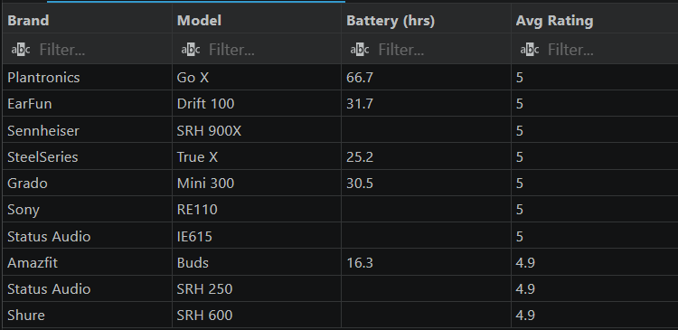
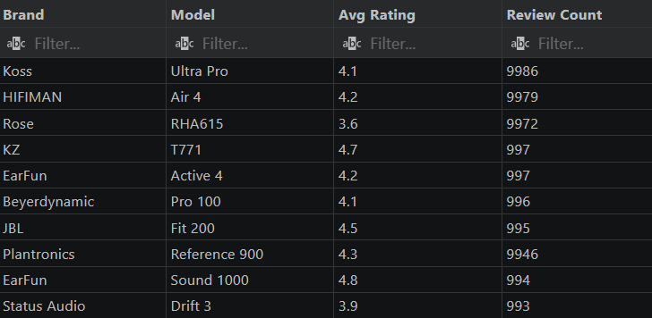
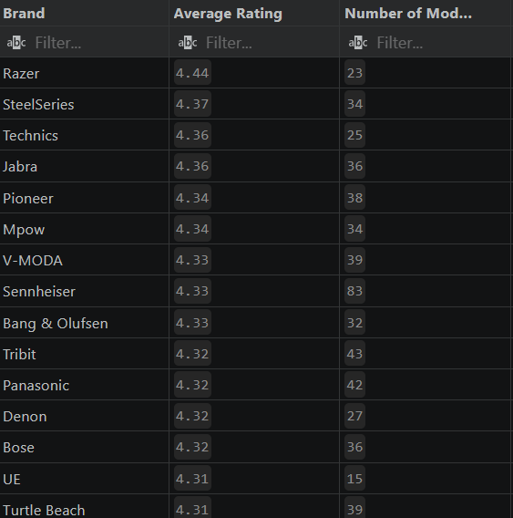
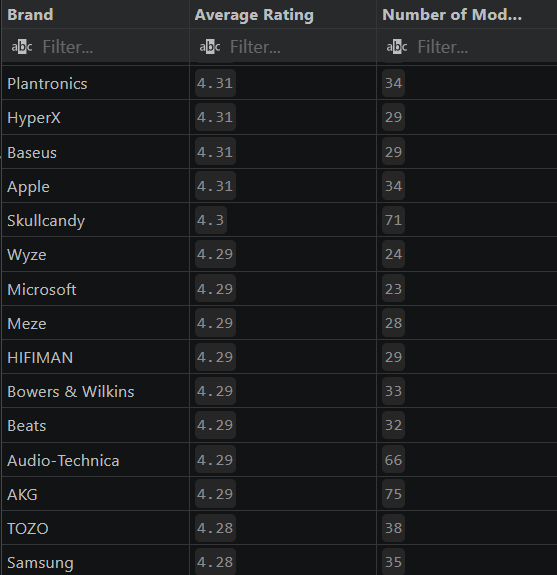
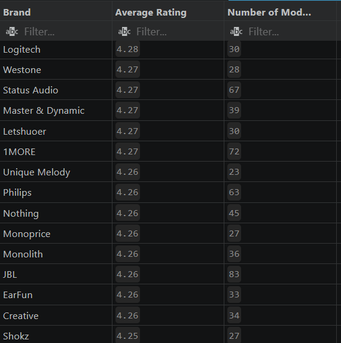
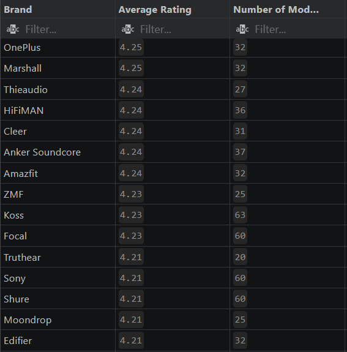
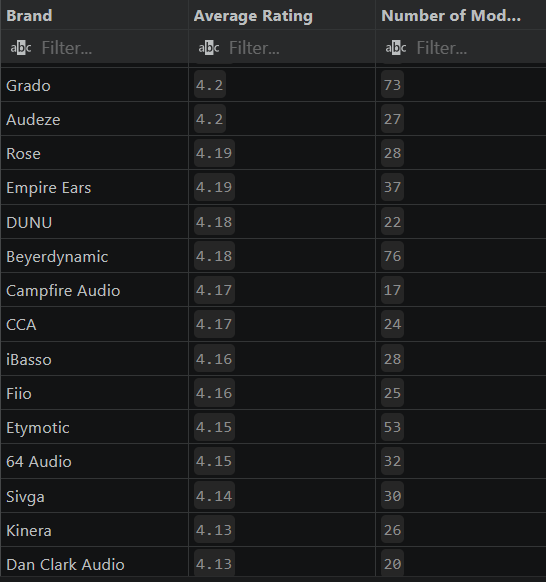
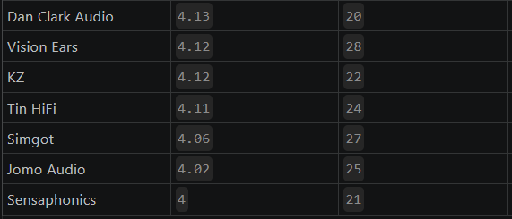

# <p align="center">Amazon headphones sales analysis</p>
Global Headphones Market Analysis (SQL)

This project performs an exploratory data analysis (EDA) of the Global Headphones Market dataset. By utilizing SQL queries, I have uncovered insights regarding brand performance, pricing trends, and customer reception within the headphone industry.

Tools used: Excel, SQL (SQLite, SQLTools)

Business Problem
The headphone market is saturated with countless brands and models, making it difficult for consumers to identify which products offer the best value or performance. The challenge lies in navigating a vast dataset of specifications and reviews to extract meaningful patterns. My goal is to provide a data-driven guide that helps consumers make informed purchasing decisions based on price, rating, and user feedback.

How I Solved the Problem
By leveraging SQL window functions and aggregation, I processed the dataset to uncover key performance indicators such as price-to-rating ratios, brand-specific excellence, and "hidden gem" products. I categorized products by price range to understand the market segments better and used statistical comparisons to see how individual models perform against their brand's average

SQL Analysis
1. Identifying Top-Tier Headphones
Goal: Find the best-performing models based on ratings and review volume.

Top 10 Highest Rated Headphones
```mysql
SELECT Brand, 
Model, 
"Battery (hrs)",
"Avg Rating"
FROM headphones
ORDER BY "Avg Rating" DESC
LIMIT 10;
```
Result:

Top 10 highest reviewed headphones
```mysql
SELECT Brand,
Model,
"Avg Rating",
"Review Count"
FROM headphones
ORDER BY "Review Count" DESC
LIMIT 10;
```
Result:

Insight: These queries distinguish between products that are critically acclaimed versus those that are mass-market favorites.

2. Market Performance by Brand
Goal: Understand how different brands position themselves in terms of quality and price.

Average rating by brand
```mysql
SELECT Brand,
round(AVG("Avg Rating"), 2) AS "Average Rating",
count(*) AS "Number of Models"
FROM headphones
GROUP BY Brand
ORDER BY "Average Rating" DESC;
```
Result:






Insight: This analysis helps identify which brands consistently deliver high-quality audio experiences compared to their average price point.

3. Price Segment Analysis
Goal: How does price bracket influence the user-perceived quality?

Average price by brand
```mysql
SELECT Brand,
round(AVG("Price (USD)"), 2) AS "Average Price",
count(*) AS "Number of Models"
FROM headphones
GROUP BY Brand
ORDER BY "Average Price" DESC;
```
Result:

4. Segmented Performance: Top 5 Headphones by Primary Use
Goal: Identify the leaders in specific categories (e.g., Gaming, Studio, Travel).
Insight: This query uses ROW_NUMBER() to isolate the "best of the best" for each usage category, helping users quickly find the top recommended gear for their specific lifestyle.

Top 5 best rated headphones by primary use
```mysql
SELECT "Primary Use",
  brand,
  Model,
  "Price (USD)",
  round("Avg Rating", 2) AS "Average Rating"
FROM (
  SELECT *,
    ROW_NUMBER() OVER (PARTITION BY "Primary Use" ORDER BY "Avg Rating" DESC) AS rn
  FROM headphones
) 
WHERE rn <= 5
ORDER BY "Primary Use", "Average Rating" DESC; 
```
Result:

5. Price Range Benchmarking
Goal: Analyze if higher price points consistently result in better user satisfaction.
Insight: This reveals if there is a "sweet spot" for pricing, where quality peaks before diminishing returns set in.
Average rating by price range
```mysql
SELECT 
    CASE 
        WHEN CAST("Price (USD)" AS REAL) < 50 THEN 'Under $50'
        WHEN CAST("Price (USD)" AS REAL) BETWEEN 50 AND 99.99 THEN '$50-$99'
        WHEN CAST("Price (USD)" AS REAL) BETWEEN 100 AND 199.99 THEN '$100-$199'
        ELSE '$200+'
    END AS price_range,
    ROUND(AVG("Avg Rating"), 2) AS average_rating,
    COUNT(*) AS number_of_products
FROM headphones
GROUP BY price_range
ORDER BY 
    CASE price_range
        WHEN 'Under $50' THEN 1
        WHEN '$50-$99' THEN 2
        WHEN '$100-$199' THEN 3
        ELSE 4
    END;
```
Result:

6. Within-Brand Ranking & Deviations
Goal: Identify standout models and how they compare to the brand average.
Insight: These window functions highlight "star performers"—products that significantly outperform their brand’s average—and "underperformers" that might drag a brand’s reputation down.

Ranking headphones by average rating within each brand
```mysql
SELECT 
    Brand,
    Model,
    "Avg Rating",
    "Review Count",
    RANK() OVER (
        PARTITION BY Brand 
        ORDER BY "Avg Rating" DESC, "Review Count" DESC
    ) AS rank
FROM headphones
ORDER BY Brand, rank;
```
Result:

7. Market Discovery: Hidden Gems & Volume Leaders
Goal: Find high-quality products that are under-the-radar vs. the most popular brands.
Insight: The "Hidden Gems" query helps identify high-quality products that lack the marketing budget of major brands, while the "Most Reviewed" query establishes which brands have the highest consumer engagement.
Products with high ratings but low review counts
```mysql
SELECT *
FROM headphones
WHERE "Avg Rating" >= 4.8
AND "Review Count" < 400;
```
Result:

8. Market Volume: Top 5 Most Reviewed Brands
Goal: Identify which brands dominate the market in terms of consumer engagement and review volume.

Top 5 most reviewed brand
```mysql
SELECT Brand,
"Avg Rating",
       COUNT(*) AS "Number of Models",
       SUM("Review Count") AS "Total Reviews"
FROM headphones
GROUP BY Brand
ORDER BY "Total Reviews" DESC
LIMIT 5;
```
Result:

9. Variance Analysis: Performance vs. Brand Average
Goal: Determine which specific models are "Outliers"—either significantly better or worse than the average product within their own brand.
Difference from brand average rating
```mysql
SELECT 
    Model,
    Brand,
    "Avg Rating",
    ROUND("Avg Rating" - AVG("Avg Rating") OVER(PARTITION BY Brand), 2) AS rating_difference
FROM headphones
ORDER BY ABS(rating_difference) DESC;
```
Result:
