# <p align="center">Amazon headphones sales analysis</p>
Global Headphones Market Analysis (SQL)

This project performs an exploratory data analysis (EDA) of the Global Headphones Market dataset. By utilizing SQL queries, I have uncovered insights regarding brand performance, pricing trends, and customer reception within the headphone industry.

Tools used: Excel, SQL (SQLite, SQLTools)

Business Problem
The headphone market is saturated with countless brands and models, making it difficult for consumers to identify which products offer the best value or performance. The challenge lies in navigating a vast dataset of specifications and reviews to extract meaningful patterns. My goal is to provide a data-driven guide that helps consumers make informed purchasing decisions based on price, rating, and user feedback.

How I Solved the Problem
By leveraging SQL window functions and aggregation, I processed the dataset to uncover key performance indicators such as price-to-rating ratios, brand-specific excellence, and "hidden gem" products. I categorized products by price range to understand the market segments better and used statistical comparisons to see how individual models perform against their brand's average

SQL Analysis
1. Identifying Top-Tier Headphones
Goal: Find the best-performing models based on ratings and review volume.

Top 10 Highest Rated Headphones
```mysql
SELECT Brand, 
Model, 
"Battery (hrs)",
"Avg Rating"
FROM headphones
ORDER BY "Avg Rating" DESC
LIMIT 10;
```
Result:

Top 10 highest reviewed headphones
```mysql
SELECT Brand,
Model,
"Avg Rating",
"Review Count"
FROM headphones
ORDER BY "Review Count" DESC
LIMIT 10;
```
Result:

Insight: These queries distinguish between products that are critically acclaimed versus those that are mass-market favorites.

2. Market Performance by Brand
Goal: Understand how different brands position themselves in terms of quality and price.

Average rating by brand
```mysql
SELECT Brand,
round(AVG("Avg Rating"), 2) AS "Average Rating",
count(*) AS "Number of Models"
FROM headphones
GROUP BY Brand
ORDER BY "Average Rating" DESC;
```
Result:


Insight: This analysis helps identify which brands consistently deliver high-quality audio experiences compared to their average price point.

3. Price Segment Analysis
Goal: How does price bracket influence the user-perceived quality?

Average price by brand
```mysql
SELECT Brand,
round(AVG("Price (USD)"), 2) AS "Average Price",
count(*) AS "Number of Models"
FROM headphones
GROUP BY Brand
ORDER BY "Average Price" DESC;
```
Result: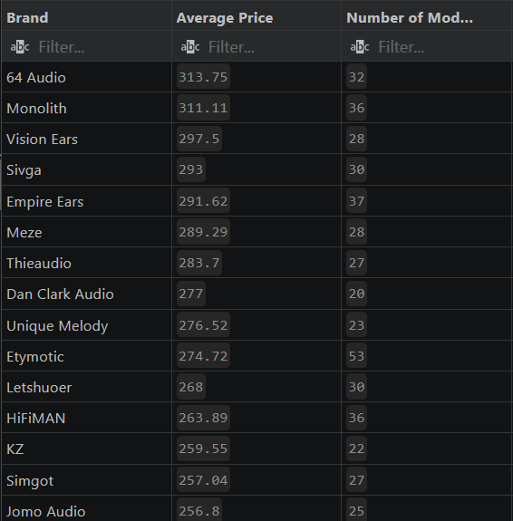
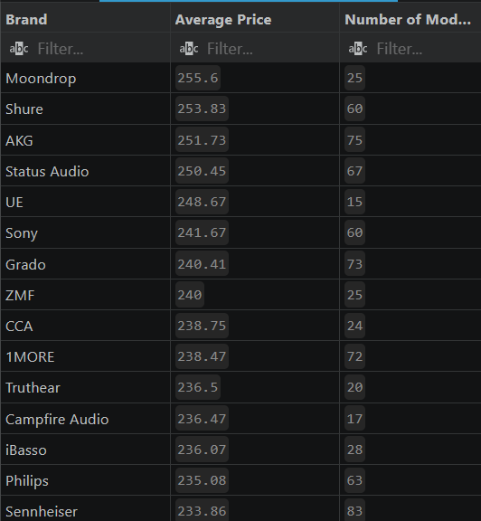
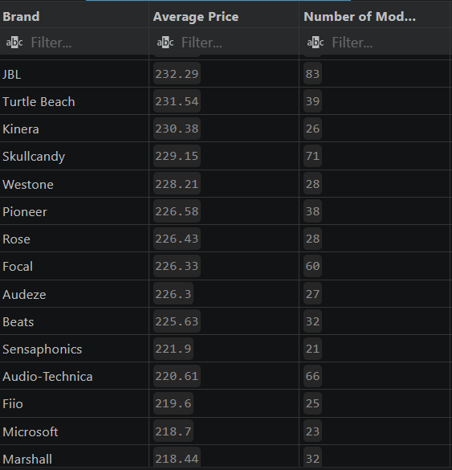
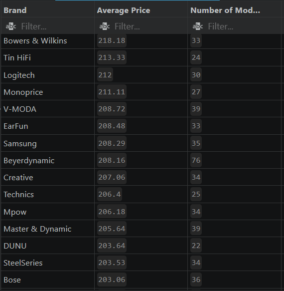
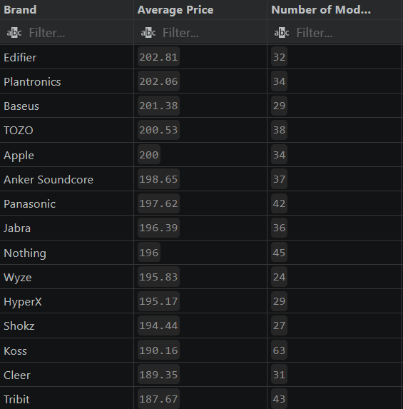
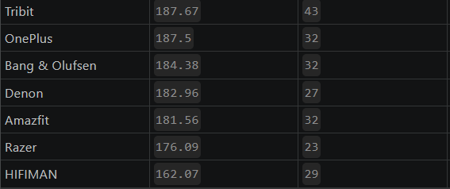

4. Segmented Performance: Top 5 Headphones by Primary Use
Goal: Identify the leaders in specific categories (e.g., Gaming, Studio, Travel).
Insight: This query uses ROW_NUMBER() to isolate the "best of the best" for each usage category, helping users quickly find the top recommended gear for their specific lifestyle.

Top 5 best rated headphones by primary use
```mysql
SELECT "Primary Use",
  brand,
  Model,
  "Price (USD)",
  round("Avg Rating", 2) AS "Average Rating"
FROM (
  SELECT *,
    ROW_NUMBER() OVER (PARTITION BY "Primary Use" ORDER BY "Avg Rating" DESC) AS rn
  FROM headphones
) 
WHERE rn <= 5
ORDER BY "Primary Use", "Average Rating" DESC; 
```
Result: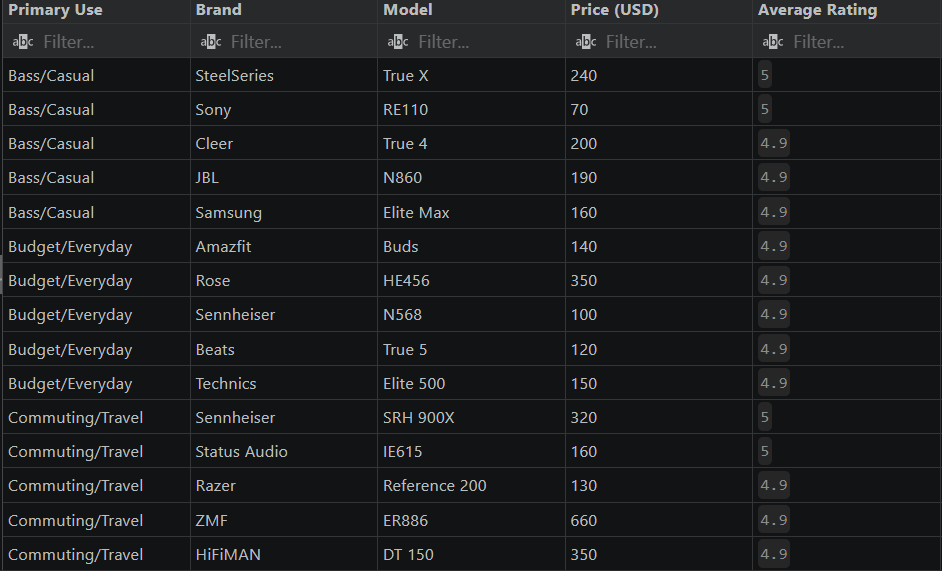
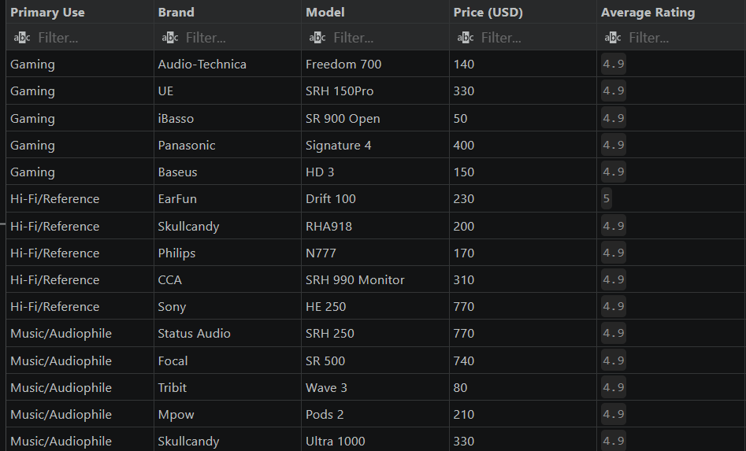
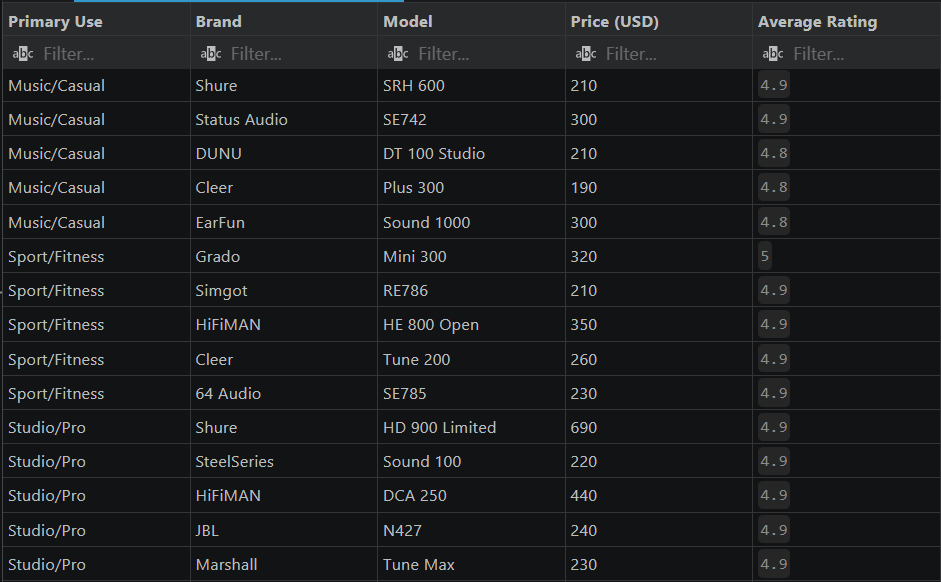
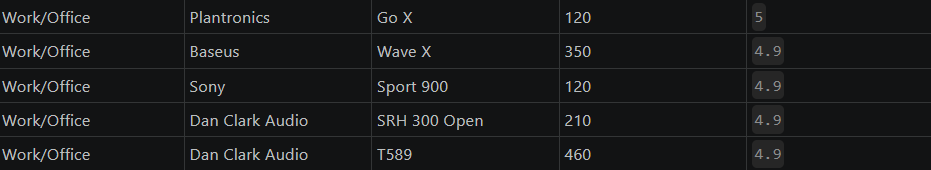

5. Price Range Benchmarking
Goal: Analyze if higher price points consistently result in better user satisfaction.
Insight: This reveals if there is a "sweet spot" for pricing, where quality peaks before diminishing returns set in.
Average rating by price range
```mysql
SELECT 
    CASE 
        WHEN CAST("Price (USD)" AS REAL) < 50 THEN 'Under $50'
        WHEN CAST("Price (USD)" AS REAL) BETWEEN 50 AND 99.99 THEN '$50-$99'
        WHEN CAST("Price (USD)" AS REAL) BETWEEN 100 AND 199.99 THEN '$100-$199'
        ELSE '$200+'
    END AS price_range,
    ROUND(AVG("Avg Rating"), 2) AS average_rating,
    COUNT(*) AS number_of_products
FROM headphones
GROUP BY price_range
ORDER BY 
    CASE price_range
        WHEN 'Under $50' THEN 1
        WHEN '$50-$99' THEN 2
        WHEN '$100-$199' THEN 3
        ELSE 4
    END;
```
Result: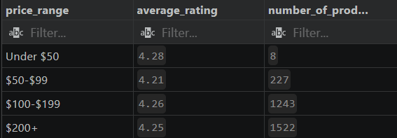

6. Within-Brand Ranking & Deviations
Goal: Identify standout models and how they compare to the brand average.
Insight: These window functions highlight "star performers"—products that significantly outperform their brand’s average—and "underperformers" that might drag a brand’s reputation down.

Ranking headphones by average rating within each brand
```mysql
SELECT 
    Brand,
    Model,
    "Avg Rating",
    "Review Count",
    RANK() OVER (
        PARTITION BY Brand 
        ORDER BY "Avg Rating" DESC, "Review Count" DESC
    ) AS rank
FROM headphones
ORDER BY Brand, rank;
```
Result:
="Model"	="Brand"	="Avg Rating"	="rating_difference"
="SR 800Pro"	="Skullcandy"	="3.3"	="-1"
="LCD 500Pro"	="AKG"	="3.3"	="-0.99"
="HE 100"	="Meze"	="3.3"	="-0.99"
="T972"	="Letshuoer"	="3.3"	="-0.97"
="HE682"	="JBL"	="3.3"	="-0.96"
="HD 500 Monitor"	="Etymotic"	="3.2"	="-0.95"
="HD 1000Pro"	="HiFiMAN"	="3.3"	="-0.94"
="SRH 150X"	="Shure"	="3.3"	="-0.91"
="RE188"	="Audio-Technica"	="3.4"	="-0.89"
="LCD 1000 Monitor"	="Audio-Technica"	="3.4"	="-0.89"
="EW381"	="Rose"	="3.3"	="-0.89"
="EW136"	="Rose"	="3.3"	="-0.89"
="EW400"	="DUNU"	="3.3"	="-0.88"
="DCA 100"	="1MORE"	="3.4"	="-0.87"
="N950"	="Letshuoer"	="3.4"	="-0.87"
="MDR 150X"	="JBL"	="3.4"	="-0.86"
="HD 700 Limited"	="Monolith"	="3.4"	="-0.86"
="SR 990X"	="Unique Melody"	="3.4"	="-0.86"
="RE786"	="Simgot"	="4.9"	="0.84"
="EW441"	="Thieaudio"	="3.4"	="-0.84"
="DCA 600X"	="Thieaudio"	="3.4"	="-0.84"
="HE 1000"	="Dan Clark Audio"	="3.3"	="-0.83"
="HE892"	="Koss"	="3.4"	="-0.83"
="Studio X"	="Denon"	="3.5"	="-0.82"
="Vibe Pro"	="Panasonic"	="3.5"	="-0.82"
="SRH 400 Open"	="Vision Ears"	="3.3"	="-0.82"
="MDR 300 Monitor"	="Sony"	="3.4"	="-0.81"
="EW179"	="Sony"	="3.4"	="-0.81"
="T738"	="Tin HiFi"	="3.3"	="-0.81"
="Mini 300"	="Grado"	="5"	="0.8"
="T42"	="Sensaphonics"	="4.8"	="0.8"
="T831"	="Rose"	="3.4"	="-0.79"
="RE110"	="Sony"	="5"	="0.79"
="SRH 600 Studio"	="DUNU"	="3.4"	="-0.78"
="K 100 Open"	="1MORE"	="3.5"	="-0.77"
="HE 600X"	="CCA"	="3.4"	="-0.77"
="HE619"	="CCA"	="3.4"	="-0.77"
="SRH 300 Open"	="Dan Clark Audio"	="4.9"	="0.77"
="T589"	="Dan Clark Audio"	="4.9"	="0.77"
="T869"	="Westone"	="3.5"	="-0.77"
="Nano 2"	="EarFun"	="3.5"	="-0.76"
="LCD 1000X"	="JBL"	="3.5"	="-0.76"
="N332"	="Monolith"	="3.5"	="-0.76"
="N223"	="Philips"	="3.5"	="-0.76"
="ATH 700Pro"	="Unique Melody"	="3.5"	="-0.76"
="DT 300"	="iBasso"	="3.4"	="-0.76"
="SE785"	="64 Audio"	="4.9"	="0.75"
="DCA 80X"	="64 Audio"	="4.9"	="0.75"
="ER605"	="Etymotic"	="3.4"	="-0.75"
="Drift 100"	="EarFun"	="5"	="0.74"
="SRH 600Pro"	="HiFiMAN"	="3.5"	="-0.74"
="IE646"	="HiFiMAN"	="3.5"	="-0.74"
="Live 3"	="Razer"	="3.7"	="-0.74"
="DCA 990"	="Sivga"	="3.4"	="-0.74"
="HE 80 Limited"	="Sivga"	="3.4"	="-0.74"
="SR 900 Open"	="iBasso"	="4.9"	="0.74"
="Active X"	="Bang & Olufsen"	="3.6"	="-0.73"
="SRH 990 Monitor"	="CCA"	="4.9"	="0.73"
="EW952"	="CCA"	="4.9"	="0.73"
="LCD 700 Open"	="Campfire Audio"	="4.9"	="0.73"
="EW253"	="Dan Clark Audio"	="3.4"	="-0.73"
="Core X"	="Focal"	="3.5"	="-0.73"
="SR 50X"	="Koss"	="3.5"	="-0.73"
="HE894"	="Koss"	="3.5"	="-0.73"
="LCD 50 Studio"	="Koss"	="3.5"	="-0.73"
="HE839"	="Sennheiser"	="3.6"	="-0.73"
="IE615"	="Status Audio"	="5"	="0.73"
="Sparks 200"	="V-MODA"	="3.6"	="-0.73"
="IE623"	="ZMF"	="3.5"	="-0.73"
="ER322"	="ZMF"	="3.5"	="-0.73"
="E233"	="ZMF"	="3.5"	="-0.73"
="RHA382"	="DUNU"	="4.9"	="0.72"
="SR 50 Limited"	="Jomo Audio"	="3.3"	="-0.72"
="Studio Pro"	="Tribit"	="3.6"	="-0.72"
="EW245"	="Moondrop"	="3.5"	="-0.71"
="HE456"	="Rose"	="4.9"	="0.71"
="N275"	="Shure"	="3.5"	="-0.71"
="SR 990Pro"	="Shure"	="3.5"	="-0.71"
="EW630"	="Shure"	="3.5"	="-0.71"
="MDR 300 Limited"	="Sony"	="3.5"	="-0.71"
="Sport 5"	="Turtle Beach"	="3.6"	="-0.71"
="HD 150Pro"	="Audeze"	="3.5"	="-0.7"
="K 800X"	="Audeze"	="3.5"	="-0.7"
="DCA 300Pro"	="Grado"	="3.5"	="-0.7"
="EW88"	="Grado"	="4.9"	="0.7"
="MDR 250Pro"	="Sensaphonics"	="4.7"	="0.7"
="ER127"	="Sensaphonics"	="4.7"	="0.7"
="Aura 3"	="Skullcandy"	="3.6"	="-0.7"
="RHA518"	="Skullcandy"	="3.6"	="-0.7"
="HE847"	="Audio-Technica"	="3.6"	="-0.69"
="Bass 2"	="Bowers & Wilkins"	="3.6"	="-0.69"
="Air 300"	="Edifier"	="4.9"	="0.69"
="LCD 990 Studio"	="Meze"	="3.6"	="-0.69"
="HD 200"	="Microsoft"	="3.6"	="-0.69"
="Go X"	="Plantronics"	="5"	="0.69"
="SRH 600"	="Shure"	="4.9"	="0.69"
="HD 900 Limited"	="Shure"	="4.9"	="0.69"
="EW547"	="Shure"	="4.9"	="0.69"
="Sport 900"	="Sony"	="4.9"	="0.69"
="HE 250"	="Sony"	="4.9"	="0.69"
="T248"	="Beyerdynamic"	="3.5"	="-0.68"
="HE210"	="Beyerdynamic"	="3.5"	="-0.68"
="DCA 150"	="1MORE"	="3.6"	="-0.67"
="IE485"	="1MORE"	="3.6"	="-0.67"
="RHA565"	="1MORE"	="3.6"	="-0.67"
="SR 500"	="Focal"	="4.9"	="0.67"
="RHA653"	="Koss"	="4.9"	="0.67"
="Active 500"	="Master & Dynamic"	="3.6"	="-0.67"
="SRH 900X"	="Sennheiser"	="5"	="0.67"
="SR 1000 Monitor"	="Status Audio"	="3.6"	="-0.67"
="Drift 300"	="Status Audio"	="3.6"	="-0.67"
="RHA413"	="Westone"	="3.6"	="-0.67"
="E883"	="Westone"	="3.6"	="-0.67"
="ER886"	="ZMF"	="4.9"	="0.67"
="DCA 600 Studio"	="ZMF"	="4.9"	="0.67"
="E877"	="ZMF"	="4.9"	="0.67"
="Buds"	="Amazfit"	="4.9"	="0.66"
="True 4"	="Cleer"	="4.9"	="0.66"
="Tune 200"	="Cleer"	="4.9"	="0.66"
="Pro 3"	="Creative"	="3.6"	="-0.66"
="DCA 250"	="HiFiMAN"	="4.9"	="0.66"
="DT 150"	="HiFiMAN"	="4.9"	="0.66"
="HE 800 Open"	="HiFiMAN"	="4.9"	="0.66"
="Zen 200"	="JBL"	="3.6"	="-0.66"
="HE 990"	="JBL"	="3.6"	="-0.66"
="T832"	="Monolith"	="3.6"	="-0.66"
="RE964"	="Monolith"	="3.6"	="-0.66"
="Drift"	="Monoprice"	="3.6"	="-0.66"
="Signature 4"	="Nothing"	="3.6"	="-0.66"
="HE 300 Open"	="Philips"	="3.6"	="-0.66"
="Plus Max"	="Philips"	="3.6"	="-0.66"
="Sport"	="Philips"	="3.6"	="-0.66"
="MDR 300 Limited"	="Simgot"	="3.4"	="-0.66"
="MDR 900X"	="Simgot"	="3.4"	="-0.66"
="RHA275"	="Thieaudio"	="4.9"	="0.66"
="RHA112"	="iBasso"	="3.5"	="-0.66"
="IE28"	="64 Audio"	="4.8"	="0.65"
="LCD 700 Limited"	="Etymotic"	="4.8"	="0.65"
="HD 700 Monitor"	="Etymotic"	="4.8"	="0.65"
="MDR 600 Open"	="Etymotic"	="4.8"	="0.65"
="Tune Max"	="Marshall"	="4.9"	="0.65"
="Buds 2"	="Marshall"	="4.9"	="0.65"
="Tune 4"	="Marshall"	="4.9"	="0.65"
="Prestige 100"	="Shokz"	="3.6"	="-0.65"
="RHA202"	="Fiio"	="4.8"	="0.64"
="HD 80X"	="Fiio"	="4.8"	="0.64"
="N860"	="JBL"	="4.9"	="0.64"
="N427"	="JBL"	="4.9"	="0.64"
="Signature 5"	="JBL"	="4.9"	="0.64"
="Sport 2"	="JBL"	="4.9"	="0.64"
="HE835"	="Monolith"	="4.9"	="0.64"
="One"	="Mpow"	="3.7"	="-0.64"
="Rhythm Max"	="Nothing"	="4.9"	="0.64"
="N777"	="Philips"	="4.9"	="0.64"
="SRH 150 Limited"	="Philips"	="4.9"	="0.64"
="Rush 900"	="Pioneer"	="3.7"	="-0.64"
="SE118"	="Sivga"	="3.5"	="-0.64"
="Core 500"	="Bang & Olufsen"	="3.7"	="-0.63"
="Air 100"	="Bang & Olufsen"	="3.7"	="-0.63"
="Air X"	="Focal"	="3.6"	="-0.63"
="SRH 150X"	="Focal"	="3.6"	="-0.63"
="ER782"	="Kinera"	="3.5"	="-0.63"
="Everest 4"	="Koss"	="3.6"	="-0.63"
="E335"	="Koss"	="3.6"	="-0.63"
="IE865"	="Sennheiser"	="3.7"	="-0.63"
="SE167"	="Sennheiser"	="3.7"	="-0.63"
="SRH 400"	="Sennheiser"	="3.7"	="-0.63"
="Series 3"	="Sennheiser"	="3.7"	="-0.63"
="Air 4"	="Sennheiser"	="3.7"	="-0.63"
="SRH 250"	="Status Audio"	="4.9"	="0.63"
="SE742"	="Status Audio"	="4.9"	="0.63"
="True X"	="SteelSeries"	="5"	="0.63"
="MDR 900"	="Westone"	="4.9"	="0.63"
="N191"	="Westone"	="4.9"	="0.63"
="LCD 80X"	="Beyerdynamic"	="4.8"	="0.62"
="Drift 2"	="Beyerdynamic"	="4.8"	="0.62"
="DT 100 Studio"	="DUNU"	="4.8"	="0.62"
="Dots 900"	="Denon"	="3.7"	="-0.62"
="EW255"	="Jomo Audio"	="3.4"	="-0.62"
="MDR 250X"	="KZ"	="3.5"	="-0.62"
="Elite Max"	="Samsung"	="4.9"	="0.62"
="Max Pro"	="Samsung"	="4.9"	="0.62"
="Dots X"	="Tribit"	="3.7"	="-0.62"
="Freedom 700"	="Audio-Technica"	="4.9"	="0.61"
="Fit 3"	="Audio-Technica"	="4.9"	="0.61"
="Veritas 2"	="Audio-Technica"	="4.9"	="0.61"
="True 5"	="Beats"	="4.9"	="0.61"
="Freedom 3"	="Beats"	="4.9"	="0.61"
="Pro 1000"	="Edifier"	="3.6"	="-0.61"
="RHA501"	="Empire Ears"	="4.8"	="0.61"
="Everest 2"	="HyperX"	="3.7"	="-0.61"
="Pods 500"	="HyperX"	="3.7"	="-0.61"
="N58"	="Moondrop"	="3.6"	="-0.61"
="RHA768"	="Moondrop"	="3.6"	="-0.61"
="RHA422"	="Rose"	="4.8"	="0.61"
="Sound 1000"	="Sony"	="3.6"	="-0.61"
="Mini X"	="Sony"	="3.6"	="-0.61"
="T571"	="Tin HiFi"	="3.5"	="-0.61"
="Reference 4"	="Turtle Beach"	="3.7"	="-0.61"
="EW131"	="UE"	="3.7"	="-0.61"
="EW960"	="UE"	="3.7"	="-0.61"
="Active"	="Wyze"	="4.9"	="0.61"
="K 900 Open"	="Audeze"	="4.8"	="0.6"
="DT 900Pro"	="Audeze"	="4.8"	="0.6"
="Dots Pro"	="Grado"	="4.8"	="0.6"
="Air 2"	="Grado"	="3.6"	="-0.6"
="Rush X"	="Grado"	="3.6"	="-0.6"
="ATH 600 Limited"	="Sensaphonics"	="3.4"	="-0.6"
="RHA918"	="Skullcandy"	="4.9"	="0.6"
="Ultra 1000"	="Skullcandy"	="4.9"	="0.6"
="HE 300X"	="Skullcandy"	="3.7"	="-0.6"
="K 900"	="Truthear"	="3.6"	="-0.6"
="LCD 300X"	="Audio-Technica"	="3.7"	="-0.59"
="Wave X"	="Baseus"	="4.9"	="0.59"
="HD 3"	="Baseus"	="4.9"	="0.59"
="Wave 5"	="Baseus"	="4.9"	="0.59"
="X Pro"	="Bowers & Wilkins"	="3.7"	="-0.59"
="DCA 250X"	="Empire Ears"	="3.6"	="-0.59"
="IE818"	="Empire Ears"	="3.6"	="-0.59"
="Veritas 100"	="HIFIMAN"	="3.7"	="-0.59"
="Air 2"	="HIFIMAN"	="3.7"	="-0.59"
="One 300"	="HyperX"	="4.9"	="0.59"
="ATH 250X"	="Moondrop"	="4.8"	="0.59"
="RHA775"	="Moondrop"	="4.8"	="0.59"
="RHA615"	="Rose"	="3.6"	="-0.59"
="HD 1000 Studio"	="Shure"	="4.8"	="0.59"
="EW20"	="Shure"	="4.8"	="0.59"
="T652"	="Shure"	="4.8"	="0.59"
="SRH 150Pro"	="UE"	="4.9"	="0.59"
="Wings 1000"	="Wyze"	="3.7"	="-0.59"
="Ultra 300"	="Wyze"	="3.7"	="-0.59"
="HE 990 Open"	="Beyerdynamic"	="3.6"	="-0.58"
="Ultra 3"	="Beyerdynamic"	="3.6"	="-0.58"
="IE77"	="Beyerdynamic"	="3.6"	="-0.58"
="RE251"	="Beyerdynamic"	="3.6"	="-0.58"
="LCD 700 Limited"	="Beyerdynamic"	="3.6"	="-0.58"
="SR 500"	="DUNU"	="3.6"	="-0.58"
="T771"	="KZ"	="4.7"	="0.58"
="Signature 4"	="Panasonic"	="4.9"	="0.58"
="Freedom 3"	="Panasonic"	="4.9"	="0.58"
="HD 1000"	="Samsung"	="3.7"	="-0.58"
="Wings 900"	="Samsung"	="3.7"	="-0.58"
="Pro 4"	="Samsung"	="3.7"	="-0.58"
="Pods X"	="Samsung"	="3.7"	="-0.58"
="True 1000"	="Sony"	="4.8"	="0.58"
="Vibe Max"	="TOZO"	="3.7"	="-0.58"
="Wave 3"	="Tribit"	="4.9"	="0.58"
="N697"	="Vision Ears"	="4.7"	="0.58"
="HE 400 Studio"	="Vision Ears"	="4.7"	="0.58"
="MDR 500 Limited"	="Vision Ears"	="4.7"	="0.58"
="E654"	="1MORE"	="3.7"	="-0.57"
="LCD 250 Limited"	="1MORE"	="3.7"	="-0.57"
="E861"	="CCA"	="3.6"	="-0.57"
="IE244"	="CCA"	="3.6"	="-0.57"
="T324"	="Dan Clark Audio"	="4.7"	="0.57"
="Series 5"	="Focal"	="4.8"	="0.57"
="IE486"	="Kinera"	="4.7"	="0.57"
="IE235"	="Kinera"	="4.7"	="0.57"
="ATH 100"	="Koss"	="4.8"	="0.57"
="Rush 700"	="Koss"	="4.8"	="0.57"
="ER593"	="Letshuoer"	="3.7"	="-0.57"
="EW158"	="Letshuoer"	="3.7"	="-0.57"
="N568"	="Sennheiser"	="4.9"	="0.57"
="Veritas Pro"	="Status Audio"	="3.7"	="-0.57"
="DCA 800 Studio"	="Status Audio"	="3.7"	="-0.57"
="HE419"	="Status Audio"	="3.7"	="-0.57"
="Plus 1000"	="Status Audio"	="3.7"	="-0.57"
="True 200"	="SteelSeries"	="3.8"	="-0.57"
="HE 800 Monitor"	="Westone"	="3.7"	="-0.57"
="Sport"	="Amazfit"	="4.8"	="0.56"
="Clear 4"	="Amazfit"	="4.8"	="0.56"
="Air 700"	="Anker Soundcore"	="4.8"	="0.56"
="Plus 300"	="Cleer"	="4.8"	="0.56"
="Vibe 3"	="Cleer"	="4.8"	="0.56"
="True X"	="Creative"	="3.7"	="-0.56"
="Nano Max"	="Creative"	="3.7"	="-0.56"
="Air Max"	="EarFun"	="3.7"	="-0.56"
="HD 700"	="Fiio"	="3.6"	="-0.56"
="ATH 1000X"	="Fiio"	="3.6"	="-0.56"
="HE710"	="HiFiMAN"	="4.8"	="0.56"
="E779"	="HiFiMAN"	="4.8"	="0.56"
="ER148"	="JBL"	="3.7"	="-0.56"
="Go 3"	="Jabra"	="3.8"	="-0.56"
="Everest 500"	="Monoprice"	="3.7"	="-0.56"
="Plus 200"	="Monoprice"	="3.7"	="-0.56"
="Pods 2"	="Mpow"	="4.9"	="0.56"
="Sparks Max"	="Nothing"	="3.7"	="-0.56"
="IE401"	="Simgot"	="3.5"	="-0.56"
="T315"	="Simgot"	="3.5"	="-0.56"
="Air X"	="Technics"	="3.8"	="-0.56"
="Rhythm 4"	="Technics"	="3.8"	="-0.56"
="LCD 50 Studio"	="Unique Melody"	="3.7"	="-0.56"
="SRH 990 Monitor"	="64 Audio"	="4.7"	="0.55"
="E610"	="64 Audio"	="3.6"	="-0.55"
="HD 990 Open"	="64 Audio"	="3.6"	="-0.55"
="SE610"	="Etymotic"	="3.6"	="-0.55"
="SR 800 Open"	="Etymotic"	="3.6"	="-0.55"
="Air 200"	="Marshall"	="3.7"	="-0.55"
="Veritas 300"	="Shokz"	="4.8"	="0.55"
="True Pro"	="Amazfit"	="3.7"	="-0.54"
="Flow 500"	="Amazfit"	="3.7"	="-0.54"
="Zen"	="Amazfit"	="3.7"	="-0.54"
="Elite 900"	="Anker Soundcore"	="3.7"	="-0.54"
="X 200"	="Anker Soundcore"	="3.7"	="-0.54"
="Sport 5"	="Creative"	="4.8"	="0.54"
="Go Pro"	="Creative"	="4.8"	="0.54"
="Sound 1000"	="EarFun"	="4.8"	="0.54"
="DCA 500"	="HiFiMAN"	="3.7"	="-0.54"
="MDR 800 Open"	="HiFiMAN"	="3.7"	="-0.54"
="HE209"	="HiFiMAN"	="3.7"	="-0.54"
="IE23"	="JBL"	="4.8"	="0.54"
="HE 100 Open"	="JBL"	="4.8"	="0.54"
="Tune 2"	="Nothing"	="4.8"	="0.54"
="RE520"	="Simgot"	="4.6"	="0.54"
="MDR 100 Limited"	="Simgot"	="4.6"	="0.54"
="RHA773"	="Sivga"	="3.6"	="-0.54"
="Elite 500"	="Technics"	="4.9"	="0.54"
="DT 80 Limited"	="Unique Melody"	="4.8"	="0.54"
="EW21"	="Unique Melody"	="4.8"	="0.54"
="ER473"	="iBasso"	="4.7"	="0.54"
="MDR 80Pro"	="iBasso"	="4.7"	="0.54"
="IE569"	="1MORE"	="4.8"	="0.53"
="Ultra X"	="1MORE"	="4.8"	="0.53"
="Drops 700"	="1MORE"	="4.8"	="0.53"
="N661"	="1MORE"	="4.8"	="0.53"
="Pro 2"	="1MORE"	="4.8"	="0.53"
="HD X"	="Bang & Olufsen"	="3.8"	="-0.53"
="Plus X"	="Bang & Olufsen"	="3.8"	="-0.53"
="SR 500 Open"	="CCA"	="4.7"	="0.53"
="RE818"	="Focal"	="3.7"	="-0.53"
="Active 3"	="Focal"	="3.7"	="-0.53"
="SR 80 Studio"	="Focal"	="3.7"	="-0.53"
="Fit 200"	="Koss"	="3.7"	="-0.53"
="E981"	="Koss"	="3.7"	="-0.53"
="RHA880"	="Letshuoer"	="4.8"	="0.53"
="Apex 900"	="Master & Dynamic"	="4.8"	="0.53"
="LCD 990"	="Sennheiser"	="3.8"	="-0.53"
="Sound 100"	="SteelSeries"	="4.9"	="0.53"
="Air 300"	="SteelSeries"	="4.9"	="0.53"
="MDR 400 Limited"	="Westone"	="4.8"	="0.53"
="RHA188"	="ZMF"	="3.7"	="-0.53"
="Signature 5"	="Beyerdynamic"	="4.7"	="0.52"
="HE 990 Studio"	="Beyerdynamic"	="4.7"	="0.52"
="Sport 1000"	="Beyerdynamic"	="4.7"	="0.52"
="Veritas 500"	="Beyerdynamic"	="4.7"	="0.52"
="Veritas Pro"	="Bose"	="3.8"	="-0.52"
="HE832"	="DUNU"	="4.7"	="0.52"
="Plus 3"	="Denon"	="3.8"	="-0.52"
="IE819"	="KZ"	="3.6"	="-0.52"
="DCA 900 Open"	="KZ"	="3.6"	="-0.52"
="Go 700"	="Logitech"	="4.8"	="0.52"
="Sparks 2"	="Logitech"	="4.8"	="0.52"
="Wave 900"	="Panasonic"	="3.8"	="-0.52"
="HD 2"	="Samsung"	="4.8"	="0.52"
="Air 3"	="Samsung"	="4.8"	="0.52"
="Ultra 4"	="Tribit"	="3.8"	="-0.52"
="LCD 400X"	="Vision Ears"	="3.6"	="-0.52"
="Reference 4"	="AKG"	="4.8"	="0.51"
="Plus 500"	="AKG"	="4.8"	="0.51"
="EW794"	="AKG"	="4.8"	="0.51"
="Active 200"	="AKG"	="4.8"	="0.51"
="Sparks X"	="Apple"	="3.8"	="-0.51"
="Buds 300"	="Apple"	="3.8"	="-0.51"
="Go 1000"	="Audio-Technica"	="4.8"	="0.51"
="Active 200"	="Baseus"	="3.8"	="-0.51"
="Sport 1000"	="Baseus"	="3.8"	="-0.51"
="Bass X"	="Baseus"	="3.8"	="-0.51"
="Veritas 2"	="Beats"	="4.8"	="0.51"
="Everest 2"	="Beats"	="4.8"	="0.51"
="Drops 3"	="Bowers & Wilkins"	="4.8"	="0.51"
="Pods 700"	="Bowers & Wilkins"	="4.8"	="0.51"
="Dots 100"	="Edifier"	="3.7"	="-0.51"
="Mini Pro"	="Edifier"	="3.7"	="-0.51"
="Plus 4"	="Edifier"	="3.7"	="-0.51"
="E730"	="Empire Ears"	="4.7"	="0.51"
="RE563"	="Empire Ears"	="4.7"	="0.51"
="Drops 200"	="HIFIMAN"	="4.8"	="0.51"
="Sport 5"	="HIFIMAN"	="4.8"	="0.51"
="Tune 4"	="HyperX"	="3.8"	="-0.51"
="SRH 700 Studio"	="Meze"	="4.8"	="0.51"
="Wave"	="Microsoft"	="4.8"	="0.51"
="Air 200"	="Microsoft"	="4.8"	="0.51"
="E19"	="Moondrop"	="3.7"	="-0.51"
="Air Pro"	="Plantronics"	="3.8"	="-0.51"
="Series 2"	="Plantronics"	="3.8"	="-0.51"
="N181"	="Rose"	="4.7"	="0.51"
="HD 250 Studio"	="Rose"	="4.7"	="0.51"
="DCA 150"	="Shure"	="3.7"	="-0.51"
="LCD 600"	="Shure"	="3.7"	="-0.51"
="LCD 500Pro"	="Shure"	="3.7"	="-0.51"
="SE909"	="Shure"	="3.7"	="-0.51"
="Go 300"	="Sony"	="3.7"	="-0.51"
="N203"	="Sony"	="3.7"	="-0.51"
="K 500 Open"	="Sony"	="3.7"	="-0.51"
="IE91"	="Audeze"	="3.7"	="-0.5"
="HD 80 Monitor"	="Audeze"	="4.7"	="0.5"
="RHA981"	="Audeze"	="4.7"	="0.5"
="T139"	="Grado"	="3.7"	="-0.5"
="HE 300 Monitor"	="Grado"	="4.7"	="0.5"
="HD 900"	="Grado"	="4.7"	="0.5"
="Sport"	="Grado"	="3.7"	="-0.5"
="RHA735"	="Sensaphonics"	="3.5"	="-0.5"
="HD 500"	="Sensaphonics"	="3.5"	="-0.5"
="MDR 150X"	="Sensaphonics"	="3.5"	="-0.5"
="LCD 1000 Studio"	="Sensaphonics"	="3.5"	="-0.5"
="SRH 50"	="Skullcandy"	="3.8"	="-0.5"
="DCA 100"	="Skullcandy"	="3.8"	="-0.5"
="Rhythm X"	="Skullcandy"	="3.8"	="-0.5"
="Elite 300"	="Skullcandy"	="3.8"	="-0.5"
="Signature"	="Skullcandy"	="4.8"	="0.5"
="HD 80"	="Truthear"	="3.7"	="-0.5"
="SRH 1000"	="Truthear"	="4.7"	="0.5"
="HD 150"	="Truthear"	="3.7"	="-0.5"
="E16"	="Truthear"	="3.7"	="-0.5"
="RE909"	="Truthear"	="4.7"	="0.5"
="DCA 800Pro"	="AKG"	="3.8"	="-0.49"
="Pods X"	="AKG"	="3.8"	="-0.49"
="HE458"	="AKG"	="3.8"	="-0.49"
="Mini Max"	="Beats"	="3.8"	="-0.49"
="Clear Max"	="Beats"	="3.8"	="-0.49"
="Wave 3"	="Beats"	="3.8"	="-0.49"
="Ultra 500"	="Edifier"	="4.7"	="0.49"
="LCD 150 Studio"	="Empire Ears"	="3.7"	="-0.49"
="Studio 5"	="HyperX"	="4.8"	="0.49"
="HE936"	="Meze"	="3.8"	="-0.49"
="RHA248"	="Meze"	="3.8"	="-0.49"
="Ultra 3"	="Microsoft"	="3.8"	="-0.49"
="Rhythm X"	="Plantronics"	="4.8"	="0.49"
="ATH 900"	="Rose"	="3.7"	="-0.49"
="RHA449"	="Rose"	="3.7"	="-0.49"
="SE705"	="Shure"	="4.7"	="0.49"
="SRH 100X"	="Shure"	="4.7"	="0.49"
="ATH 500"	="Shure"	="4.7"	="0.49"
="Active 100"	="Sony"	="4.7"	="0.49"
="Sport 700"	="Sony"	="4.7"	="0.49"
="E343"	="Sony"	="4.7"	="0.49"
="Drift 2"	="Turtle Beach"	="4.8"	="0.49"
="Nano 100"	="Turtle Beach"	="4.8"	="0.49"
="RHA354"	="UE"	="4.8"	="0.49"
="RE594"	="UE"	="4.8"	="0.49"
="IE408"	="UE"	="4.8"	="0.49"
="Pro 200"	="Wyze"	="3.8"	="-0.49"
="Wave 200"	="Wyze"	="3.8"	="-0.49"
="HE 150Pro"	="Beyerdynamic"	="3.7"	="-0.48"
="Go 500"	="Beyerdynamic"	="3.7"	="-0.48"
="Series 200"	="Beyerdynamic"	="3.7"	="-0.48"
="Buds 900"	="Bose"	="4.8"	="0.48"
="Elite 300"	="Denon"	="4.8"	="0.48"
="Wave 900"	="Denon"	="4.8"	="0.48"
="N553"	="Jomo Audio"	="4.5"	="0.48"
="RE683"	="Jomo Audio"	="4.5"	="0.48"
="E562"	="Jomo Audio"	="4.5"	="0.48"
="RE113"	="Jomo Audio"	="4.5"	="0.48"
="SE280"	="KZ"	="4.6"	="0.48"
="Plus 200"	="Logitech"	="3.8"	="-0.48"
="Elite 900"	="Panasonic"	="4.8"	="0.48"
="Fit Max"	="Samsung"	="3.8"	="-0.48"
="Pro 700"	="TOZO"	="3.8"	="-0.48"
="Rush 2"	="Tribit"	="4.8"	="0.48"
="Sound X"	="Tribit"	="4.8"	="0.48"
="Series X"	="Tribit"	="4.8"	="0.48"
="Aura 200"	="Tribit"	="4.8"	="0.48"
="E552"	="Vision Ears"	="4.6"	="0.48"
="Wave 500"	="1MORE"	="3.8"	="-0.47"
="Aura Max"	="1MORE"	="3.8"	="-0.47"
="Pro 100"	="Bang & Olufsen"	="4.8"	="0.47"
="Elite 700"	="Bang & Olufsen"	="4.8"	="0.47"
="Pro 500"	="Bang & Olufsen"	="4.8"	="0.47"
="ER930"	="CCA"	="3.7"	="-0.47"
="HE 900 Monitor"	="CCA"	="3.7"	="-0.47"
="HE438"	="Campfire Audio"	="3.7"	="-0.47"
="K 400Pro"	="Campfire Audio"	="3.7"	="-0.47"
="MDR 800X"	="Dan Clark Audio"	="4.6"	="0.47"
="HE 100X"	="Dan Clark Audio"	="4.6"	="0.47"
="Go Pro"	="Focal"	="4.7"	="0.47"
="Plus 1000"	="Koss"	="4.7"	="0.47"
="Elite 3"	="Koss"	="4.7"	="0.47"
="Mini 4"	="Koss"	="4.7"	="0.47"
="Reference X"	="Koss"	="4.7"	="0.47"
="E219"	="Letshuoer"	="3.8"	="-0.47"
="Ultra"	="Master & Dynamic"	="3.8"	="-0.47"
="Signature"	="Sennheiser"	="4.8"	="0.47"
="SE349"	="Sennheiser"	="4.8"	="0.47"
="SR 400"	="Status Audio"	="3.8"	="-0.47"
="Live 2"	="Status Audio"	="3.8"	="-0.47"
="K 300X"	="Status Audio"	="3.8"	="-0.47"
="Sport X"	="SteelSeries"	="3.9"	="-0.47"
="Veritas 300"	="SteelSeries"	="3.9"	="-0.47"
="Core Max"	="SteelSeries"	="3.9"	="-0.47"
="Freedom 900"	="SteelSeries"	="3.9"	="-0.47"
="MDR 150 Studio"	="Westone"	="3.8"	="-0.47"
="RE957"	="ZMF"	="4.7"	="0.47"
="MDR 80X"	="ZMF"	="4.7"	="0.47"
="IE753"	="ZMF"	="4.7"	="0.47"
="Sound Max"	="Amazfit"	="4.7"	="0.46"
="Veritas Max"	="Anker Soundcore"	="4.7"	="0.46"
="Pro Max"	="Anker Soundcore"	="4.7"	="0.46"
="Plus 700"	="Creative"	="3.8"	="-0.46"
="Live 3"	="EarFun"	="3.8"	="-0.46"
="X 2"	="EarFun"	="3.8"	="-0.46"
="ER967"	="Fiio"	="3.7"	="-0.46"
="IE704"	="Fiio"	="3.7"	="-0.46"
="HD 800 Monitor"	="Fiio"	="3.7"	="-0.46"
="HE36"	="Fiio"	="3.7"	="-0.46"
="N736"	="Fiio"	="3.7"	="-0.46"
="LCD 300 Limited"	="HiFiMAN"	="4.7"	="0.46"
="ER581"	="HiFiMAN"	="4.7"	="0.46"
="Series 3"	="JBL"	="3.8"	="-0.46"
="ER54"	="JBL"	="3.8"	="-0.46"
="Wave 5"	="JBL"	="3.8"	="-0.46"
="IE510"	="JBL"	="3.8"	="-0.46"
="Active 5"	="Jabra"	="3.9"	="-0.46"
="Go Max"	="Jabra"	="3.9"	="-0.46"
="Veritas 4"	="Jabra"	="3.9"	="-0.46"
="ER988"	="Monolith"	="3.8"	="-0.46"
="Everest 900"	="Monoprice"	="3.8"	="-0.46"
="Active 700"	="Mpow"	="4.8"	="0.46"
="Bass 500"	="Nothing"	="3.8"	="-0.46"
="Aura Max"	="Nothing"	="3.8"	="-0.46"
="Freedom 4"	="Nothing"	="3.8"	="-0.46"
="Bass 2"	="Nothing"	="3.8"	="-0.46"
="SRH 400"	="Philips"	="3.8"	="-0.46"
="Pro Pro"	="Pioneer"	="4.8"	="0.46"
="Mini 4"	="Pioneer"	="4.8"	="0.46"
="Reference 200"	="Razer"	="4.9"	="0.46"
="Pro Pro"	="Razer"	="4.9"	="0.46"
="IE529"	="Simgot"	="3.6"	="-0.46"
="SR 50"	="Sivga"	="4.6"	="0.46"
="K 600X"	="Sivga"	="4.6"	="0.46"
="LCD 600 Limited"	="Sivga"	="4.6"	="0.46"
="IE811"	="Sivga"	="4.6"	="0.46"
="Vibe 700"	="Technics"	="3.9"	="-0.46"
="K 300"	="iBasso"	="3.7"	="-0.46"
="RE589"	="iBasso"	="3.7"	="-0.46"
="RE96"	="64 Audio"	="3.7"	="-0.45"
="SRH 300 Open"	="64 Audio"	="3.7"	="-0.45"
="ATH 1000 Monitor"	="64 Audio"	="3.7"	="-0.45"
="HD 100 Studio"	="64 Audio"	="3.7"	="-0.45"
="N340"	="64 Audio"	="3.7"	="-0.45"
="DCA 400"	="Etymotic"	="4.6"	="0.45"
="HE 400"	="Etymotic"	="3.7"	="-0.45"
="HD 80 Studio"	="Etymotic"	="3.7"	="-0.45"
="MDR 80Pro"	="Etymotic"	="4.6"	="0.45"
="SRH 250"	="Etymotic"	="4.6"	="0.45"
="Core 1000"	="Marshall"	="3.8"	="-0.45"
="Buds 500"	="Marshall"	="4.7"	="0.45"
="Signature 700"	="Marshall"	="3.8"	="-0.45"
="Sport 900"	="OnePlus"	="4.7"	="0.45"
="Live 300"	="OnePlus"	="3.8"	="-0.45"
="HD 5"	="OnePlus"	="3.8"	="-0.45"
="Prestige 2"	="Shokz"	="4.7"	="0.45"
="Everest Pro"	="Amazfit"	="3.8"	="-0.44"
="Air 1000"	="Anker Soundcore"	="3.8"	="-0.44"
="Everest 500"	="Anker Soundcore"	="3.8"	="-0.44"
="Drops 5"	="Anker Soundcore"	="3.8"	="-0.44"
="Reference 100"	="Anker Soundcore"	="3.8"	="-0.44"
="Flow 300"	="Anker Soundcore"	="3.8"	="-0.44"
="Ultra 200"	="Cleer"	="3.8"	="-0.44"
="Plus 900"	="Cleer"	="3.8"	="-0.44"
="Freedom X"	="Cleer"	="3.8"	="-0.44"
="Plus 5"	="Creative"	="4.7"	="0.44"
="Sparks 900"	="Creative"	="4.7"	="0.44"
="Rush 5"	="EarFun"	="4.7"	="0.44"
="ER206"	="Fiio"	="4.6"	="0.44"
="LCD 100 Open"	="HiFiMAN"	="3.8"	="-0.44"
="SR 400"	="JBL"	="4.7"	="0.44"
="Dots Max"	="JBL"	="4.7"	="0.44"
="Bass 700"	="JBL"	="4.7"	="0.44"
="Sport 1000"	="Jabra"	="4.8"	="0.44"
="Go Max"	="Jabra"	="4.8"	="0.44"
="Sport 500"	="Monoprice"	="4.7"	="0.44"
="Studio 700"	="Monoprice"	="4.7"	="0.44"
="Max 4"	="Monoprice"	="4.7"	="0.44"
="Air 700"	="Monoprice"	="4.7"	="0.44"
="Air 200"	="Monoprice"	="4.7"	="0.44"
="Elite 5"	="Mpow"	="3.9"	="-0.44"
="Drops"	="Mpow"	="3.9"	="-0.44"
="Aura Pro"	="Nothing"	="4.7"	="0.44"
="Sound Pro"	="Nothing"	="4.7"	="0.44"
="Bass"	="Philips"	="4.7"	="0.44"
="Active 500"	="Philips"	="4.7"	="0.44"
="DCA 400 Open"	="Philips"	="4.7"	="0.44"
="EW791"	="Philips"	="4.7"	="0.44"
="True 700"	="Pioneer"	="3.9"	="-0.44"
="Sport X"	="Razer"	="4"	="-0.44"
="T275"	="Simgot"	="4.5"	="0.44"
="SRH 50 Studio"	="Simgot"	="4.5"	="0.44"
="RHA945"	="Simgot"	="4.5"	="0.44"
="IE667"	="Simgot"	="4.5"	="0.44"
="Aura Pro"	="Technics"	="4.8"	="0.44"
="Pro X"	="Technics"	="4.8"	="0.44"
="HD 4"	="Technics"	="4.8"	="0.44"
="MDR 700"	="Unique Melody"	="4.7"	="0.44"
="SRH 80 Studio"	="Unique Melody"	="4.7"	="0.44"
="DT 300"	="iBasso"	="4.6"	="0.44"
="Pro 5"	="1MORE"	="4.7"	="0.43"
="E404"	="1MORE"	="4.7"	="0.43"
="Drift"	="1MORE"	="4.7"	="0.43"
="ATH 700 Limited"	="1MORE"	="4.7"	="0.43"
="E787"	="1MORE"	="4.7"	="0.43"
="ER362"	="1MORE"	="4.7"	="0.43"
="Wings 1000"	="1MORE"	="4.7"	="0.43"
="Plus 4"	="Bang & Olufsen"	="3.9"	="-0.43"
="LCD 300Pro"	="CCA"	="4.6"	="0.43"
="SR 700 Monitor"	="CCA"	="4.6"	="0.43"
="LCD 990 Monitor"	="Dan Clark Audio"	="3.7"	="-0.43"
="SE200"	="Dan Clark Audio"	="3.7"	="-0.43"
="RE563"	="Dan Clark Audio"	="3.7"	="-0.43"
="ATH 1000X"	="Dan Clark Audio"	="3.7"	="-0.43"
="HE 50Pro"	="Kinera"	="3.7"	="-0.43"
="ER383"	="Kinera"	="3.7"	="-0.43"
="EW622"	="Koss"	="3.8"	="-0.43"
="HD 600"	="Koss"	="3.8"	="-0.43"
="HE693"	="Letshuoer"	="4.7"	="0.43"
="T427"	="Letshuoer"	="4.7"	="0.43"
="SE31"	="Letshuoer"	="4.7"	="0.43"
="DT 800"	="Letshuoer"	="4.7"	="0.43"
="Buds 3"	="Master & Dynamic"	="4.7"	="0.43"
="RHA882"	="Sennheiser"	="3.9"	="-0.43"
="T777"	="Sennheiser"	="3.9"	="-0.43"
="Pro 4"	="Status Audio"	="4.7"	="0.43"
="Apex 900"	="Status Audio"	="4.7"	="0.43"
="SRH 900Pro"	="Status Audio"	="4.7"	="0.43"
="Apex Max"	="Status Audio"	="4.7"	="0.43"
="Aura"	="Status Audio"	="4.7"	="0.43"
="X 100"	="Status Audio"	="4.7"	="0.43"
="Pro Pro"	="Status Audio"	="4.7"	="0.43"
="Tune 3"	="SteelSeries"	="4.8"	="0.43"
="Prestige 5"	="SteelSeries"	="4.8"	="0.43"
="Sparks 500"	="V-MODA"	="3.9"	="-0.43"
="Freedom 900"	="V-MODA"	="3.9"	="-0.43"
="Air X"	="V-MODA"	="3.9"	="-0.43"
="RHA232"	="Westone"	="4.7"	="0.43"
="SR 150Pro"	="ZMF"	="3.8"	="-0.43"
="ER81"	="Beyerdynamic"	="4.6"	="0.42"
="Pods 900"	="Beyerdynamic"	="4.6"	="0.42"
="Flow"	="Beyerdynamic"	="4.6"	="0.42"
="Bass 3"	="Beyerdynamic"	="4.6"	="0.42"
="Reference 100"	="Beyerdynamic"	="4.6"	="0.42"
="Sport Pro"	="Bose"	="3.9"	="-0.42"
="Max 4"	="Bose"	="3.9"	="-0.42"
="Vibe 900"	="Bose"	="3.9"	="-0.42"
="SR 100"	="DUNU"	="4.6"	="0.42"
="T677"	="DUNU"	="4.6"	="0.42"
="Prestige Max"	="Denon"	="3.9"	="-0.42"
="T120"	="Jomo Audio"	="3.6"	="-0.42"
="RE615"	="Jomo Audio"	="3.6"	="-0.42"
="HD 50"	="KZ"	="3.7"	="-0.42"
="Sport 300"	="Logitech"	="4.7"	="0.42"
="Wave 2"	="Panasonic"	="3.9"	="-0.42"
="Buds Pro"	="Panasonic"	="3.9"	="-0.42"
="Nano 1000"	="Panasonic"	="3.9"	="-0.42"
="Studio 500"	="Samsung"	="4.7"	="0.42"
="RE393"	="Sony"	="3.8"	="-0.42"
="Signature"	="Sony"	="3.8"	="-0.42"
="Air X"	="TOZO"	="4.7"	="0.42"
="Series 3"	="TOZO"	="4.7"	="0.42"
="Go 4"	="Tribit"	="3.9"	="-0.42"
="Mini 900"	="Tribit"	="3.9"	="-0.42"
="Flow 200"	="Tribit"	="3.9"	="-0.42"
="Drift Max"	="Tribit"	="3.9"	="-0.42"
="Freedom 4"	="Tribit"	="3.9"	="-0.42"
="Aura 3"	="Tribit"	="3.9"	="-0.42"
="DT 1000X"	="Vision Ears"	="3.7"	="-0.42"
="RHA191"	="Vision Ears"	="3.7"	="-0.42"
="E543"	="Vision Ears"	="3.7"	="-0.42"
="HD 150Pro"	="Vision Ears"	="3.7"	="-0.42"
="Sport Max"	="AKG"	="4.7"	="0.41"
="ER36"	="AKG"	="4.7"	="0.41"
="SRH 600X"	="AKG"	="4.7"	="0.41"
="Sparks 500"	="Apple"	="3.9"	="-0.41"
="Sport X"	="Audio-Technica"	="4.7"	="0.41"
="Signature 200"	="Audio-Technica"	="4.7"	="0.41"
="Rush 3"	="Baseus"	="3.9"	="-0.41"
="Sound 500"	="Baseus"	="3.9"	="-0.41"
="Drops X"	="Beats"	="4.7"	="0.41"
="Elite 5"	="Bowers & Wilkins"	="4.7"	="0.41"
="True Max"	="Bowers & Wilkins"	="4.7"	="0.41"
="Aura 700"	="Edifier"	="3.8"	="-0.41"
="Buds 3"	="Edifier"	="3.8"	="-0.41"
="HE 80X"	="Empire Ears"	="4.6"	="0.41"
="HD 900"	="HIFIMAN"	="4.7"	="0.41"
="One 700"	="HIFIMAN"	="4.7"	="0.41"
="Mini X"	="HyperX"	="3.9"	="-0.41"
="Active 300"	="HyperX"	="3.9"	="-0.41"
="SRH 800 Limited"	="Meze"	="4.7"	="0.41"
="Rhythm 300"	="Microsoft"	="4.7"	="0.41"
="X X"	="Plantronics"	="3.9"	="-0.41"
="Freedom 1000"	="Plantronics"	="3.9"	="-0.41"
="RE13"	="Rose"	="4.6"	="0.41"
="ER923"	="Rose"	="4.6"	="0.41"
="ATH 700Pro"	="Shure"	="3.8"	="-0.41"
="DT 50Pro"	="Shure"	="3.8"	="-0.41"
="IE10"	="Tin HiFi"	="3.7"	="-0.41"
="Aura Max"	="Turtle Beach"	="3.9"	="-0.41"
="Studio Pro"	="Turtle Beach"	="3.9"	="-0.41"
="Tune"	="Turtle Beach"	="3.9"	="-0.41"
="ER328"	="UE"	="3.9"	="-0.41"
="IE728"	="UE"	="3.9"	="-0.41"
="True 500"	="Wyze"	="4.7"	="0.41"
="Mini 200"	="Wyze"	="4.7"	="0.41"
="MDR 100 Monitor"	="Audeze"	="3.8"	="-0.4"
="SRH 900X"	="Audeze"	="3.8"	="-0.4"
="T870"	="Audeze"	="4.6"	="0.4"
="RE579"	="Audeze"	="3.8"	="-0.4"
="RE194"	="Grado"	="3.8"	="-0.4"
="IE588"	="Grado"	="4.6"	="0.4"
="Sparks 300"	="Grado"	="4.6"	="0.4"
="Live 200"	="Grado"	="3.8"	="-0.4"
="SE944"	="Grado"	="3.8"	="-0.4"
="LCD 150 Studio"	="Grado"	="4.6"	="0.4"
="Rhythm 900"	="Grado"	="3.8"	="-0.4"
="K 500 Open"	="Sensaphonics"	="4.4"	="0.4"
="ATH 300 Monitor"	="Sensaphonics"	="3.6"	="-0.4"
="RE781"	="Sensaphonics"	="4.4"	="0.4"
="LCD 800 Open"	="Sensaphonics"	="4.4"	="0.4"
="HD 100"	="Skullcandy"	="3.9"	="-0.4"
="Pro 500"	="Skullcandy"	="4.7"	="0.4"
="RE903"	="Skullcandy"	="4.7"	="0.4"
="HE200"	="Skullcandy"	="4.7"	="0.4"
="ER699"	="Skullcandy"	="3.9"	="-0.4"
="Sport 700"	="Skullcandy"	="4.7"	="0.4"
="DCA 700"	="Skullcandy"	="3.9"	="-0.4"
="SR 150 Studio"	="Skullcandy"	="4.7"	="0.4"
="DCA 800 Limited"	="AKG"	="3.9"	="-0.39"
="DCA 300"	="AKG"	="3.9"	="-0.39"
="Pro 1000"	="Apple"	="4.7"	="0.39"
="Pods 300"	="Apple"	="4.7"	="0.39"
="SR 150 Monitor"	="Audio-Technica"	="3.9"	="-0.39"
="Go X"	="Audio-Technica"	="3.9"	="-0.39"
="LCD 500X"	="Audio-Technica"	="3.9"	="-0.39"
="RHA883"	="Audio-Technica"	="3.9"	="-0.39"
="Wave X"	="Audio-Technica"	="3.9"	="-0.39"
="Sport 100"	="Audio-Technica"	="3.9"	="-0.39"
="HE642"	="Audio-Technica"	="3.9"	="-0.39"
="K 400X"	="Audio-Technica"	="3.9"	="-0.39"
="Prestige 100"	="Beats"	="3.9"	="-0.39"
="Vibe 200"	="Beats"	="3.9"	="-0.39"
="Dots 1000"	="Bowers & Wilkins"	="3.9"	="-0.39"
="Series 4"	="Bowers & Wilkins"	="3.9"	="-0.39"
="Pro 2"	="Edifier"	="4.6"	="0.39"
="Rhythm 200"	="Edifier"	="4.6"	="0.39"
="Studio 1000"	="Edifier"	="4.6"	="0.39"
="Plus 900"	="Edifier"	="4.6"	="0.39"
="Rhythm 300"	="Edifier"	="4.6"	="0.39"
="HE 990"	="Empire Ears"	="3.8"	="-0.39"
="K 700"	="Empire Ears"	="3.8"	="-0.39"
="Freedom 2"	="HIFIMAN"	="3.9"	="-0.39"
="Bass 4"	="HIFIMAN"	="3.9"	="-0.39"
="Pods 4"	="HIFIMAN"	="3.9"	="-0.39"
="Sound 3"	="HIFIMAN"	="3.9"	="-0.39"
="Sound"	="HyperX"	="4.7"	="0.39"
="Active 2"	="HyperX"	="4.7"	="0.39"
="Sport Max"	="HyperX"	="4.7"	="0.39"
="Elite 1000"	="HyperX"	="4.7"	="0.39"
="SR 150 Monitor"	="Moondrop"	="4.6"	="0.39"
="SE898"	="Moondrop"	="4.6"	="0.39"
="Air 100"	="Plantronics"	="4.7"	="0.39"
="MDR 990 Open"	="Rose"	="3.8"	="-0.39"
="HE 80 Monitor"	="Tin HiFi"	="4.5"	="0.39"
="RE94"	="Tin HiFi"	="4.5"	="0.39"
="HD 300X"	="Tin HiFi"	="4.5"	="0.39"
="DT 250"	="Truthear"	="4.6"	="0.39"
="SRH 800 Monitor"	="Truthear"	="4.6"	="0.39"
="X 700"	="Beyerdynamic"	="3.8"	="-0.38"
="HD 600X"	="Beyerdynamic"	="3.8"	="-0.38"
="DT 80"	="Beyerdynamic"	="3.8"	="-0.38"
="SRH 800 Open"	="Beyerdynamic"	="3.8"	="-0.38"
="Wings 3"	="Beyerdynamic"	="3.8"	="-0.38"
="K 700"	="Beyerdynamic"	="3.8"	="-0.38"
="DT 80 Open"	="Beyerdynamic"	="3.8"	="-0.38"
="Nano X"	="Bose"	="4.7"	="0.38"
="Buds 5"	="Bose"	="4.7"	="0.38"
="Apex 1000"	="Denon"	="4.7"	="0.38"
="DCA 400Pro"	="Jomo Audio"	="4.4"	="0.38"
="HD 990 Open"	="Jomo Audio"	="4.4"	="0.38"
="E169"	="Jomo Audio"	="4.4"	="0.38"
="HD 800 Studio"	="KZ"	="4.5"	="0.38"
="Mini 200"	="Logitech"	="3.9"	="-0.38"
="Air 700"	="Logitech"	="3.9"	="-0.38"
="Pods 5"	="Panasonic"	="4.7"	="0.38"
="Plus 5"	="Panasonic"	="4.7"	="0.38"
="Core 1000"	="Samsung"	="3.9"	="-0.38"
="MDR 250X"	="Sony"	="4.6"	="0.38"
="Sport 700"	="Sony"	="4.6"	="0.38"
="ATH 800 Studio"	="Sony"	="4.6"	="0.38"
="LCD 50X"	="Sony"	="4.6"	="0.38"
="LCD 600 Monitor"	="Sony"	="4.6"	="0.38"
="Live 900"	="TOZO"	="3.9"	="-0.38"
="Pro 200"	="TOZO"	="3.9"	="-0.38"
="Go Max"	="TOZO"	="3.9"	="-0.38"
="Plus 300"	="Tribit"	="4.7"	="0.38"
="Buds 1000"	="Tribit"	="4.7"	="0.38"
="MDR 250 Monitor"	="Vision Ears"	="4.5"	="0.38"
="T766"	="Vision Ears"	="4.5"	="0.38"
="T589"	="Vision Ears"	="4.5"	="0.38"
="E641"	="1MORE"	="3.9"	="-0.37"
="Wave 4"	="1MORE"	="3.9"	="-0.37"
="Reference 1000"	="1MORE"	="3.9"	="-0.37"
="Sound 100"	="1MORE"	="3.9"	="-0.37"
="Rhythm 5"	="Bang & Olufsen"	="4.7"	="0.37"
="HD X"	="Bang & Olufsen"	="4.7"	="0.37"
="Sport X"	="Bang & Olufsen"	="4.7"	="0.37"
="Drift 3"	="Bang & Olufsen"	="4.7"	="0.37"
="X Pro"	="Bang & Olufsen"	="4.7"	="0.37"
="EW388"	="CCA"	="3.8"	="-0.37"
="N271"	="Campfire Audio"	="3.8"	="-0.37"
="EW665"	="Dan Clark Audio"	="4.5"	="0.37"
="ER158"	="Dan Clark Audio"	="4.5"	="0.37"
="Dots 5"	="Focal"	="4.6"	="0.37"
="SR 80"	="Focal"	="4.6"	="0.37"
="Rush 900"	="Focal"	="4.6"	="0.37"
="SR 150 Limited"	="Focal"	="4.6"	="0.37"
="Sport 1000"	="Focal"	="4.6"	="0.37"
="Mini 4"	="Focal"	="4.6"	="0.37"
="IE69"	="Kinera"	="4.5"	="0.37"
="K 500Pro"	="Kinera"	="4.5"	="0.37"
="SR 100 Monitor"	="Kinera"	="4.5"	="0.37"
="X 2"	="Koss"	="4.6"	="0.37"
="Aura X"	="Koss"	="4.6"	="0.37"
="Flow 100"	="Koss"	="4.6"	="0.37"
="EW680"	="Koss"	="4.6"	="0.37"
="ATH 900"	="Letshuoer"	="3.9"	="-0.37"
="Flow X"	="Master & Dynamic"	="3.9"	="-0.37"
="Everest 900"	="Master & Dynamic"	="3.9"	="-0.37"
="Active 1000"	="Master & Dynamic"	="3.9"	="-0.37"
="Max X"	="Master & Dynamic"	="3.9"	="-0.37"
="DCA 600X"	="Sennheiser"	="4.7"	="0.37"
="ATH 150X"	="Sennheiser"	="4.7"	="0.37"
="True 200"	="Sennheiser"	="4.7"	="0.37"
="ATH 800 Monitor"	="Sennheiser"	="4.7"	="0.37"
="E197"	="Sennheiser"	="4.7"	="0.37"
="X 700"	="Sennheiser"	="4.7"	="0.37"
="ER220"	="Sennheiser"	="4.7"	="0.37"
="Aura"	="Sennheiser"	="4.7"	="0.37"
="EW799"	="Status Audio"	="3.9"	="-0.37"
="Apex 1000"	="Status Audio"	="3.9"	="-0.37"
="N649"	="Status Audio"	="3.9"	="-0.37"
="Drift 3"	="Status Audio"	="3.9"	="-0.37"
="Everest 3"	="Status Audio"	="3.9"	="-0.37"
="Freedom X"	="SteelSeries"	="4"	="-0.37"
="Max Pro"	="V-MODA"	="4.7"	="0.37"
="Ultra 300"	="V-MODA"	="4.7"	="0.37"
="HD 3"	="V-MODA"	="4.7"	="0.37"
="True 5"	="V-MODA"	="4.7"	="0.37"
="HE304"	="Westone"	="3.9"	="-0.37"
="IE224"	="Westone"	="3.9"	="-0.37"
="Plus 200"	="Amazfit"	="4.6"	="0.36"
="Flow 700"	="Anker Soundcore"	="4.6"	="0.36"
="Active 2"	="Anker Soundcore"	="4.6"	="0.36"
="Plus 4"	="Anker Soundcore"	="4.6"	="0.36"
="One 1000"	="Cleer"	="4.6"	="0.36"
="Fit 700"	="Cleer"	="4.6"	="0.36"
="Go 4"	="Creative"	="3.9"	="-0.36"
="Sport 1000"	="Creative"	="3.9"	="-0.36"
="Sport 900"	="Creative"	="3.9"	="-0.36"
="Nano"	="EarFun"	="3.9"	="-0.36"
="Series 100"	="EarFun"	="3.9"	="-0.36"
="Dots 3"	="EarFun"	="3.9"	="-0.36"
="HE 800Pro"	="Fiio"	="3.8"	="-0.36"
="LCD 500 Limited"	="HiFiMAN"	="4.6"	="0.36"
="Series 700"	="JBL"	="3.9"	="-0.36"
="SE928"	="JBL"	="3.9"	="-0.36"
="Prestige 900"	="JBL"	="3.9"	="-0.36"
="Drops 200"	="JBL"	="3.9"	="-0.36"
="Max 300"	="JBL"	="3.9"	="-0.36"
="K 150 Open"	="JBL"	="3.9"	="-0.36"
="Plus Max"	="Jabra"	="4"	="-0.36"
="Freedom 300"	="Jabra"	="4"	="-0.36"
="Studio 5"	="Monoprice"	="3.9"	="-0.36"
="Apex 900"	="Monoprice"	="3.9"	="-0.36"
="Go 4"	="Monoprice"	="3.9"	="-0.36"
="Everest Max"	="Mpow"	="4.7"	="0.36"
="One Pro"	="Mpow"	="4.7"	="0.36"
="HD X"	="Mpow"	="4.7"	="0.36"
="Pro X"	="Nothing"	="3.9"	="-0.36"
="Dots"	="Nothing"	="3.9"	="-0.36"
="Clear 5"	="Philips"	="3.9"	="-0.36"
="Series X"	="Philips"	="3.9"	="-0.36"
="IE215"	="Philips"	="3.9"	="-0.36"
="Prestige 4"	="Philips"	="3.9"	="-0.36"
="Rhythm 5"	="Philips"	="3.9"	="-0.36"
="Active"	="Pioneer"	="4.7"	="0.36"
="Sound 300"	="Pioneer"	="4.7"	="0.36"
="Series 4"	="Pioneer"	="4.7"	="0.36"
="Sparks X"	="Razer"	="4.8"	="0.36"
="Core 2"	="Razer"	="4.8"	="0.36"
="Live 500"	="Razer"	="4.8"	="0.36"
="ER18"	="Simgot"	="3.7"	="-0.36"
="HE825"	="Simgot"	="3.7"	="-0.36"
="N39"	="Sivga"	="4.5"	="0.36"
="HE472"	="Sivga"	="4.5"	="0.36"
="Tune 1000"	="Technics"	="4"	="-0.36"
="Pro 2"	="Technics"	="4"	="-0.36"
="Live Pro"	="Technics"	="4"	="-0.36"
="Nano 4"	="Technics"	="4"	="-0.36"
="T509"	="Thieaudio"	="4.6"	="0.36"
="SR 100X"	="Thieaudio"	="4.6"	="0.36"
="SR 600 Monitor"	="Thieaudio"	="4.6"	="0.36"
="K 250 Open"	="Unique Melody"	="3.9"	="-0.36"
="SE563"	="Unique Melody"	="3.9"	="-0.36"
="HE 500"	="iBasso"	="3.8"	="-0.36"
="K 80"	="64 Audio"	="3.8"	="-0.35"
="RHA443"	="64 Audio"	="4.5"	="0.35"
="SRH 500 Open"	="64 Audio"	="4.5"	="0.35"
="SE178"	="64 Audio"	="4.5"	="0.35"
="E260"	="Etymotic"	="3.8"	="-0.35"
="RE714"	="Etymotic"	="4.5"	="0.35"
="K 1000"	="Etymotic"	="3.8"	="-0.35"
="LCD 50"	="Etymotic"	="3.8"	="-0.35"
="E969"	="Etymotic"	="4.5"	="0.35"
="N909"	="Etymotic"	="4.5"	="0.35"
="RE744"	="Etymotic"	="4.5"	="0.35"
="HE45"	="Etymotic"	="4.5"	="0.35"
="SR 1000"	="Etymotic"	="4.5"	="0.35"
="Rhythm 5"	="Marshall"	="3.9"	="-0.35"
="Drift 100"	="Marshall"	="3.9"	="-0.35"
="Aura 100"	="Marshall"	="3.9"	="-0.35"
="Everest 500"	="Marshall"	="3.9"	="-0.35"
="Air 3"	="OnePlus"	="4.6"	="0.35"
="HD 5"	="OnePlus"	="4.6"	="0.35"
="Freedom Pro"	="OnePlus"	="3.9"	="-0.35"
="Pro X"	="OnePlus"	="3.9"	="-0.35"
="Nano"	="OnePlus"	="3.9"	="-0.35"
="Active X"	="OnePlus"	="4.6"	="0.35"
="Everest 5"	="Shokz"	="3.9"	="-0.35"
="Sound"	="Shokz"	="4.6"	="0.35"
="Zen Pro"	="Shokz"	="4.6"	="0.35"
="Studio 1000"	="Shokz"	="3.9"	="-0.35"
="Bass 1000"	="Shokz"	="3.9"	="-0.35"
="Sparks 900"	="Shokz"	="3.9"	="-0.35"
="X 4"	="Shokz"	="4.6"	="0.35"
="Air 5"	="Shokz"	="3.9"	="-0.35"
="Tune X"	="Anker Soundcore"	="3.9"	="-0.34"
="HD 900"	="Anker Soundcore"	="3.9"	="-0.34"
="One 900"	="Cleer"	="3.9"	="-0.34"
="Ultra 700"	="Cleer"	="3.9"	="-0.34"
="Max Max"	="Cleer"	="3.9"	="-0.34"
="True X"	="Cleer"	="3.9"	="-0.34"
="Active 4"	="Cleer"	="3.9"	="-0.34"
="Zen"	="Creative"	="4.6"	="0.34"
="Elite 2"	="Creative"	="4.6"	="0.34"
="Studio 300"	="Creative"	="4.6"	="0.34"
="Vibe 1000"	="Creative"	="4.6"	="0.34"
="Sport X"	="Creative"	="4.6"	="0.34"
="Tune 300"	="EarFun"	="4.6"	="0.34"
="Core 700"	="EarFun"	="4.6"	="0.34"
="Zen 700"	="EarFun"	="4.6"	="0.34"
="Air 4"	="EarFun"	="4.6"	="0.34"
="SRH 600 Open"	="Fiio"	="4.5"	="0.34"
="EW233"	="Fiio"	="4.5"	="0.34"
="DT 600"	="Fiio"	="4.5"	="0.34"
="SRH 1000"	="HiFiMAN"	="3.9"	="-0.34"
="SRH 500 Limited"	="HiFiMAN"	="3.9"	="-0.34"
="Drops Pro"	="JBL"	="4.6"	="0.34"
="MDR 80 Limited"	="JBL"	="4.6"	="0.34"
="Flow"	="JBL"	="4.6"	="0.34"
="Studio 500"	="JBL"	="4.6"	="0.34"
="HE458"	="JBL"	="4.6"	="0.34"
="HD 700"	="JBL"	="4.6"	="0.34"
="LCD 800 Limited"	="JBL"	="4.6"	="0.34"
="Bass 500"	="JBL"	="4.6"	="0.34"
="Pro 1000"	="JBL"	="4.6"	="0.34"
="Active Max"	="Jabra"	="4.7"	="0.34"
="Wave 1000"	="Jabra"	="4.7"	="0.34"
="Mini 1000"	="Jabra"	="4.7"	="0.34"
="Pods 200"	="Jabra"	="4.7"	="0.34"
="Wings 900"	="Jabra"	="4.7"	="0.34"
="SR 250"	="Monolith"	="4.6"	="0.34"
="DCA 1000 Open"	="Monolith"	="4.6"	="0.34"
="SR 300X"	="Monolith"	="4.6"	="0.34"
="SR 150 Open"	="Monolith"	="4.6"	="0.34"
="N591"	="Monolith"	="4.6"	="0.34"
="ATH 700X"	="Monolith"	="4.6"	="0.34"
="LCD 900 Open"	="Monolith"	="4.6"	="0.34"
="True 1000"	="Monoprice"	="4.6"	="0.34"
="Vibe 3"	="Monoprice"	="4.6"	="0.34"
="Veritas 3"	="Mpow"	="4"	="-0.34"
="Zen"	="Mpow"	="4"	="-0.34"
="Rhythm 5"	="Mpow"	="4"	="-0.34"
="Studio 500"	="Nothing"	="4.6"	="0.34"
="Tune 100"	="Nothing"	="4.6"	="0.34"
="Sport"	="Nothing"	="4.6"	="0.34"
="Series 300"	="Nothing"	="4.6"	="0.34"
="Vibe 700"	="Philips"	="4.6"	="0.34"
="DCA 700 Open"	="Philips"	="4.6"	="0.34"
="Prestige 3"	="Philips"	="4.6"	="0.34"
="EW909"	="Philips"	="4.6"	="0.34"
="Flow 5"	="Philips"	="4.6"	="0.34"
="Reference 4"	="Philips"	="4.6"	="0.34"
="Reference 4"	="Pioneer"	="4"	="-0.34"
="Tune Pro"	="Pioneer"	="4"	="-0.34"
="Sound Pro"	="Pioneer"	="4"	="-0.34"
="Air 200"	="Pioneer"	="4"	="-0.34"
="Veritas Max"	="Pioneer"	="4"	="-0.34"
="Plus 1000"	="Pioneer"	="4"	="-0.34"
="Air Max"	="Razer"	="4.1"	="-0.34"
="Core 300"	="Razer"	="4.1"	="-0.34"
="Buds 1000"	="Razer"	="4.1"	="-0.34"
="HD 990 Limited"	="Simgot"	="4.4"	="0.34"
="K 500Pro"	="Sivga"	="3.8"	="-0.34"
="ER452"	="Sivga"	="3.8"	="-0.34"
="Active 2"	="Technics"	="4.7"	="0.34"
="Sport 3"	="Technics"	="4.7"	="0.34"
="K 900"	="Thieaudio"	="3.9"	="-0.34"
="ATH 100 Open"	="Thieaudio"	="3.9"	="-0.34"
="HD 1000 Monitor"	="Thieaudio"	="3.9"	="-0.34"
="RHA633"	="Unique Melody"	="4.6"	="0.34"
="MDR 150"	="Unique Melody"	="4.6"	="0.34"
="N857"	="iBasso"	="4.5"	="0.34"
="SR 900X"	="iBasso"	="4.5"	="0.34"
="Core Pro"	="1MORE"	="4.6"	="0.33"
="LCD 600 Monitor"	="1MORE"	="4.6"	="0.33"
="Tune 1000"	="1MORE"	="4.6"	="0.33"
="N536"	="1MORE"	="4.6"	="0.33"
="Max 1000"	="Bang & Olufsen"	="4"	="-0.33"
="LCD 600"	="CCA"	="4.5"	="0.33"
="SE641"	="CCA"	="4.5"	="0.33"
="RHA819"	="Campfire Audio"	="4.5"	="0.33"
="T624"	="Dan Clark Audio"	="3.8"	="-0.33"
="RE350"	="Dan Clark Audio"	="3.8"	="-0.33"
="Nano"	="Focal"	="3.9"	="-0.33"
="E95"	="Focal"	="3.9"	="-0.33"
="Ultra 5"	="Focal"	="3.9"	="-0.33"
="Tune 200"	="Focal"	="3.9"	="-0.33"
="DT 50 Limited"	="Kinera"	="3.8"	="-0.33"
="HE27"	="Kinera"	="3.8"	="-0.33"
="Dots 2"	="Koss"	="3.9"	="-0.33"
="HD 5"	="Koss"	="3.9"	="-0.33"
="RHA157"	="Koss"	="3.9"	="-0.33"
="Max 2"	="Koss"	="3.9"	="-0.33"
="DCA 990"	="Letshuoer"	="4.6"	="0.33"
="Rush"	="Master & Dynamic"	="4.6"	="0.33"
="Air 5"	="Master & Dynamic"	="4.6"	="0.33"
="Pods 900"	="Master & Dynamic"	="4.6"	="0.33"
="Nano X"	="Master & Dynamic"	="4.6"	="0.33"
="Nano 500"	="Sennheiser"	="4"	="-0.33"
="Mini 300"	="Sennheiser"	="4"	="-0.33"
="LCD 150 Limited"	="Sennheiser"	="4"	="-0.33"
="Rush 700"	="Status Audio"	="4.6"	="0.33"
="Go 3"	="Status Audio"	="4.6"	="0.33"
="Sound 100"	="Status Audio"	="4.6"	="0.33"
="Rhythm 900"	="Status Audio"	="4.6"	="0.33"
="HE 50Pro"	="Status Audio"	="4.6"	="0.33"
="Active 700"	="SteelSeries"	="4.7"	="0.33"
="Everest X"	="SteelSeries"	="4.7"	="0.33"
="Zen 5"	="V-MODA"	="4"	="-0.33"
="True 100"	="V-MODA"	="4"	="-0.33"
="Series 900"	="V-MODA"	="4"	="-0.33"
="K 700X"	="Westone"	="4.6"	="0.33"
="ER838"	="Westone"	="4.6"	="0.33"
="K 50 Open"	="Westone"	="4.6"	="0.33"
="SE30"	="ZMF"	="3.9"	="-0.33"
="RHA890"	="ZMF"	="3.9"	="-0.33"
="SE794"	="Beyerdynamic"	="4.5"	="0.32"
="Plus X"	="Beyerdynamic"	="4.5"	="0.32"
="EW908"	="Beyerdynamic"	="4.5"	="0.32"
="Sparks 3"	="Beyerdynamic"	="4.5"	="0.32"
="Veritas"	="Beyerdynamic"	="4.5"	="0.32"
="Core 1000"	="Beyerdynamic"	="4.5"	="0.32"
="One 2"	="Beyerdynamic"	="4.5"	="0.32"
="N705"	="Beyerdynamic"	="4.5"	="0.32"
="One 200"	="Bose"	="4"	="-0.32"
="X 4"	="Bose"	="4"	="-0.32"
="Rush 200"	="Denon"	="4"	="-0.32"
="RHA291"	="Jomo Audio"	="3.7"	="-0.32"
="DCA 990"	="Jomo Audio"	="3.7"	="-0.32"
="N56"	="Jomo Audio"	="3.7"	="-0.32"
="Wave 1000"	="Logitech"	="4.6"	="0.32"
="Live X"	="Logitech"	="4.6"	="0.32"
="Pods X"	="Panasonic"	="4"	="-0.32"
="Rush 500"	="Panasonic"	="4"	="-0.32"
="Zen 4"	="Panasonic"	="4"	="-0.32"
="Veritas Max"	="Panasonic"	="4"	="-0.32"
="Ultra 500"	="Samsung"	="4.6"	="0.32"
="Air 500"	="TOZO"	="4.6"	="0.32"
="Signature 5"	="TOZO"	="4.6"	="0.32"
="Zen 2"	="Tribit"	="4"	="-0.32"
="N178"	="Vision Ears"	="3.8"	="-0.32"
="IE427"	="Vision Ears"	="3.8"	="-0.32"
="Vibe X"	="AKG"	="4.6"	="0.31"
="Active 500"	="AKG"	="4.6"	="0.31"
="Drops 100"	="AKG"	="4.6"	="0.31"
="DT 150 Studio"	="AKG"	="4.6"	="0.31"
="Air 200"	="AKG"	="4.6"	="0.31"
="Nano Pro"	="Apple"	="4"	="-0.31"
="Sound Max"	="Apple"	="4"	="-0.31"
="X 200"	="Apple"	="4"	="-0.31"
="Aura Pro"	="Apple"	="4"	="-0.31"
="E890"	="Audio-Technica"	="4.6"	="0.31"
="Prestige 2"	="Audio-Technica"	="4.6"	="0.31"
="Sparks 2"	="Audio-Technica"	="4.6"	="0.31"
="Series 700"	="Audio-Technica"	="4.6"	="0.31"
="ATH 250"	="Audio-Technica"	="4.6"	="0.31"
="DCA 900X"	="Audio-Technica"	="4.6"	="0.31"
="Aura 500"	="Audio-Technica"	="4.6"	="0.31"
="Dots 300"	="Audio-Technica"	="4.6"	="0.31"
="Dots 100"	="Beats"	="4.6"	="0.31"
="Prestige 5"	="Bowers & Wilkins"	="4.6"	="0.31"
="Elite 700"	="Bowers & Wilkins"	="4.6"	="0.31"
="Core 300"	="Edifier"	="3.9"	="-0.31"
="Bass 100"	="Edifier"	="3.9"	="-0.31"
="Series X"	="Edifier"	="3.9"	="-0.31"
="IE70"	="Empire Ears"	="4.5"	="0.31"
="Prestige 2"	="HIFIMAN"	="4.6"	="0.31"
="Prestige 300"	="HIFIMAN"	="4.6"	="0.31"
="Live 900"	="HyperX"	="4"	="-0.31"
="Active 1000"	="HyperX"	="4"	="-0.31"
="K 1000 Studio"	="Meze"	="4.6"	="0.31"
="T972"	="Meze"	="4.6"	="0.31"
="ATH 100 Open"	="Meze"	="4.6"	="0.31"
="HE 500"	="Meze"	="4.6"	="0.31"
="T783"	="Moondrop"	="3.9"	="-0.31"
="K 400 Open"	="Moondrop"	="3.9"	="-0.31"
="Sport Pro"	="Plantronics"	="4"	="-0.31"
="Wings Max"	="Plantronics"	="4"	="-0.31"
="Pro 900"	="Plantronics"	="4"	="-0.31"
="T149"	="Rose"	="4.5"	="0.31"
="SE731"	="Rose"	="4.5"	="0.31"
="LCD 400 Studio"	="Rose"	="4.5"	="0.31"
="ER250"	="Rose"	="4.5"	="0.31"
="DCA 900"	="Shure"	="3.9"	="-0.31"
="DT 1000"	="Shure"	="3.9"	="-0.31"
="RE584"	="Shure"	="3.9"	="-0.31"
="LCD 300X"	="Shure"	="3.9"	="-0.31"
="SR 1000"	="Sony"	="3.9"	="-0.31"
="Pro 3"	="Sony"	="3.9"	="-0.31"
="SRH 50"	="Sony"	="3.9"	="-0.31"
="DT 600"	="Sony"	="3.9"	="-0.31"
="Ultra 5"	="Sony"	="3.9"	="-0.31"
="ER972"	="Sony"	="3.9"	="-0.31"
="EW895"	="Tin HiFi"	="3.8"	="-0.31"
="ER244"	="Tin HiFi"	="3.8"	="-0.31"
="LCD 100"	="Truthear"	="3.9"	="-0.31"
="X Max"	="Turtle Beach"	="4"	="-0.31"
="Ultra 700"	="Turtle Beach"	="4"	="-0.31"
="True 4"	="Turtle Beach"	="4"	="-0.31"
="Series 300"	="Wyze"	="4.6"	="0.31"
="HD 4"	="Wyze"	="4.6"	="0.31"
="T191"	="Audeze"	="3.9"	="-0.3"
="RE519"	="Audeze"	="4.5"	="0.3"
="EW305"	="Audeze"	="4.5"	="0.3"
="E969"	="Audeze"	="4.5"	="0.3"
="MDR 800 Open"	="Grado"	="3.9"	="-0.3"
="Active 700"	="Grado"	="3.9"	="-0.3"
="ER157"	="Grado"	="3.9"	="-0.3"
="Elite 500"	="Grado"	="3.9"	="-0.3"
="IE561"	="Grado"	="3.9"	="-0.3"
="EW239"	="Grado"	="4.5"	="0.3"
="SRH 990 Open"	="Grado"	="3.9"	="-0.3"
="RE245"	="Grado"	="3.9"	="-0.3"
="Everest 100"	="Grado"	="3.9"	="-0.3"
="SR 800Pro"	="Grado"	="4.5"	="0.3"
="SRH 80X"	="Grado"	="3.9"	="-0.3"
="Wave 2"	="Grado"	="4.5"	="0.3"
="Sport 1000"	="Grado"	="3.9"	="-0.3"
="Flow"	="Grado"	="4.5"	="0.3"
="Studio 1000"	="Grado"	="4.5"	="0.3"
="Sport Max"	="Grado"	="3.9"	="-0.3"
="Mini 5"	="Grado"	="3.9"	="-0.3"
="RE385"	="Sensaphonics"	="3.7"	="-0.3"
="HD 250Pro"	="Sensaphonics"	="3.7"	="-0.3"
="ATH 150Pro"	="Sensaphonics"	="4.3"	="0.3"
="Sport 500"	="Skullcandy"	="4.6"	="0.3"
="Active 500"	="Skullcandy"	="4"	="-0.3"
="One 1000"	="Skullcandy"	="4"	="-0.3"
="Everest 300"	="Skullcandy"	="4"	="-0.3"
="Studio 4"	="Skullcandy"	="4.6"	="0.3"
="Pro 2"	="Skullcandy"	="4.6"	="0.3"
="Signature"	="Skullcandy"	="4.6"	="0.3"
="MDR 250"	="Skullcandy"	="4"	="-0.3"
="Air 900"	="Skullcandy"	="4.6"	="0.3"
="Wave X"	="Skullcandy"	="4.6"	="0.3"
="HE907"	="Skullcandy"	="4.6"	="0.3"
="One X"	="Skullcandy"	="4.6"	="0.3"
="Buds 4"	="Skullcandy"	="4.6"	="0.3"
="ER576"	="AKG"	="4"	="-0.29"
="Sound 3"	="AKG"	="4"	="-0.29"
="Sparks 5"	="AKG"	="4"	="-0.29"
="MDR 50"	="AKG"	="4"	="-0.29"
="HE799"	="AKG"	="4"	="-0.29"
="Rhythm 900"	="AKG"	="4"	="-0.29"
="Sport 5"	="AKG"	="4"	="-0.29"
="HE 250 Limited"	="AKG"	="4"	="-0.29"
="Buds 5"	="AKG"	="4"	="-0.29"
="Air 5"	="AKG"	="4"	="-0.29"
="Flow 4"	="Apple"	="4.6"	="0.29"
="Series 3"	="Apple"	="4.6"	="0.29"
="Tune 3"	="Apple"	="4.6"	="0.29"
="Aura Max"	="Audio-Technica"	="4"	="-0.29"
="Max 3"	="Audio-Technica"	="4"	="-0.29"
="Air 200"	="Audio-Technica"	="4"	="-0.29"
="Pro 5"	="Audio-Technica"	="4"	="-0.29"
="Active 700"	="Baseus"	="4.6"	="0.29"
="Rhythm"	="Baseus"	="4.6"	="0.29"
="Go 700"	="Baseus"	="4.6"	="0.29"
="True 5"	="Baseus"	="4.6"	="0.29"
="Everest X"	="Baseus"	="4.6"	="0.29"
="Apex X"	="Baseus"	="4.6"	="0.29"
="Go"	="Beats"	="4"	="-0.29"
="Rhythm 5"	="Beats"	="4"	="-0.29"
="Pods 200"	="Beats"	="4"	="-0.29"
="X 1000"	="Beats"	="4"	="-0.29"
="Ultra 1000"	="Bowers & Wilkins"	="4"	="-0.29"
="Studio 1000"	="Bowers & Wilkins"	="4"	="-0.29"
="Flow 4"	="Bowers & Wilkins"	="4"	="-0.29"
="Apex 700"	="Edifier"	="4.5"	="0.29"
="Apex X"	="Edifier"	="4.5"	="0.29"
="RE767"	="Empire Ears"	="3.9"	="-0.29"
="SRH 700Pro"	="Empire Ears"	="3.9"	="-0.29"
="IE553"	="Empire Ears"	="3.9"	="-0.29"
="Drift 3"	="HIFIMAN"	="4"	="-0.29"
="Veritas 200"	="HIFIMAN"	="4"	="-0.29"
="Sparks 1000"	="HyperX"	="4.6"	="0.29"
="Live Max"	="HyperX"	="4.6"	="0.29"
="RE288"	="Meze"	="4"	="-0.29"
="Sport 500"	="Microsoft"	="4"	="-0.29"
="Active"	="Microsoft"	="4"	="-0.29"
="Rhythm"	="Microsoft"	="4"	="-0.29"
="K 100"	="Moondrop"	="4.5"	="0.29"
="IE406"	="Moondrop"	="4.5"	="0.29"
="ER874"	="Moondrop"	="4.5"	="0.29"
="IE702"	="Moondrop"	="4.5"	="0.29"
="Reference 900"	="Plantronics"	="4.6"	="0.29"
="Bass Max"	="Plantronics"	="4.6"	="0.29"
="Rhythm"	="Plantronics"	="4.6"	="0.29"
="Mini"	="Plantronics"	="4.6"	="0.29"
="X Max"	="Plantronics"	="4.6"	="0.29"
="Aura 500"	="Plantronics"	="4.6"	="0.29"
="T82"	="Rose"	="3.9"	="-0.29"
="N658"	="Shure"	="4.5"	="0.29"
="LCD 300 Open"	="Shure"	="4.5"	="0.29"
="EW516"	="Shure"	="4.5"	="0.29"
="DT 500Pro"	="Shure"	="4.5"	="0.29"
="HE171"	="Shure"	="4.5"	="0.29"
="IE211"	="Shure"	="4.5"	="0.29"
="Flow 900"	="Sony"	="4.5"	="0.29"
="RE551"	="Sony"	="4.5"	="0.29"
="T920"	="Sony"	="4.5"	="0.29"
="Ultra Max"	="Sony"	="4.5"	="0.29"
="Dots Pro"	="Sony"	="4.5"	="0.29"
="RE671"	="Sony"	="4.5"	="0.29"
="DT 500 Studio"	="Sony"	="4.5"	="0.29"
="EW288"	="Tin HiFi"	="4.4"	="0.29"
="ATH 250 Monitor"	="Tin HiFi"	="4.4"	="0.29"
="RHA746"	="Tin HiFi"	="4.4"	="0.29"
="ER551"	="Truthear"	="4.5"	="0.29"
="ER821"	="Truthear"	="4.5"	="0.29"
="T567"	="Truthear"	="4.5"	="0.29"
="Pods 5"	="Turtle Beach"	="4.6"	="0.29"
="Sport 500"	="Turtle Beach"	="4.6"	="0.29"
="Go"	="Turtle Beach"	="4.6"	="0.29"
="Wave 1000"	="Turtle Beach"	="4.6"	="0.29"
="Active"	="Turtle Beach"	="4.6"	="0.29"
="Reference 4"	="Turtle Beach"	="4.6"	="0.29"
="Flow 2"	="Turtle Beach"	="4.6"	="0.29"
="Everest 3"	="Turtle Beach"	="4.6"	="0.29"
="EW333"	="UE"	="4.6"	="0.29"
="Buds 4"	="Wyze"	="4"	="-0.29"
="Series 300"	="Wyze"	="4"	="-0.29"
="True X"	="Beyerdynamic"	="3.9"	="-0.28"
="Buds 4"	="Beyerdynamic"	="3.9"	="-0.28"
="Live 900"	="Beyerdynamic"	="3.9"	="-0.28"
="Drift Max"	="Bose"	="4.6"	="0.28"
="Aura 100"	="Bose"	="4.6"	="0.28"
="Dots 500"	="Bose"	="4.6"	="0.28"
="Apex 100"	="Bose"	="4.6"	="0.28"
="Zen X"	="Bose"	="4.6"	="0.28"
="Rush 5"	="Bose"	="4.6"	="0.28"
="DCA 300Pro"	="DUNU"	="3.9"	="-0.28"
="Sound 4"	="Denon"	="4.6"	="0.28"
="Drops 1000"	="Denon"	="4.6"	="0.28"
="K 400"	="Jomo Audio"	="4.3"	="0.28"
="LCD 100X"	="Jomo Audio"	="4.3"	="0.28"
="IE258"	="KZ"	="4.4"	="0.28"
="T546"	="KZ"	="4.4"	="0.28"
="ER801"	="KZ"	="4.4"	="0.28"
="SR 500"	="KZ"	="4.4"	="0.28"
="Veritas 700"	="Logitech"	="4"	="-0.28"
="Dots X"	="Logitech"	="4"	="-0.28"
="Vibe 900"	="Logitech"	="4"	="-0.28"
="Apex 900"	="Logitech"	="4"	="-0.28"
="Ultra 1000"	="Panasonic"	="4.6"	="0.28"
="Sport 500"	="Panasonic"	="4.6"	="0.28"
="Aura 300"	="Panasonic"	="4.6"	="0.28"
="Elite"	="Samsung"	="4"	="-0.28"
="Fit 4"	="Samsung"	="4"	="-0.28"
="Dots 2"	="TOZO"	="4"	="-0.28"
="Live 300"	="Tribit"	="4.6"	="0.28"
="Pro 700"	="Tribit"	="4.6"	="0.28"
="E140"	="Vision Ears"	="4.4"	="0.28"
="DCA 50 Studio"	="Vision Ears"	="4.4"	="0.28"
="K 800"	="Vision Ears"	="4.4"	="0.28"
="Veritas X"	="1MORE"	="4"	="-0.27"
="Sound 1000"	="1MORE"	="4"	="-0.27"
="Clear 4"	="1MORE"	="4"	="-0.27"
="Vibe"	="Bang & Olufsen"	="4.6"	="0.27"
="E203"	="Campfire Audio"	="3.9"	="-0.27"
="ER649"	="Campfire Audio"	="3.9"	="-0.27"
="DCA 300 Limited"	="Dan Clark Audio"	="4.4"	="0.27"
="Everest X"	="Focal"	="4.5"	="0.27"
="IE886"	="Focal"	="4.5"	="0.27"
="ATH 300Pro"	="Focal"	="4.5"	="0.27"
="One 2"	="Focal"	="4.5"	="0.27"
="RHA181"	="Focal"	="4.5"	="0.27"
="Drops Max"	="Focal"	="4.5"	="0.27"
="DCA 990 Studio"	="Focal"	="4.5"	="0.27"
="Studio 200"	="Focal"	="4.5"	="0.27"
="HE 500 Limited"	="Focal"	="4.5"	="0.27"
="E246"	="Kinera"	="4.4"	="0.27"
="LCD 900X"	="Koss"	="4.5"	="0.27"
="Max 300"	="Koss"	="4.5"	="0.27"
="Max 5"	="Koss"	="4.5"	="0.27"
="Pro 100"	="Koss"	="4.5"	="0.27"
="RHA845"	="Koss"	="4.5"	="0.27"
="MDR 500"	="Koss"	="4.5"	="0.27"
="SR 400X"	="Koss"	="4.5"	="0.27"
="Max 200"	="Master & Dynamic"	="4"	="-0.27"
="Apex 5"	="Sennheiser"	="4.6"	="0.27"
="Pro 300"	="Sennheiser"	="4.6"	="0.27"
="Rush 300"	="Sennheiser"	="4.6"	="0.27"
="Drift Pro"	="Sennheiser"	="4.6"	="0.27"
="Studio 300"	="Sennheiser"	="4.6"	="0.27"
="Veritas 1000"	="Sennheiser"	="4.6"	="0.27"
="Max 2"	="Sennheiser"	="4.6"	="0.27"
="ER236"	="Sennheiser"	="4.6"	="0.27"
="True 100"	="Sennheiser"	="4.6"	="0.27"
="Studio 500"	="Sennheiser"	="4.6"	="0.27"
="EW194"	="Status Audio"	="4"	="-0.27"
="RHA891"	="Status Audio"	="4"	="-0.27"
="HD 990 Open"	="Status Audio"	="4"	="-0.27"
="Ultra X"	="Status Audio"	="4"	="-0.27"
="Series 1000"	="SteelSeries"	="4.1"	="-0.27"
="Series 4"	="SteelSeries"	="4.1"	="-0.27"
="Rhythm 2"	="SteelSeries"	="4.1"	="-0.27"
="Everest 900"	="SteelSeries"	="4.1"	="-0.27"
="HD 700"	="V-MODA"	="4.6"	="0.27"
="Live 500"	="V-MODA"	="4.6"	="0.27"
="Pro 900"	="V-MODA"	="4.6"	="0.27"
="One"	="V-MODA"	="4.6"	="0.27"
="Ultra 4"	="V-MODA"	="4.6"	="0.27"
="Dots Max"	="V-MODA"	="4.6"	="0.27"
="Sparks 300"	="Amazfit"	="4.5"	="0.26"
="Apex 200"	="Amazfit"	="4.5"	="0.26"
="Bass 2"	="Anker Soundcore"	="4.5"	="0.26"
="Veritas 1000"	="Anker Soundcore"	="4.5"	="0.26"
="Veritas Pro"	="Anker Soundcore"	="4.5"	="0.26"
="Sport 3"	="Anker Soundcore"	="4.5"	="0.26"
="Fit 3"	="Anker Soundcore"	="4.5"	="0.26"
="Tune 5"	="Anker Soundcore"	="4.5"	="0.26"
="Flow"	="Cleer"	="4.5"	="0.26"
="HD 500"	="Cleer"	="4.5"	="0.26"
="One 1000"	="Creative"	="4"	="-0.26"
="Pods Pro"	="Creative"	="4"	="-0.26"
="Rhythm Pro"	="Creative"	="4"	="-0.26"
="Tune"	="Creative"	="4"	="-0.26"
="Sport 5"	="Creative"	="4"	="-0.26"
="Rush 100"	="EarFun"	="4"	="-0.26"
="Active 2"	="EarFun"	="4"	="-0.26"
="Flow X"	="EarFun"	="4"	="-0.26"
="E194"	="Fiio"	="3.9"	="-0.26"
="EW671"	="Fiio"	="3.9"	="-0.26"
="SE160"	="HiFiMAN"	="4.5"	="0.26"
="ER896"	="HiFiMAN"	="4.5"	="0.26"
="K 80"	="HiFiMAN"	="4.5"	="0.26"
="Clear 5"	="JBL"	="4"	="-0.26"
="HE 600 Open"	="JBL"	="4"	="-0.26"
="Rush 200"	="JBL"	="4"	="-0.26"
="SR 500 Open"	="JBL"	="4"	="-0.26"
="SR 900"	="JBL"	="4"	="-0.26"
="Bass 4"	="JBL"	="4"	="-0.26"
="K 990 Open"	="JBL"	="4"	="-0.26"
="Buds 4"	="JBL"	="4"	="-0.26"
="Sparks 5"	="Jabra"	="4.1"	="-0.26"
="Air 100"	="Jabra"	="4.1"	="-0.26"
="Drops 900"	="Jabra"	="4.1"	="-0.26"
="Sport Max"	="Jabra"	="4.1"	="-0.26"
="Pro X"	="Jabra"	="4.1"	="-0.26"
="ER558"	="Monolith"	="4"	="-0.26"
="HD 250X"	="Monolith"	="4"	="-0.26"
="MDR 600Pro"	="Monolith"	="4"	="-0.26"
="Clear 100"	="Monoprice"	="4"	="-0.26"
="Apex 300"	="Monoprice"	="4"	="-0.26"
="Go 200"	="Mpow"	="4.6"	="0.26"
="Sport 300"	="Mpow"	="4.6"	="0.26"
="Freedom 1000"	="Mpow"	="4.6"	="0.26"
="Vibe Pro"	="Mpow"	="4.6"	="0.26"
="Sport 4"	="Mpow"	="4.6"	="0.26"
="Mini Max"	="Nothing"	="4"	="-0.26"
="Aura X"	="Nothing"	="4"	="-0.26"
="Everest 300"	="Nothing"	="4"	="-0.26"
="E213"	="Philips"	="4"	="-0.26"
="HD 200"	="Philips"	="4"	="-0.26"
="Nano 3"	="Philips"	="4"	="-0.26"
="HE164"	="Philips"	="4"	="-0.26"
="LCD 600 Monitor"	="Philips"	="4"	="-0.26"
="Pods"	="Philips"	="4"	="-0.26"
="Go 100"	="Pioneer"	="4.6"	="0.26"
="Bass 1000"	="Pioneer"	="4.6"	="0.26"
="Prestige 500"	="Pioneer"	="4.6"	="0.26"
="Ultra 5"	="Pioneer"	="4.6"	="0.26"
="Pods 300"	="Razer"	="4.7"	="0.26"
="EW292"	="Simgot"	="3.8"	="-0.26"
="SR 900 Monitor"	="Sivga"	="4.4"	="0.26"
="DCA 150 Open"	="Sivga"	="4.4"	="0.26"
="RE595"	="Sivga"	="4.4"	="0.26"
="SRH 50 Limited"	="Sivga"	="4.4"	="0.26"
="Aura 700"	="Technics"	="4.1"	="-0.26"
="IE516"	="Thieaudio"	="4.5"	="0.26"
="E288"	="Thieaudio"	="4.5"	="0.26"
="K 800 Open"	="Thieaudio"	="4.5"	="0.26"
="DT 800 Limited"	="Thieaudio"	="4.5"	="0.26"
="LCD 80"	="Thieaudio"	="4.5"	="0.26"
="N459"	="Unique Melody"	="4"	="-0.26"
="DT 300X"	="iBasso"	="3.9"	="-0.26"
="DT 250"	="iBasso"	="3.9"	="-0.26"
="K 500 Limited"	="iBasso"	="3.9"	="-0.26"
="ATH 150"	="64 Audio"	="3.9"	="-0.25"
="T392"	="64 Audio"	="4.4"	="0.25"
="DT 990 Studio"	="64 Audio"	="4.4"	="0.25"
="DT 80 Monitor"	="64 Audio"	="3.9"	="-0.25"
="LCD 500X"	="64 Audio"	="3.9"	="-0.25"
="MDR 150 Open"	="64 Audio"	="4.4"	="0.25"
="RHA233"	="Etymotic"	="3.9"	="-0.25"
="N499"	="Etymotic"	="3.9"	="-0.25"
="RHA815"	="Etymotic"	="4.4"	="0.25"
="HD 150Pro"	="Etymotic"	="3.9"	="-0.25"
="RHA616"	="Etymotic"	="3.9"	="-0.25"
="RE78"	="Etymotic"	="4.4"	="0.25"
="Go 900"	="Marshall"	="4.5"	="0.25"
="Signature 500"	="Marshall"	="4.5"	="0.25"
="Vibe Pro"	="Marshall"	="4.5"	="0.25"
="Veritas 700"	="Marshall"	="4"	="-0.25"
="Reference 900"	="Marshall"	="4"	="-0.25"
="Signature 3"	="Marshall"	="4"	="-0.25"
="Pro 4"	="OnePlus"	="4.5"	="0.25"
="Pods 4"	="OnePlus"	="4.5"	="0.25"
="Aura 4"	="OnePlus"	="4.5"	="0.25"
="Sparks"	="OnePlus"	="4"	="-0.25"
="Veritas 100"	="OnePlus"	="4"	="-0.25"
="Everest 2"	="OnePlus"	="4.5"	="0.25"
="Air 5"	="OnePlus"	="4.5"	="0.25"
="Go 300"	="OnePlus"	="4.5"	="0.25"
="Wave 300"	="OnePlus"	="4"	="-0.25"
="Active 5"	="OnePlus"	="4"	="-0.25"
="Drops 200"	="Shokz"	="4.5"	="0.25"
="Signature 1000"	="Shokz"	="4.5"	="0.25"
="Studio Pro"	="Shokz"	="4.5"	="0.25"
="Pods 100"	="Shokz"	="4"	="-0.25"
="Drift Max"	="Shokz"	="4.5"	="0.25"
="Pro"	="Amazfit"	="4"	="-0.24"
="Vibe Pro"	="Amazfit"	="4"	="-0.24"
="Live 5"	="Amazfit"	="4"	="-0.24"
="Sparks 300"	="Anker Soundcore"	="4"	="-0.24"
="Nano 500"	="Anker Soundcore"	="4"	="-0.24"
="Live 700"	="Cleer"	="4"	="-0.24"
="Ultra"	="Cleer"	="4"	="-0.24"
="X 100"	="Cleer"	="4"	="-0.24"
="Vibe 200"	="Cleer"	="4"	="-0.24"
="Wave 700"	="Creative"	="4.5"	="0.24"
="Max 1000"	="Creative"	="4.5"	="0.24"
="Aura 3"	="Creative"	="4.5"	="0.24"
="Ultra 500"	="EarFun"	="4.5"	="0.24"
="Sport Max"	="EarFun"	="4.5"	="0.24"
="Wings 900"	="EarFun"	="4.5"	="0.24"
="Freedom 300"	="EarFun"	="4.5"	="0.24"
="Mini 200"	="EarFun"	="4.5"	="0.24"
="MDR 150Pro"	="Fiio"	="4.4"	="0.24"
="LCD 500Pro"	="Fiio"	="4.4"	="0.24"
="RE336"	="Fiio"	="4.4"	="0.24"
="SE186"	="Fiio"	="4.4"	="0.24"
="RHA521"	="Fiio"	="4.4"	="0.24"
="MDR 250 Studio"	="HiFiMAN"	="4"	="-0.24"
="LCD 150"	="HiFiMAN"	="4"	="-0.24"
="Bass 900"	="JBL"	="4.5"	="0.24"
="HE753"	="JBL"	="4.5"	="0.24"
="DCA 250X"	="JBL"	="4.5"	="0.24"
="HE 990 Studio"	="JBL"	="4.5"	="0.24"
="Sparks 300"	="JBL"	="4.5"	="0.24"
="Wings 200"	="JBL"	="4.5"	="0.24"
="SRH 990 Studio"	="JBL"	="4.5"	="0.24"
="Vibe 900"	="JBL"	="4.5"	="0.24"
="EW436"	="JBL"	="4.5"	="0.24"
="Fit 200"	="JBL"	="4.5"	="0.24"
="Rush 700"	="JBL"	="4.5"	="0.24"
="Elite 2"	="JBL"	="4.5"	="0.24"
="SE912"	="JBL"	="4.5"	="0.24"
="Studio 1000"	="JBL"	="4.5"	="0.24"
="Clear"	="Jabra"	="4.6"	="0.24"
="Sound"	="Jabra"	="4.6"	="0.24"
="Buds 5"	="Jabra"	="4.6"	="0.24"
="Go Pro"	="Jabra"	="4.6"	="0.24"
="Wave 1000"	="Jabra"	="4.6"	="0.24"
="IE109"	="Monolith"	="4.5"	="0.24"
="E75"	="Monolith"	="4.5"	="0.24"
="MDR 400"	="Monolith"	="4.5"	="0.24"
="Signature 700"	="Monoprice"	="4.5"	="0.24"
="Dots X"	="Monoprice"	="4.5"	="0.24"
="Drops 300"	="Monoprice"	="4.5"	="0.24"
="Drift 1000"	="Mpow"	="4.1"	="-0.24"
="True 300"	="Mpow"	="4.1"	="-0.24"
="Fit 5"	="Mpow"	="4.1"	="-0.24"
="Series 5"	="Mpow"	="4.1"	="-0.24"
="Freedom 3"	="Nothing"	="4.5"	="0.24"
="Active 4"	="Nothing"	="4.5"	="0.24"
="Zen 4"	="Nothing"	="4.5"	="0.24"
="Max 200"	="Philips"	="4.5"	="0.24"
="Max 5"	="Philips"	="4.5"	="0.24"
="Nano 200"	="Philips"	="4.5"	="0.24"
="ER331"	="Philips"	="4.5"	="0.24"
="HE 1000 Studio"	="Philips"	="4.5"	="0.24"
="Bass 900"	="Philips"	="4.5"	="0.24"
="HD 5"	="Philips"	="4.5"	="0.24"
="Wings X"	="Pioneer"	="4.1"	="-0.24"
="Series 2"	="Pioneer"	="4.1"	="-0.24"
="HD X"	="Pioneer"	="4.1"	="-0.24"
="Core 3"	="Razer"	="4.2"	="-0.24"
="RE711"	="Sivga"	="3.9"	="-0.24"
="LCD 80"	="Sivga"	="3.9"	="-0.24"
="Sound 2"	="Technics"	="4.6"	="0.24"
="Clear 200"	="Technics"	="4.6"	="0.24"
="Active 5"	="Technics"	="4.6"	="0.24"
="HE318"	="Thieaudio"	="4"	="-0.24"
="T444"	="Thieaudio"	="4"	="-0.24"
="DT 50 Studio"	="Unique Melody"	="4.5"	="0.24"
="ER877"	="Unique Melody"	="4.5"	="0.24"
="ER173"	="iBasso"	="4.4"	="0.24"
="RE998"	="iBasso"	="4.4"	="0.24"
="Freedom 500"	="1MORE"	="4.5"	="0.23"
="One Pro"	="1MORE"	="4.5"	="0.23"
="SR 250 Studio"	="1MORE"	="4.5"	="0.23"
="Studio 700"	="1MORE"	="4.5"	="0.23"
="Buds 3"	="1MORE"	="4.5"	="0.23"
="SR 1000 Monitor"	="CCA"	="4.4"	="0.23"
="E155"	="CCA"	="4.4"	="0.23"
="MDR 600 Open"	="Campfire Audio"	="4.4"	="0.23"
="IE313"	="Campfire Audio"	="4.4"	="0.23"
="SRH 300 Open"	="Campfire Audio"	="4.4"	="0.23"
="SE997"	="Focal"	="4"	="-0.23"
="Live Max"	="Focal"	="4"	="-0.23"
="IE187"	="Focal"	="4"	="-0.23"
="IE56"	="Focal"	="4"	="-0.23"
="HE 80Pro"	="Focal"	="4"	="-0.23"
="Bass X"	="Focal"	="4"	="-0.23"
="DCA 600Pro"	="Kinera"	="3.9"	="-0.23"
="T364"	="Kinera"	="3.9"	="-0.23"
="Rush Max"	="Koss"	="4"	="-0.23"
="RE395"	="Koss"	="4"	="-0.23"
="Live 5"	="Koss"	="4"	="-0.23"
="T547"	="Letshuoer"	="4.5"	="0.23"
="SE890"	="Letshuoer"	="4.5"	="0.23"
="N93"	="Letshuoer"	="4.5"	="0.23"
="N352"	="Letshuoer"	="4.5"	="0.23"
="Ultra 1000"	="Master & Dynamic"	="4.5"	="0.23"
="Vibe 2"	="Master & Dynamic"	="4.5"	="0.23"
="HD 3"	="Master & Dynamic"	="4.5"	="0.23"
="N164"	="Sennheiser"	="4.1"	="-0.23"
="Sparks Max"	="Sennheiser"	="4.1"	="-0.23"
="Ultra 4"	="Sennheiser"	="4.1"	="-0.23"
="SR 1000"	="Sennheiser"	="4.1"	="-0.23"
="Freedom X"	="Sennheiser"	="4.1"	="-0.23"
="Go 2"	="Sennheiser"	="4.1"	="-0.23"
="Everest 900"	="Sennheiser"	="4.1"	="-0.23"
="E603"	="Sennheiser"	="4.1"	="-0.23"
="ER488"	="Sennheiser"	="4.1"	="-0.23"
="Clear"	="Status Audio"	="4.5"	="0.23"
="Sound Pro"	="Status Audio"	="4.5"	="0.23"
="SR 990 Studio"	="Status Audio"	="4.5"	="0.23"
="E167"	="Status Audio"	="4.5"	="0.23"
="Active 3"	="Status Audio"	="4.5"	="0.23"
="Nano 4"	="SteelSeries"	="4.6"	="0.23"
="Signature 200"	="SteelSeries"	="4.6"	="0.23"
="Elite 700"	="SteelSeries"	="4.6"	="0.23"
="Ultra Max"	="SteelSeries"	="4.6"	="0.23"
="Nano 2"	="V-MODA"	="4.1"	="-0.23"
="Flow 100"	="V-MODA"	="4.1"	="-0.23"
="HD X"	="V-MODA"	="4.1"	="-0.23"
="SE655"	="Westone"	="4.5"	="0.23"
="SE552"	="ZMF"	="4"	="-0.23"
="LCD 700Pro"	="ZMF"	="4"	="-0.23"
="DT 1000 Studio"	="ZMF"	="4"	="-0.23"
="T483"	="Beyerdynamic"	="4.4"	="0.22"
="EW485"	="Beyerdynamic"	="4.4"	="0.22"
="Core 200"	="Beyerdynamic"	="4.4"	="0.22"
="RE866"	="Beyerdynamic"	="4.4"	="0.22"
="SR 50"	="Beyerdynamic"	="4.4"	="0.22"
="T379"	="Beyerdynamic"	="4.4"	="0.22"
="RE357"	="Beyerdynamic"	="4.4"	="0.22"
="Sport 3"	="Bose"	="4.1"	="-0.22"
="Aura 500"	="Bose"	="4.1"	="-0.22"
="Pods 4"	="Bose"	="4.1"	="-0.22"
="Apex"	="Bose"	="4.1"	="-0.22"
="LCD 990X"	="DUNU"	="4.4"	="0.22"
="HD 80X"	="DUNU"	="4.4"	="0.22"
="Air 900"	="Denon"	="4.1"	="-0.22"
="K 600"	="Jomo Audio"	="3.8"	="-0.22"
="MDR 300 Open"	="Jomo Audio"	="3.8"	="-0.22"
="RE705"	="Jomo Audio"	="3.8"	="-0.22"
="T19"	="KZ"	="3.9"	="-0.22"
="N154"	="KZ"	="3.9"	="-0.22"
="EW745"	="KZ"	="3.9"	="-0.22"
="Tune 5"	="Logitech"	="4.5"	="0.22"
="Ultra 1000"	="Logitech"	="4.5"	="0.22"
="Drops Max"	="Logitech"	="4.5"	="0.22"
="Tune 500"	="Logitech"	="4.5"	="0.22"
="Air 900"	="Panasonic"	="4.1"	="-0.22"
="Active 5"	="Panasonic"	="4.1"	="-0.22"
="Drift 2"	="Samsung"	="4.5"	="0.22"
="Wings"	="Samsung"	="4.5"	="0.22"
="Wings 900"	="Samsung"	="4.5"	="0.22"
="HD 4"	="Samsung"	="4.5"	="0.22"
="Wave X"	="TOZO"	="4.5"	="0.22"
="Sport 500"	="TOZO"	="4.5"	="0.22"
="Flow 2"	="TOZO"	="4.5"	="0.22"
="Sparks 700"	="TOZO"	="4.5"	="0.22"
="Fit 300"	="Tribit"	="4.1"	="-0.22"
="Bass 500"	="Tribit"	="4.1"	="-0.22"
="Tune 2"	="Tribit"	="4.1"	="-0.22"
="HE979"	="Vision Ears"	="3.9"	="-0.22"
="E919"	="Vision Ears"	="3.9"	="-0.22"
="SRH 600"	="AKG"	="4.5"	="0.21"
="Mini 200"	="AKG"	="4.5"	="0.21"
="DCA 100Pro"	="AKG"	="4.5"	="0.21"
="Elite 3"	="AKG"	="4.5"	="0.21"
="MDR 900 Limited"	="AKG"	="4.5"	="0.21"
="Plus 1000"	="AKG"	="4.5"	="0.21"
="SR 400X"	="AKG"	="4.5"	="0.21"
="Sound Pro"	="AKG"	="4.5"	="0.21"
="HE395"	="AKG"	="4.5"	="0.21"
="Everest 500"	="AKG"	="4.5"	="0.21"
="X 500"	="Apple"	="4.1"	="-0.21"
="Freedom 1000"	="Apple"	="4.1"	="-0.21"
="Mini 500"	="Audio-Technica"	="4.5"	="0.21"
="Pro 2"	="Audio-Technica"	="4.5"	="0.21"
="Air 200"	="Audio-Technica"	="4.5"	="0.21"
="Air 3"	="Audio-Technica"	="4.5"	="0.21"
="Plus 700"	="Audio-Technica"	="4.5"	="0.21"
="Drops 700"	="Audio-Technica"	="4.5"	="0.21"
="Sparks Max"	="Audio-Technica"	="4.5"	="0.21"
="T751"	="Audio-Technica"	="4.5"	="0.21"
="Plus 5"	="Baseus"	="4.1"	="-0.21"
="HD 100"	="Baseus"	="4.1"	="-0.21"
="Apex 1000"	="Baseus"	="4.1"	="-0.21"
="Drift Max"	="Baseus"	="4.1"	="-0.21"
="Reference"	="Baseus"	="4.1"	="-0.21"
="Go 1000"	="Beats"	="4.5"	="0.21"
="Air Pro"	="Beats"	="4.5"	="0.21"
="Rush 700"	="Beats"	="4.5"	="0.21"
="Reference 3"	="Bowers & Wilkins"	="4.5"	="0.21"
="Ultra"	="Bowers & Wilkins"	="4.5"	="0.21"
="Nano 3"	="Bowers & Wilkins"	="4.5"	="0.21"
="Ultra 1000"	="Bowers & Wilkins"	="4.5"	="0.21"
="Zen X"	="Bowers & Wilkins"	="4.5"	="0.21"
="Signature"	="Edifier"	="4"	="-0.21"
="Elite 100"	="Edifier"	="4"	="-0.21"
="One 5"	="Edifier"	="4"	="-0.21"
="K 700 Monitor"	="Empire Ears"	="4.4"	="0.21"
="LCD 700X"	="Empire Ears"	="4.4"	="0.21"
="EW808"	="Empire Ears"	="4.4"	="0.21"
="K 80 Open"	="Empire Ears"	="4.4"	="0.21"
="RE347"	="Empire Ears"	="4.4"	="0.21"
="MDR 400X"	="Empire Ears"	="4.4"	="0.21"
="Freedom 4"	="HIFIMAN"	="4.5"	="0.21"
="Bass 1000"	="HIFIMAN"	="4.5"	="0.21"
="Bass Pro"	="HIFIMAN"	="4.5"	="0.21"
="Reference 700"	="HIFIMAN"	="4.5"	="0.21"
="Elite 2"	="HyperX"	="4.1"	="-0.21"
="Live 200"	="HyperX"	="4.1"	="-0.21"
="Flow 300"	="HyperX"	="4.1"	="-0.21"
="E32"	="Meze"	="4.5"	="0.21"
="MDR 150"	="Meze"	="4.5"	="0.21"
="Plus 700"	="Microsoft"	="4.5"	="0.21"
="Sparks 100"	="Microsoft"	="4.5"	="0.21"
="Tune Max"	="Microsoft"	="4.5"	="0.21"
="EW726"	="Moondrop"	="4"	="-0.21"
="ATH 100 Studio"	="Moondrop"	="4"	="-0.21"
="Studio"	="Plantronics"	="4.1"	="-0.21"
="Tune"	="Plantronics"	="4.1"	="-0.21"
="Sparks 100"	="Plantronics"	="4.1"	="-0.21"
="SE68"	="Rose"	="4.4"	="0.21"
="RHA976"	="Rose"	="4.4"	="0.21"
="LCD 600"	="Rose"	="4.4"	="0.21"
="IE891"	="Shure"	="4"	="-0.21"
="ATH 150 Limited"	="Shure"	="4"	="-0.21"
="RHA332"	="Shure"	="4"	="-0.21"
="N218"	="Shure"	="4"	="-0.21"
="RE863"	="Shure"	="4"	="-0.21"
="IE83"	="Shure"	="4"	="-0.21"
="DCA 50"	="Sony"	="4"	="-0.21"
="Plus"	="Sony"	="4"	="-0.21"
="Everest 3"	="Sony"	="4"	="-0.21"
="T963"	="Sony"	="4"	="-0.21"
="T178"	="Sony"	="4"	="-0.21"
="MDR 50Pro"	="Sony"	="4"	="-0.21"
="SRH 250 Limited"	="Tin HiFi"	="3.9"	="-0.21"
="ATH 250"	="Truthear"	="4"	="-0.21"
="MDR 990 Limited"	="Truthear"	="4"	="-0.21"
="Veritas 3"	="Turtle Beach"	="4.1"	="-0.21"
="Active 200"	="Turtle Beach"	="4.1"	="-0.21"
="Elite 700"	="Turtle Beach"	="4.1"	="-0.21"
="EW198"	="UE"	="4.1"	="-0.21"
="True 200"	="Wyze"	="4.5"	="0.21"
="Sound 900"	="Wyze"	="4.5"	="0.21"
="Freedom 700"	="Wyze"	="4.5"	="0.21"
="Bass 4"	="Wyze"	="4.5"	="0.21"
="Mini 700"	="Wyze"	="4.5"	="0.21"
="RHA433"	="Audeze"	="4.4"	="0.2"
="T689"	="Audeze"	="4"	="-0.2"
="ER796"	="Audeze"	="4.4"	="0.2"
="HD 600"	="Audeze"	="4"	="-0.2"
="Sparks 4"	="Grado"	="4.4"	="0.2"
="ER866"	="Grado"	="4.4"	="0.2"
="Series 500"	="Grado"	="4.4"	="0.2"
="DT 700 Open"	="Grado"	="4.4"	="0.2"
="Active 4"	="Grado"	="4.4"	="0.2"
="RHA233"	="Grado"	="4.4"	="0.2"
="Mini 500"	="Grado"	="4.4"	="0.2"
="Series 3"	="Grado"	="4.4"	="0.2"
="EW892"	="Grado"	="4"	="-0.2"
="Active"	="Grado"	="4.4"	="0.2"
="Live Max"	="Grado"	="4.4"	="0.2"
="SRH 150 Open"	="Grado"	="4.4"	="0.2"
="Zen 100"	="Grado"	="4"	="-0.2"
="Tune Pro"	="Grado"	="4.4"	="0.2"
="HE724"	="Grado"	="4.4"	="0.2"
="ER284"	="Grado"	="4.4"	="0.2"
="DCA 300"	="Grado"	="4.4"	="0.2"
="ER874"	="Grado"	="4"	="-0.2"
="HE304"	="Grado"	="4.4"	="0.2"
="SRH 700 Monitor"	="Sensaphonics"	="4.2"	="0.2"
="ER562"	="Sensaphonics"	="3.8"	="-0.2"
="IE439"	="Sensaphonics"	="3.8"	="-0.2"
="Wave"	="Skullcandy"	="4.5"	="0.2"
="EW684"	="Skullcandy"	="4.5"	="0.2"
="SR 500 Open"	="Skullcandy"	="4.5"	="0.2"
="RHA622"	="Skullcandy"	="4.5"	="0.2"
="LCD 990 Open"	="Skullcandy"	="4.5"	="0.2"
="SE36"	="Skullcandy"	="4.5"	="0.2"
="Pro"	="Skullcandy"	="4.1"	="-0.2"
="LCD 600"	="Skullcandy"	="4.5"	="0.2"
="HD 100"	="Skullcandy"	="4.5"	="0.2"
="LCD 600 Limited"	="Skullcandy"	="4.5"	="0.2"
="Veritas"	="Skullcandy"	="4.5"	="0.2"
="Sport 3"	="Skullcandy"	="4.5"	="0.2"
="Plus 700"	="Skullcandy"	="4.1"	="-0.2"
="HD 2"	="Skullcandy"	="4.5"	="0.2"
="Max 200"	="Skullcandy"	="4.1"	="-0.2"
="Go 700"	="Skullcandy"	="4.1"	="-0.2"
="HE715"	="Truthear"	="4.4"	="0.2"
="HD 900 Studio"	="Truthear"	="4.4"	="0.2"
="RE115"	="AKG"	="4.1"	="-0.19"
="Clear 900"	="AKG"	="4.1"	="-0.19"
="Plus 100"	="AKG"	="4.1"	="-0.19"
="Active Pro"	="AKG"	="4.1"	="-0.19"
="Drops Max"	="AKG"	="4.1"	="-0.19"
="T885"	="AKG"	="4.1"	="-0.19"
="SE342"	="AKG"	="4.1"	="-0.19"
="Drift 500"	="Apple"	="4.5"	="0.19"
="Freedom 100"	="Apple"	="4.5"	="0.19"
="Veritas 1000"	="Apple"	="4.5"	="0.19"
="Air Max"	="Apple"	="4.5"	="0.19"
="Plus"	="Apple"	="4.5"	="0.19"
="Freedom Max"	="Apple"	="4.5"	="0.19"
="True X"	="Audio-Technica"	="4.1"	="-0.19"
="N61"	="Audio-Technica"	="4.1"	="-0.19"
="HE597"	="Audio-Technica"	="4.1"	="-0.19"
="Everest 900"	="Baseus"	="4.5"	="0.19"
="Rhythm 300"	="Baseus"	="4.5"	="0.19"
="Ultra 3"	="Beats"	="4.1"	="-0.19"
="Flow 4"	="Beats"	="4.1"	="-0.19"
="Tune Pro"	="Bowers & Wilkins"	="4.1"	="-0.19"
="Everest 900"	="Bowers & Wilkins"	="4.1"	="-0.19"
="Dots 1000"	="Bowers & Wilkins"	="4.1"	="-0.19"
="Reference 1000"	="Edifier"	="4.4"	="0.19"
="Active 2"	="Edifier"	="4.4"	="0.19"
="Wave 3"	="Edifier"	="4.4"	="0.19"
="Plus 900"	="Edifier"	="4.4"	="0.19"
="DT 700"	="Empire Ears"	="4"	="-0.19"
="HE 250 Monitor"	="Empire Ears"	="4"	="-0.19"
="ER489"	="Empire Ears"	="4"	="-0.19"
="Pro 300"	="HIFIMAN"	="4.1"	="-0.19"
="Nano 300"	="HyperX"	="4.5"	="0.19"
="Series 1000"	="HyperX"	="4.5"	="0.19"
="RE346"	="Meze"	="4.1"	="-0.19"
="HD 800 Monitor"	="Moondrop"	="4.4"	="0.19"
="MDR 100 Open"	="Moondrop"	="4.4"	="0.19"
="Studio 100"	="Plantronics"	="4.5"	="0.19"
="Ultra 700"	="Plantronics"	="4.5"	="0.19"
="Prestige 5"	="Plantronics"	="4.5"	="0.19"
="Pro 1000"	="Plantronics"	="4.5"	="0.19"
="RE811"	="Rose"	="4"	="-0.19"
="SE995"	="Shure"	="4.4"	="0.19"
="DT 250"	="Shure"	="4.4"	="0.19"
="SE378"	="Shure"	="4.4"	="0.19"
="MDR 800 Open"	="Shure"	="4.4"	="0.19"
="SE616"	="Shure"	="4.4"	="0.19"
="IE284"	="Shure"	="4.4"	="0.19"
="LCD 800 Limited"	="Shure"	="4.4"	="0.19"
="Buds 500"	="Sony"	="4.4"	="0.19"
="N521"	="Sony"	="4.4"	="0.19"
="Veritas 4"	="Sony"	="4.4"	="0.19"
="True 700"	="Sony"	="4.4"	="0.19"
="Go X"	="Sony"	="4.4"	="0.19"
="Plus 4"	="Sony"	="4.4"	="0.19"
="Prestige 3"	="Sony"	="4.4"	="0.19"
="N242"	="Tin HiFi"	="4.3"	="0.19"
="T245"	="Tin HiFi"	="4.3"	="0.19"
="EW500"	="Tin HiFi"	="4.3"	="0.19"
="LCD 80X"	="Tin HiFi"	="4.3"	="0.19"
="Dots 500"	="Turtle Beach"	="4.5"	="0.19"
="Max 2"	="Turtle Beach"	="4.5"	="0.19"
="Mini 500"	="Turtle Beach"	="4.5"	="0.19"
="Pods 4"	="Turtle Beach"	="4.5"	="0.19"
="K 500 Limited"	="UE"	="4.5"	="0.19"
="Go 5"	="Wyze"	="4.1"	="-0.19"
="Studio 500"	="Wyze"	="4.1"	="-0.19"
="Series 2"	="Beyerdynamic"	="4"	="-0.18"
="Rhythm 5"	="Beyerdynamic"	="4"	="-0.18"
="RE530"	="Beyerdynamic"	="4"	="-0.18"
="MDR 100 Studio"	="Beyerdynamic"	="4"	="-0.18"
="Plus 2"	="Beyerdynamic"	="4"	="-0.18"
="HE708"	="Beyerdynamic"	="4"	="-0.18"
="Signature 900"	="Bose"	="4.5"	="0.18"
="Live 4"	="Bose"	="4.5"	="0.18"
="Go"	="Bose"	="4.5"	="0.18"
="Studio"	="Bose"	="4.5"	="0.18"
="ATH 250 Monitor"	="DUNU"	="4"	="-0.18"
="SR 700X"	="DUNU"	="4"	="-0.18"
="N991"	="DUNU"	="4"	="-0.18"
="Pods 1000"	="Denon"	="4.5"	="0.18"
="Buds 300"	="Denon"	="4.5"	="0.18"
="Sound Max"	="Denon"	="4.5"	="0.18"
="X 5"	="Denon"	="4.5"	="0.18"
="RHA295"	="Jomo Audio"	="4.2"	="0.18"
="N97"	="Jomo Audio"	="4.2"	="0.18"
="DCA 400"	="KZ"	="4.3"	="0.18"
="Sport 300"	="Logitech"	="4.1"	="-0.18"
="HD 5"	="Logitech"	="4.1"	="-0.18"
="TRUE"	="Panasonic"	="4.5"	="0.18"
="Studio 5"	="Panasonic"	="4.5"	="0.18"
="Air 2"	="Panasonic"	="4.5"	="0.18"
="Air 2"	="Panasonic"	="4.5"	="0.18"
="One"	="Panasonic"	="4.5"	="0.18"
="Freedom X"	="Panasonic"	="4.5"	="0.18"
="Pro 200"	="Panasonic"	="4.5"	="0.18"
="Sound 100"	="Panasonic"	="4.5"	="0.18"
="Max"	="Samsung"	="4.1"	="-0.18"
="Air 1000"	="Samsung"	="4.1"	="-0.18"
="Reference 500"	="TOZO"	="4.1"	="-0.18"
="Go 200"	="TOZO"	="4.1"	="-0.18"
="Drift 1000"	="TOZO"	="4.1"	="-0.18"
="Aura 300"	="Tribit"	="4.5"	="0.18"
="Tune 3"	="Tribit"	="4.5"	="0.18"
="Go 5"	="Tribit"	="4.5"	="0.18"
="Prestige 2"	="Tribit"	="4.5"	="0.18"
="X 4"	="Tribit"	="4.5"	="0.18"
="Veritas X"	="Tribit"	="4.5"	="0.18"
="Max 5"	="Tribit"	="4.5"	="0.18"
="X X"	="Tribit"	="4.5"	="0.18"
="Go 200"	="Tribit"	="4.5"	="0.18"
="DCA 80 Monitor"	="Vision Ears"	="4.3"	="0.18"
="EW597"	="Vision Ears"	="4.3"	="0.18"
="Fit 200"	="1MORE"	="4.1"	="-0.17"
="SRH 1000 Open"	="1MORE"	="4.1"	="-0.17"
="Sport 900"	="1MORE"	="4.1"	="-0.17"
="Reference 4"	="1MORE"	="4.1"	="-0.17"
="EW603"	="1MORE"	="4.1"	="-0.17"
="X 2"	="1MORE"	="4.1"	="-0.17"
="IE269"	="1MORE"	="4.1"	="-0.17"
="Sport X"	="Bang & Olufsen"	="4.5"	="0.17"
="Sparks X"	="Bang & Olufsen"	="4.5"	="0.17"
="Sport 900"	="Bang & Olufsen"	="4.5"	="0.17"
="Mini 5"	="Bang & Olufsen"	="4.5"	="0.17"
="Pro 500"	="Bang & Olufsen"	="4.5"	="0.17"
="HD 990"	="CCA"	="4"	="-0.17"
="IE351"	="CCA"	="4"	="-0.17"
="Rhythm 200"	="Focal"	="4.4"	="0.17"
="Vibe 1000"	="Focal"	="4.4"	="0.17"
="SE71"	="Focal"	="4.4"	="0.17"
="Everest X"	="Focal"	="4.4"	="0.17"
="Clear 900"	="Focal"	="4.4"	="0.17"
="Flow 1000"	="Focal"	="4.4"	="0.17"
="SRH 500 Monitor"	="Focal"	="4.4"	="0.17"
="ER680"	="Kinera"	="4.3"	="0.17"
="Zen X"	="Koss"	="4.4"	="0.17"
="Tune X"	="Koss"	="4.4"	="0.17"
="X 500"	="Koss"	="4.4"	="0.17"
="Dots 5"	="Koss"	="4.4"	="0.17"
="Flow 4"	="Koss"	="4.4"	="0.17"
="IE628"	="Koss"	="4.4"	="0.17"
="Live Pro"	="Koss"	="4.4"	="0.17"
="LCD 150X"	="Koss"	="4.4"	="0.17"
="Go"	="Koss"	="4.4"	="0.17"
="HE 900"	="Letshuoer"	="4.1"	="-0.17"
="N539"	="Letshuoer"	="4.1"	="-0.17"
="Max 2"	="Master & Dynamic"	="4.1"	="-0.17"
="Mini 100"	="Master & Dynamic"	="4.1"	="-0.17"
="Pods 500"	="Master & Dynamic"	="4.1"	="-0.17"
="Sport 700"	="Master & Dynamic"	="4.1"	="-0.17"
="Wave 2"	="Master & Dynamic"	="4.1"	="-0.17"
="EW216"	="Sennheiser"	="4.5"	="0.17"
="Pods 5"	="Sennheiser"	="4.5"	="0.17"
="MDR 150 Studio"	="Sennheiser"	="4.5"	="0.17"
="DT 250 Studio"	="Sennheiser"	="4.5"	="0.17"
="One 3"	="Sennheiser"	="4.5"	="0.17"
="Rhythm 500"	="Sennheiser"	="4.5"	="0.17"
="SR 700 Open"	="Sennheiser"	="4.5"	="0.17"
="One 500"	="Sennheiser"	="4.5"	="0.17"
="X 700"	="Sennheiser"	="4.5"	="0.17"
="Fit 5"	="Sennheiser"	="4.5"	="0.17"
="LCD 300 Limited"	="Status Audio"	="4.1"	="-0.17"
="Nano Max"	="Status Audio"	="4.1"	="-0.17"
="T655"	="Status Audio"	="4.1"	="-0.17"
="Rush 5"	="Status Audio"	="4.1"	="-0.17"
="DCA 600 Monitor"	="Status Audio"	="4.1"	="-0.17"
="Nano 1000"	="SteelSeries"	="4.2"	="-0.17"
="Sport 2"	="SteelSeries"	="4.2"	="-0.17"
="Wings X"	="SteelSeries"	="4.2"	="-0.17"
="Series 100"	="SteelSeries"	="4.2"	="-0.17"
="Reference 200"	="V-MODA"	="4.5"	="0.17"
="Core 5"	="V-MODA"	="4.5"	="0.17"
="Tune 3"	="V-MODA"	="4.5"	="0.17"
="Wave 3"	="V-MODA"	="4.5"	="0.17"
="Signature X"	="V-MODA"	="4.5"	="0.17"
="Live Pro"	="V-MODA"	="4.5"	="0.17"
="LCD 1000 Monitor"	="Westone"	="4.1"	="-0.17"
="N962"	="Westone"	="4.1"	="-0.17"
="K 900 Studio"	="Westone"	="4.1"	="-0.17"
="HD 900X"	="ZMF"	="4.4"	="0.17"
="SE192"	="ZMF"	="4.4"	="0.17"
="T281"	="ZMF"	="4.4"	="0.17"
="SRH 100 Limited"	="ZMF"	="4.4"	="0.17"
="E689"	="ZMF"	="4.4"	="0.17"
="Dots Pro"	="Amazfit"	="4.4"	="0.16"
="Mini 100"	="Amazfit"	="4.4"	="0.16"
="Tune 5"	="Anker Soundcore"	="4.4"	="0.16"
="Bass 300"	="Cleer"	="4.4"	="0.16"
="Plus Pro"	="Cleer"	="4.4"	="0.16"
="Bass 2"	="Cleer"	="4.4"	="0.16"
="Bass Max"	="Cleer"	="4.4"	="0.16"
="Go 2"	="Creative"	="4.1"	="-0.16"
="Go 2"	="Creative"	="4.1"	="-0.16"
="Tune 500"	="EarFun"	="4.1"	="-0.16"
="SE306"	="HiFiMAN"	="4.4"	="0.16"
="HE 300 Monitor"	="HiFiMAN"	="4.4"	="0.16"
="ER31"	="HiFiMAN"	="4.4"	="0.16"
="SR 300 Monitor"	="HiFiMAN"	="4.4"	="0.16"
="HE425"	="HiFiMAN"	="4.4"	="0.16"
="Vibe Pro"	="JBL"	="4.1"	="-0.16"
="Live 5"	="JBL"	="4.1"	="-0.16"
="Sport 5"	="JBL"	="4.1"	="-0.16"
="Drift 4"	="JBL"	="4.1"	="-0.16"
="T717"	="JBL"	="4.1"	="-0.16"
="HD 400"	="JBL"	="4.1"	="-0.16"
="Go 2"	="JBL"	="4.1"	="-0.16"
="SRH 600"	="JBL"	="4.1"	="-0.16"
="Reference 300"	="JBL"	="4.1"	="-0.16"
="Freedom 200"	="Jabra"	="4.2"	="-0.16"
="Clear X"	="Jabra"	="4.2"	="-0.16"
="IE325"	="Monolith"	="4.1"	="-0.16"
="ATH 600 Limited"	="Monolith"	="4.1"	="-0.16"
="MDR 900 Limited"	="Monolith"	="4.1"	="-0.16"
="Sport"	="Monoprice"	="4.1"	="-0.16"
="Core Pro"	="Mpow"	="4.5"	="0.16"
="Live 3"	="Nothing"	="4.1"	="-0.16"
="Nano X"	="Nothing"	="4.1"	="-0.16"
="Pro X"	="Nothing"	="4.1"	="-0.16"
="Signature 1000"	="Nothing"	="4.1"	="-0.16"
="Signature 500"	="Nothing"	="4.1"	="-0.16"
="RE85"	="Philips"	="4.1"	="-0.16"
="Vibe 4"	="Philips"	="4.1"	="-0.16"
="ATH 1000 Studio"	="Philips"	="4.1"	="-0.16"
="Elite X"	="Philips"	="4.1"	="-0.16"
="Go Pro"	="Philips"	="4.1"	="-0.16"
="Sparks 500"	="Philips"	="4.1"	="-0.16"
="T543"	="Philips"	="4.1"	="-0.16"
="RE558"	="Philips"	="4.1"	="-0.16"
="Sparks 900"	="Pioneer"	="4.5"	="0.16"
="Rush 300"	="Pioneer"	="4.5"	="0.16"
="Sound 3"	="Pioneer"	="4.5"	="0.16"
="One 5"	="Pioneer"	="4.5"	="0.16"
="Vibe"	="Pioneer"	="4.5"	="0.16"
="Nano 100"	="Razer"	="4.6"	="0.16"
="HE545"	="Simgot"	="3.9"	="-0.16"
="RHA185"	="Simgot"	="3.9"	="-0.16"
="DT 900"	="Sivga"	="4.3"	="0.16"
="Clear 100"	="Technics"	="4.2"	="-0.16"
="Studio 300"	="Technics"	="4.2"	="-0.16"
="K 800 Studio"	="Thieaudio"	="4.4"	="0.16"
="HD 50X"	="Thieaudio"	="4.4"	="0.16"
="RHA287"	="Unique Melody"	="4.1"	="-0.16"
="E985"	="iBasso"	="4"	="-0.16"
="RHA641"	="iBasso"	="4"	="-0.16"
="E674"	="iBasso"	="4"	="-0.16"
="RHA877"	="iBasso"	="4"	="-0.16"
="E370"	="64 Audio"	="4.3"	="0.15"
="SE276"	="64 Audio"	="4"	="-0.15"
="T95"	="64 Audio"	="4.3"	="0.15"
="N581"	="64 Audio"	="4"	="-0.15"
="HE 700Pro"	="64 Audio"	="4"	="-0.15"
="SRH 50X"	="64 Audio"	="4.3"	="0.15"
="HE994"	="Etymotic"	="4.3"	="0.15"
="K 500"	="Etymotic"	="4"	="-0.15"
="LCD 100X"	="Etymotic"	="4"	="-0.15"
="ATH 800"	="Etymotic"	="4.3"	="0.15"
="SR 1000X"	="Etymotic"	="4"	="-0.15"
="LCD 250 Studio"	="Etymotic"	="4"	="-0.15"
="HD 150 Monitor"	="Etymotic"	="4.3"	="0.15"
="SRH 800 Limited"	="Etymotic"	="4"	="-0.15"
="E823"	="Etymotic"	="4.3"	="0.15"
="DCA 400 Limited"	="Etymotic"	="4"	="-0.15"
="SE82"	="Etymotic"	="4.3"	="0.15"
="RE902"	="Etymotic"	="4"	="-0.15"
="SE669"	="Etymotic"	="4"	="-0.15"
="ER566"	="Etymotic"	="4.3"	="0.15"
="Freedom Max"	="Marshall"	="4.1"	="-0.15"
="Mini 4"	="Marshall"	="4.4"	="0.15"
="Go 2"	="Marshall"	="4.4"	="0.15"
="Active Pro"	="Marshall"	="4.1"	="-0.15"
="Zen Pro"	="Marshall"	="4.4"	="0.15"
="Plus 5"	="Marshall"	="4.4"	="0.15"
="Active 300"	="Marshall"	="4.4"	="0.15"
="Signature 1000"	="OnePlus"	="4.4"	="0.15"
="Active 200"	="OnePlus"	="4.1"	="-0.15"
="Active 1000"	="OnePlus"	="4.4"	="0.15"
="Ultra Max"	="OnePlus"	="4.1"	="-0.15"
="Wave Max"	="OnePlus"	="4.4"	="0.15"
="Tune"	="Shokz"	="4.4"	="0.15"
="Series 900"	="Shokz"	="4.1"	="-0.15"
="Ultra 500"	="Shokz"	="4.4"	="0.15"
="Mini 100"	="Shokz"	="4.1"	="-0.15"
="Drift 5"	="Shokz"	="4.1"	="-0.15"
="Plus 900"	="Shokz"	="4.1"	="-0.15"
="Veritas 2"	="Amazfit"	="4.1"	="-0.14"
="Flow 700"	="Amazfit"	="4.1"	="-0.14"
="Elite 900"	="Amazfit"	="4.1"	="-0.14"
="Apex Max"	="Amazfit"	="4.1"	="-0.14"
="Active 100"	="Amazfit"	="4.1"	="-0.14"
="Studio 200"	="Amazfit"	="4.1"	="-0.14"
="Tune 2"	="Anker Soundcore"	="4.1"	="-0.14"
="Apex 500"	="Anker Soundcore"	="4.1"	="-0.14"
="Elite"	="Cleer"	="4.1"	="-0.14"
="Pods 4"	="Cleer"	="4.1"	="-0.14"
="X 1000"	="Creative"	="4.4"	="0.14"
="Signature 4"	="Creative"	="4.4"	="0.14"
="Mini 500"	="Creative"	="4.4"	="0.14"
="Signature 2"	="EarFun"	="4.4"	="0.14"
="EW218"	="Fiio"	="4.3"	="0.14"
="IE218"	="Fiio"	="4.3"	="0.14"
="N924"	="HiFiMAN"	="4.1"	="-0.14"
="SE678"	="HiFiMAN"	="4.1"	="-0.14"
="T383"	="HiFiMAN"	="4.1"	="-0.14"
="Signature Pro"	="JBL"	="4.4"	="0.14"
="Rush 5"	="JBL"	="4.4"	="0.14"
="Signature 700"	="JBL"	="4.4"	="0.14"
="Pro 900"	="JBL"	="4.4"	="0.14"
="Drift 4"	="JBL"	="4.4"	="0.14"
="Tune Pro"	="Jabra"	="4.5"	="0.14"
="Buds 100"	="Jabra"	="4.5"	="0.14"
="Air 200"	="Jabra"	="4.5"	="0.14"
="Apex 100"	="Jabra"	="4.5"	="0.14"
="RHA490"	="Monolith"	="4.4"	="0.14"
="HE 150 Open"	="Monolith"	="4.4"	="0.14"
="ER498"	="Monolith"	="4.4"	="0.14"
="MDR 80 Monitor"	="Monolith"	="4.4"	="0.14"
="N320"	="Monolith"	="4.4"	="0.14"
="One 200"	="Monoprice"	="4.4"	="0.14"
="Core 100"	="Monoprice"	="4.4"	="0.14"
="Core 200"	="Monoprice"	="4.4"	="0.14"
="Tune"	="Mpow"	="4.2"	="-0.14"
="Wave 3"	="Mpow"	="4.2"	="-0.14"
="Aura 300"	="Mpow"	="4.2"	="-0.14"
="One 100"	="Nothing"	="4.4"	="0.14"
="Clear 700"	="Nothing"	="4.4"	="0.14"
="Drift 4"	="Nothing"	="4.4"	="0.14"
="Go 300"	="Nothing"	="4.4"	="0.14"
="Air 2"	="Nothing"	="4.4"	="0.14"
="HD 3"	="Nothing"	="4.4"	="0.14"
="Aura 200"	="Nothing"	="4.4"	="0.14"
="HE 1000X"	="Philips"	="4.4"	="0.14"
="Active 500"	="Philips"	="4.4"	="0.14"
="Max 3"	="Philips"	="4.4"	="0.14"
="Sport 100"	="Philips"	="4.4"	="0.14"
="Fit 200"	="Philips"	="4.4"	="0.14"
="Drift 4"	="Philips"	="4.4"	="0.14"
="DCA 50"	="Philips"	="4.4"	="0.14"
="Ultra 700"	="Pioneer"	="4.2"	="-0.14"
="Live Max"	="Pioneer"	="4.2"	="-0.14"
="Apex X"	="Razer"	="4.3"	="-0.14"
="IE973"	="Simgot"	="4.2"	="0.14"
="K 500 Monitor"	="Simgot"	="4.2"	="0.14"
="HE843"	="Sivga"	="4"	="-0.14"
="HE 700 Studio"	="Sivga"	="4"	="-0.14"
="RE713"	="Sivga"	="4"	="-0.14"
="Vibe 4"	="Technics"	="4.5"	="0.14"
="T884"	="Thieaudio"	="4.1"	="-0.14"
="DCA 800 Studio"	="Thieaudio"	="4.1"	="-0.14"
="RHA752"	="Thieaudio"	="4.1"	="-0.14"
="E425"	="Unique Melody"	="4.4"	="0.14"
="ATH 400"	="iBasso"	="4.3"	="0.14"
="EW938"	="iBasso"	="4.3"	="0.14"
="LCD 600 Open"	="iBasso"	="4.3"	="0.14"
="E908"	="iBasso"	="4.3"	="0.14"
="Veritas 5"	="1MORE"	="4.4"	="0.13"
="Reference 5"	="1MORE"	="4.4"	="0.13"
="Elite 4"	="1MORE"	="4.4"	="0.13"
="LCD 100"	="1MORE"	="4.4"	="0.13"
="ATH 700 Open"	="1MORE"	="4.4"	="0.13"
="Prestige 1000"	="1MORE"	="4.4"	="0.13"
="Freedom 1000"	="1MORE"	="4.4"	="0.13"
="Studio 100"	="1MORE"	="4.4"	="0.13"
="Vibe 4"	="Bang & Olufsen"	="4.2"	="-0.13"
="Series 1000"	="Bang & Olufsen"	="4.2"	="-0.13"
="Core Max"	="Bang & Olufsen"	="4.2"	="-0.13"
="Ultra"	="Bang & Olufsen"	="4.2"	="-0.13"
="Veritas 100"	="Bang & Olufsen"	="4.2"	="-0.13"
="EW119"	="CCA"	="4.3"	="0.13"
="IE12"	="CCA"	="4.3"	="0.13"
="IE409"	="CCA"	="4.3"	="0.13"
="HE 500Pro"	="Campfire Audio"	="4.3"	="0.13"
="LCD 150 Studio"	="Dan Clark Audio"	="4"	="-0.13"
="HE 50 Limited"	="Focal"	="4.1"	="-0.13"
="Series 3"	="Focal"	="4.1"	="-0.13"
="E279"	="Focal"	="4.1"	="-0.13"
="SRH 500"	="Focal"	="4.1"	="-0.13"
="Reference"	="Focal"	="4.1"	="-0.13"
="DT 900X"	="Focal"	="4.1"	="-0.13"
="LCD 1000Pro"	="Focal"	="4.1"	="-0.13"
="Fit 700"	="Focal"	="4.1"	="-0.13"
="X 200"	="Focal"	="4.1"	="-0.13"
="Air 3"	="Focal"	="4.1"	="-0.13"
="HE712"	="Kinera"	="4"	="-0.13"
="Ultra Pro"	="Koss"	="4.1"	="-0.13"
="T876"	="Koss"	="4.1"	="-0.13"
="HE 500"	="Koss"	="4.1"	="-0.13"
="N974"	="Koss"	="4.1"	="-0.13"
="SR 500Pro"	="Letshuoer"	="4.4"	="0.13"
="N747"	="Letshuoer"	="4.4"	="0.13"
="RHA286"	="Letshuoer"	="4.4"	="0.13"
="DCA 250"	="Letshuoer"	="4.4"	="0.13"
="LCD 1000"	="Letshuoer"	="4.4"	="0.13"
="SR 250"	="Letshuoer"	="4.4"	="0.13"
="Series 1000"	="Master & Dynamic"	="4.4"	="0.13"
="Go 300"	="Master & Dynamic"	="4.4"	="0.13"
="Rush Pro"	="Master & Dynamic"	="4.4"	="0.13"
="Dots"	="Master & Dynamic"	="4.4"	="0.13"
="Pods 300"	="Master & Dynamic"	="4.4"	="0.13"
="Max 300"	="Master & Dynamic"	="4.4"	="0.13"
="Live 200"	="Master & Dynamic"	="4.4"	="0.13"
="Series 700"	="Master & Dynamic"	="4.4"	="0.13"
="ER436"	="Sennheiser"	="4.2"	="-0.13"
="Nano Pro"	="Sennheiser"	="4.2"	="-0.13"
="X 100"	="Sennheiser"	="4.2"	="-0.13"
="Series 200"	="Sennheiser"	="4.2"	="-0.13"
="DT 700 Open"	="Sennheiser"	="4.2"	="-0.13"
="SE100"	="Sennheiser"	="4.2"	="-0.13"
="Rush 1000"	="Sennheiser"	="4.2"	="-0.13"
="Pro Max"	="Sennheiser"	="4.2"	="-0.13"
="SRH 900 Monitor"	="Sennheiser"	="4.2"	="-0.13"
="Series 700"	="Sennheiser"	="4.2"	="-0.13"
="SE964"	="Sennheiser"	="4.2"	="-0.13"
="Wings 700"	="Sennheiser"	="4.2"	="-0.13"
="N960"	="Sennheiser"	="4.2"	="-0.13"
="K 150 Open"	="Status Audio"	="4.4"	="0.13"
="Studio 200"	="Status Audio"	="4.4"	="0.13"
="Prestige X"	="Status Audio"	="4.4"	="0.13"
="Go 5"	="Status Audio"	="4.4"	="0.13"
="Rhythm"	="Status Audio"	="4.4"	="0.13"
="Studio Pro"	="Status Audio"	="4.4"	="0.13"
="IE154"	="Status Audio"	="4.4"	="0.13"
="Prestige 100"	="SteelSeries"	="4.5"	="0.13"
="Go 500"	="SteelSeries"	="4.5"	="0.13"
="Pro 900"	="SteelSeries"	="4.5"	="0.13"
="Aura X"	="SteelSeries"	="4.5"	="0.13"
="Fit"	="V-MODA"	="4.2"	="-0.13"
="Apex Pro"	="V-MODA"	="4.2"	="-0.13"
="Drift 300"	="V-MODA"	="4.2"	="-0.13"
="Freedom Pro"	="V-MODA"	="4.2"	="-0.13"
="HE990"	="Westone"	="4.4"	="0.13"
="DT 300"	="Westone"	="4.4"	="0.13"
="HD 600"	="Westone"	="4.4"	="0.13"
="DT 100 Studio"	="Westone"	="4.4"	="0.13"
="ER975"	="Westone"	="4.4"	="0.13"
="DT 300 Open"	="Westone"	="4.4"	="0.13"
="LCD 900 Open"	="Westone"	="4.4"	="0.13"
="HE897"	="Westone"	="4.4"	="0.13"
="SRH 900 Limited"	="Beyerdynamic"	="4.3"	="0.12"
="T237"	="Beyerdynamic"	="4.3"	="0.12"
="Go 5"	="Beyerdynamic"	="4.3"	="0.12"
="Sport 4"	="Beyerdynamic"	="4.3"	="0.12"
="DCA 700 Studio"	="Beyerdynamic"	="4.3"	="0.12"
="Plus 300"	="Beyerdynamic"	="4.3"	="0.12"
="Active X"	="Beyerdynamic"	="4.3"	="0.12"
="MDR 800 Studio"	="Beyerdynamic"	="4.3"	="0.12"
="Rush 100"	="Beyerdynamic"	="4.3"	="0.12"
="MDR 600Pro"	="Beyerdynamic"	="4.3"	="0.12"
="Go X"	="Bose"	="4.2"	="-0.12"
="Aura X"	="Bose"	="4.2"	="-0.12"
="Go 200"	="Bose"	="4.2"	="-0.12"
="Nano"	="Bose"	="4.2"	="-0.12"
="E10"	="DUNU"	="4.3"	="0.12"
="SE85"	="DUNU"	="4.3"	="0.12"
="Air 4"	="Denon"	="4.2"	="-0.12"
="LCD 400 Studio"	="Jomo Audio"	="3.9"	="-0.12"
="EW147"	="KZ"	="4"	="-0.12"
="Sport 5"	="Logitech"	="4.4"	="0.12"
="Plus Pro"	="Logitech"	="4.4"	="0.12"
="Rhythm 3"	="Logitech"	="4.4"	="0.12"
="Go 1000"	="Panasonic"	="4.2"	="-0.12"
="Air X"	="Panasonic"	="4.2"	="-0.12"
="One"	="Panasonic"	="4.2"	="-0.12"
="Elite 500"	="Panasonic"	="4.2"	="-0.12"
="Pro 5"	="Panasonic"	="4.2"	="-0.12"
="Pro 900"	="Samsung"	="4.4"	="0.12"
="Apex 3"	="Samsung"	="4.4"	="0.12"
="Buds"	="Samsung"	="4.4"	="0.12"
="Zen Max"	="Samsung"	="4.4"	="0.12"
="Wings 4"	="Samsung"	="4.4"	="0.12"
="Air Max"	="Sony"	="4.1"	="-0.12"
="RHA35"	="Sony"	="4.1"	="-0.12"
="DT 990 Open"	="Sony"	="4.1"	="-0.12"
="Ultra 200"	="Sony"	="4.1"	="-0.12"
="Dots 4"	="TOZO"	="4.4"	="0.12"
="Flow 1000"	="TOZO"	="4.4"	="0.12"
="Sparks 2"	="TOZO"	="4.4"	="0.12"
="Go 2"	="TOZO"	="4.4"	="0.12"
="Everest 700"	="TOZO"	="4.4"	="0.12"
="Clear 100"	="TOZO"	="4.4"	="0.12"
="Air 2"	="TOZO"	="4.4"	="0.12"
="Max 500"	="Tribit"	="4.2"	="-0.12"
="Max 4"	="Tribit"	="4.2"	="-0.12"
="LCD 300X"	="Vision Ears"	="4"	="-0.12"
="ER617"	="Vision Ears"	="4"	="-0.12"
="DT 700"	="Vision Ears"	="4"	="-0.12"
="ER486"	="AKG"	="4.4"	="0.11"
="T820"	="AKG"	="4.4"	="0.11"
="HE 400"	="AKG"	="4.4"	="0.11"
="True 1000"	="AKG"	="4.4"	="0.11"
="RHA607"	="AKG"	="4.4"	="0.11"
="Pods 2"	="AKG"	="4.4"	="0.11"
="LCD 900X"	="AKG"	="4.4"	="0.11"
="One 5"	="AKG"	="4.4"	="0.11"
="Pro 700"	="Apple"	="4.2"	="-0.11"
="Prestige 700"	="Apple"	="4.2"	="-0.11"
="Ultra 2"	="Apple"	="4.2"	="-0.11"
="Pods Max"	="Audio-Technica"	="4.4"	="0.11"
="Drops 5"	="Audio-Technica"	="4.4"	="0.11"
="RE73"	="Audio-Technica"	="4.4"	="0.11"
="DCA 600 Studio"	="Audio-Technica"	="4.4"	="0.11"
="Rush 3"	="Audio-Technica"	="4.4"	="0.11"
="Pro X"	="Audio-Technica"	="4.4"	="0.11"
="DCA 100 Monitor"	="Audio-Technica"	="4.4"	="0.11"
="Reference X"	="Audio-Technica"	="4.4"	="0.11"
="Air Max"	="Audio-Technica"	="4.4"	="0.11"
="Drops 5"	="Baseus"	="4.2"	="-0.11"
="True 700"	="Baseus"	="4.2"	="-0.11"
="Series Max"	="Baseus"	="4.2"	="-0.11"
="Go Max"	="Baseus"	="4.2"	="-0.11"
="Plus 2"	="Baseus"	="4.2"	="-0.11"
="Reference 200"	="Beats"	="4.4"	="0.11"
="Core X"	="Beats"	="4.4"	="0.11"
="Everest 900"	="Beats"	="4.4"	="0.11"
="Flow 3"	="Beats"	="4.4"	="0.11"
="Wings 500"	="Beats"	="4.4"	="0.11"
="Veritas Max"	="Bowers & Wilkins"	="4.4"	="0.11"
="Sport 4"	="Bowers & Wilkins"	="4.4"	="0.11"
="Bass"	="Bowers & Wilkins"	="4.4"	="0.11"
="Elite 100"	="Edifier"	="4.1"	="-0.11"
="Drift 2"	="Edifier"	="4.1"	="-0.11"
="Live"	="Edifier"	="4.1"	="-0.11"
="LCD 900Pro"	="Empire Ears"	="4.3"	="0.11"
="SE756"	="Empire Ears"	="4.3"	="0.11"
="E814"	="Empire Ears"	="4.3"	="0.11"
="HD 800"	="Empire Ears"	="4.3"	="0.11"
="IE976"	="Empire Ears"	="4.3"	="0.11"
="Zen X"	="HIFIMAN"	="4.4"	="0.11"
="Active 2"	="HIFIMAN"	="4.4"	="0.11"
="Pro 1000"	="HIFIMAN"	="4.4"	="0.11"
="Max 700"	="HyperX"	="4.2"	="-0.11"
="RHA297"	="Meze"	="4.4"	="0.11"
="IE708"	="Meze"	="4.4"	="0.11"
="SRH 80 Monitor"	="Meze"	="4.4"	="0.11"
="RE762"	="Meze"	="4.4"	="0.11"
="HE 600"	="Meze"	="4.4"	="0.11"
="SR 990 Studio"	="Meze"	="4.4"	="0.11"
="RE870"	="Meze"	="4.4"	="0.11"
="Plus 100"	="Microsoft"	="4.4"	="0.11"
="Wings 300"	="Microsoft"	="4.4"	="0.11"
="Ultra 5"	="Microsoft"	="4.4"	="0.11"
="RHA487"	="Moondrop"	="4.1"	="-0.11"
="HE100"	="Moondrop"	="4.1"	="-0.11"
="Drops 3"	="Plantronics"	="4.2"	="-0.11"
="Go 700"	="Plantronics"	="4.2"	="-0.11"
="Active 5"	="Plantronics"	="4.2"	="-0.11"
="Aura 300"	="Plantronics"	="4.2"	="-0.11"
="Pro 200"	="Plantronics"	="4.2"	="-0.11"
="Sound 900"	="Plantronics"	="4.2"	="-0.11"
="HD 2"	="Plantronics"	="4.2"	="-0.11"
="SRH 50"	="Rose"	="4.3"	="0.11"
="SRH 150 Open"	="Rose"	="4.3"	="0.11"
="E174"	="Shure"	="4.1"	="-0.11"
="MDR 900X"	="Shure"	="4.1"	="-0.11"
="N852"	="Shure"	="4.1"	="-0.11"
="RHA737"	="Shure"	="4.1"	="-0.11"
="LCD 1000"	="Tin HiFi"	="4"	="-0.11"
="DT 500 Limited"	="Tin HiFi"	="4"	="-0.11"
="HD 100 Studio"	="Tin HiFi"	="4"	="-0.11"
="DT 1000"	="Truthear"	="4.1"	="-0.11"
="RHA280"	="Truthear"	="4.1"	="-0.11"
="ATH 100X"	="Truthear"	="4.1"	="-0.11"
="Ultra 900"	="Turtle Beach"	="4.2"	="-0.11"
="Rush X"	="Turtle Beach"	="4.2"	="-0.11"
="X 700"	="Turtle Beach"	="4.2"	="-0.11"
="Air 500"	="Turtle Beach"	="4.2"	="-0.11"
="IE382"	="UE"	="4.2"	="-0.11"
="ATH 100"	="UE"	="4.2"	="-0.11"
="HD 900 Monitor"	="UE"	="4.2"	="-0.11"
="Pro X"	="Wyze"	="4.4"	="0.11"
="Sport X"	="Wyze"	="4.4"	="0.11"
="N668"	="Audeze"	="4.3"	="0.1"
="EW901"	="Audeze"	="4.3"	="0.1"
="EW106"	="Audeze"	="4.1"	="-0.1"
="HE525"	="Audeze"	="4.1"	="-0.1"
="DT 150 Limited"	="Audeze"	="4.1"	="-0.1"
="SR 150"	="Audeze"	="4.1"	="-0.1"
="ER896"	="Audeze"	="4.3"	="0.1"
="Prestige Max"	="Grado"	="4.1"	="-0.1"
="Buds 2"	="Grado"	="4.3"	="0.1"
="Reference Max"	="Grado"	="4.1"	="-0.1"
="T700"	="Grado"	="4.3"	="0.1"
="X 100"	="Grado"	="4.3"	="0.1"
="LCD 300"	="Grado"	="4.1"	="-0.1"
="Air 200"	="Grado"	="4.1"	="-0.1"
="Fit Pro"	="Grado"	="4.1"	="-0.1"
="ATH 250 Limited"	="Grado"	="4.1"	="-0.1"
="SE77"	="Grado"	="4.1"	="-0.1"
="N721"	="Grado"	="4.3"	="0.1"
="Tune 4"	="Grado"	="4.1"	="-0.1"
="HE467"	="Sensaphonics"	="4.1"	="0.1"
="SE908"	="Sensaphonics"	="4.1"	="0.1"
="K 990 Limited"	="Sensaphonics"	="3.9"	="-0.1"
="HE 900 Studio"	="Skullcandy"	="4.4"	="0.1"
="ER813"	="Skullcandy"	="4.4"	="0.1"
="Core"	="Skullcandy"	="4.4"	="0.1"
="HE382"	="Skullcandy"	="4.2"	="-0.1"
="Elite 3"	="Skullcandy"	="4.2"	="-0.1"
="HD X"	="Skullcandy"	="4.2"	="-0.1"
="T501"	="Skullcandy"	="4.2"	="-0.1"
="SE390"	="Skullcandy"	="4.2"	="-0.1"
="Dots 200"	="Skullcandy"	="4.2"	="-0.1"
="SR 800 Studio"	="Skullcandy"	="4.2"	="-0.1"
="IE728"	="Skullcandy"	="4.2"	="-0.1"
="EW214"	="Skullcandy"	="4.2"	="-0.1"
="N345"	="Skullcandy"	="4.4"	="0.1"
="IE515"	="AKG"	="4.2"	="-0.09"
="Prestige Max"	="AKG"	="4.2"	="-0.09"
="Everest 1000"	="AKG"	="4.2"	="-0.09"
="E488"	="AKG"	="4.2"	="-0.09"
="HD 500"	="AKG"	="4.2"	="-0.09"
="SRH 500 Monitor"	="AKG"	="4.2"	="-0.09"
="X 500"	="AKG"	="4.2"	="-0.09"
="HD 150 Limited"	="AKG"	="4.2"	="-0.09"
="X 3"	="Apple"	="4.4"	="0.09"
="Series Max"	="Apple"	="4.4"	="0.09"
="Flow 700"	="Apple"	="4.4"	="0.09"
="Zen 2"	="Apple"	="4.4"	="0.09"
="Sparks 3"	="Apple"	="4.4"	="0.09"
="Pods 500"	="Apple"	="4.4"	="0.09"
="True 4"	="Audio-Technica"	="4.2"	="-0.09"
="X 1000"	="Audio-Technica"	="4.2"	="-0.09"
="Bass 700"	="Audio-Technica"	="4.2"	="-0.09"
="ATH 700 Open"	="Audio-Technica"	="4.2"	="-0.09"
="Elite 3"	="Audio-Technica"	="4.2"	="-0.09"
="Nano 2"	="Baseus"	="4.4"	="0.09"
="Wings 5"	="Beats"	="4.2"	="-0.09"
="Zen 3"	="Beats"	="4.2"	="-0.09"
="Flow 1000"	="Beats"	="4.2"	="-0.09"
="Clear X"	="Bowers & Wilkins"	="4.2"	="-0.09"
="True 700"	="Bowers & Wilkins"	="4.2"	="-0.09"
="Flow 900"	="Bowers & Wilkins"	="4.2"	="-0.09"
="Flow 5"	="Edifier"	="4.3"	="0.09"
="Air 2"	="Edifier"	="4.3"	="0.09"
="Clear 300"	="Edifier"	="4.3"	="0.09"
="RE162"	="Empire Ears"	="4.1"	="-0.09"
="SR 50 Studio"	="Empire Ears"	="4.1"	="-0.09"
="HE 600 Open"	="Empire Ears"	="4.1"	="-0.09"
="Air 4"	="HIFIMAN"	="4.2"	="-0.09"
="Studio Max"	="HIFIMAN"	="4.2"	="-0.09"
="Veritas 700"	="HIFIMAN"	="4.2"	="-0.09"
="Signature 500"	="HyperX"	="4.4"	="0.09"
="Sport 4"	="HyperX"	="4.4"	="0.09"
="Clear 1000"	="HyperX"	="4.4"	="0.09"
="Freedom"	="HyperX"	="4.4"	="0.09"
="Max 200"	="HyperX"	="4.4"	="0.09"
="EW175"	="Meze"	="4.2"	="-0.09"
="LCD 600 Studio"	="Meze"	="4.2"	="-0.09"
="EW735"	="Meze"	="4.2"	="-0.09"
="SE95"	="Meze"	="4.2"	="-0.09"
="Nano 4"	="Microsoft"	="4.2"	="-0.09"
="Plus X"	="Microsoft"	="4.2"	="-0.09"
="Go X"	="Microsoft"	="4.2"	="-0.09"
="X 2"	="Microsoft"	="4.2"	="-0.09"
="HD 800 Monitor"	="Moondrop"	="4.3"	="0.09"
="ER412"	="Moondrop"	="4.3"	="0.09"
="LCD 250X"	="Moondrop"	="4.3"	="0.09"
="Clear 500"	="Plantronics"	="4.4"	="0.09"
="One Max"	="Plantronics"	="4.4"	="0.09"
="IE902"	="Rose"	="4.1"	="-0.09"
="RHA790"	="Rose"	="4.1"	="-0.09"
="DCA 50 Limited"	="Rose"	="4.1"	="-0.09"
="HE 300"	="Shure"	="4.3"	="0.09"
="DT 900 Open"	="Shure"	="4.3"	="0.09"
="EW424"	="Shure"	="4.3"	="0.09"
="SRH 100 Limited"	="Shure"	="4.3"	="0.09"
="HD 600 Monitor"	="Shure"	="4.3"	="0.09"
="E679"	="Shure"	="4.3"	="0.09"
="E605"	="Shure"	="4.3"	="0.09"
="HE 990"	="Tin HiFi"	="4.2"	="0.09"
="DT 150 Monitor"	="Tin HiFi"	="4.2"	="0.09"
="ER949"	="Tin HiFi"	="4.2"	="0.09"
="DT 80Pro"	="Truthear"	="4.3"	="0.09"
="True 300"	="Turtle Beach"	="4.4"	="0.09"
="True 2"	="Turtle Beach"	="4.4"	="0.09"
="Apex Max"	="Turtle Beach"	="4.4"	="0.09"
="Wave 2"	="Turtle Beach"	="4.4"	="0.09"
="Fit Max"	="Turtle Beach"	="4.4"	="0.09"
="Active 900"	="Turtle Beach"	="4.4"	="0.09"
="Apex"	="Turtle Beach"	="4.4"	="0.09"
="DCA 150Pro"	="UE"	="4.4"	="0.09"
="Sport 300"	="Wyze"	="4.2"	="-0.09"
="Pro 3"	="Wyze"	="4.2"	="-0.09"
="SRH 900 Open"	="Beyerdynamic"	="4.1"	="-0.08"
="Pro 100"	="Beyerdynamic"	="4.1"	="-0.08"
="Prestige 100"	="Beyerdynamic"	="4.1"	="-0.08"
="LCD 80"	="Beyerdynamic"	="4.1"	="-0.08"
="Air 700"	="Beyerdynamic"	="4.1"	="-0.08"
="LCD 400 Limited"	="Beyerdynamic"	="4.1"	="-0.08"
="Clear 700"	="Bose"	="4.4"	="0.08"
="Go 1000"	="Bose"	="4.4"	="0.08"
="Core 100"	="Bose"	="4.4"	="0.08"
="One 4"	="Bose"	="4.4"	="0.08"
="HE 100 Open"	="DUNU"	="4.1"	="-0.08"
="DT 500 Open"	="DUNU"	="4.1"	="-0.08"
="T61"	="DUNU"	="4.1"	="-0.08"
="IE595"	="DUNU"	="4.1"	="-0.08"
="Fit 2"	="Denon"	="4.4"	="0.08"
="Drift 1000"	="Denon"	="4.4"	="0.08"
="Air 2"	="Denon"	="4.4"	="0.08"
="Series"	="Denon"	="4.4"	="0.08"
="Pro 700"	="Denon"	="4.4"	="0.08"
="Sparks 200"	="Denon"	="4.4"	="0.08"
="DT 80Pro"	="Jomo Audio"	="4.1"	="0.08"
="T299"	="KZ"	="4.2"	="0.08"
="IE964"	="KZ"	="4.2"	="0.08"
="IE796"	="KZ"	="4.2"	="0.08"
="Nano 900"	="Logitech"	="4.2"	="-0.08"
="Air Max"	="Logitech"	="4.2"	="-0.08"
="Signature 300"	="Logitech"	="4.2"	="-0.08"
="Tune X"	="Logitech"	="4.2"	="-0.08"
="Reference 500"	="Logitech"	="4.2"	="-0.08"
="Active 200"	="Logitech"	="4.2"	="-0.08"
="Core 4"	="Logitech"	="4.2"	="-0.08"
="Vibe 1000"	="Panasonic"	="4.4"	="0.08"
="Plus 1000"	="Panasonic"	="4.4"	="0.08"
="Clear 900"	="Panasonic"	="4.4"	="0.08"
="Vibe 100"	="Panasonic"	="4.4"	="0.08"
="Air 500"	="Samsung"	="4.2"	="-0.08"
="Elite Pro"	="Samsung"	="4.2"	="-0.08"
="Buds"	="Samsung"	="4.2"	="-0.08"
="Dots 700"	="Samsung"	="4.2"	="-0.08"
="HD"	="Samsung"	="4.2"	="-0.08"
="Sound 5"	="Samsung"	="4.2"	="-0.08"
="Prestige 5"	="Samsung"	="4.2"	="-0.08"
="RHA52"	="Sony"	="4.3"	="0.08"
="K 600X"	="Sony"	="4.3"	="0.08"
="Nano 500"	="Sony"	="4.3"	="0.08"
="Zen 1000"	="TOZO"	="4.2"	="-0.08"
="One 4"	="TOZO"	="4.2"	="-0.08"
="Air 200"	="TOZO"	="4.2"	="-0.08"
="Elite 100"	="TOZO"	="4.2"	="-0.08"
="Drops"	="TOZO"	="4.2"	="-0.08"
="Plus Max"	="TOZO"	="4.2"	="-0.08"
="Core 5"	="Tribit"	="4.4"	="0.08"
="Tune 1000"	="Tribit"	="4.4"	="0.08"
="Sparks X"	="Tribit"	="4.4"	="0.08"
="Everest Max"	="Tribit"	="4.4"	="0.08"
="Air 500"	="1MORE"	="4.2"	="-0.07"
="Drops 700"	="1MORE"	="4.2"	="-0.07"
="EW960"	="1MORE"	="4.2"	="-0.07"
="IE543"	="1MORE"	="4.2"	="-0.07"
="Zen 500"	="1MORE"	="4.2"	="-0.07"
="SRH 250"	="1MORE"	="4.2"	="-0.07"
="Core 5"	="1MORE"	="4.2"	="-0.07"
="Flow X"	="1MORE"	="4.2"	="-0.07"
="Rush 900"	="Bang & Olufsen"	="4.4"	="0.07"
="Air X"	="Bang & Olufsen"	="4.4"	="0.07"
="Core 300"	="Bang & Olufsen"	="4.4"	="0.07"
="Buds X"	="Bang & Olufsen"	="4.4"	="0.07"
="SRH 600 Open"	="CCA"	="4.1"	="-0.07"
="N398"	="CCA"	="4.1"	="-0.07"
="T251"	="Campfire Audio"	="4.1"	="-0.07"
="HE625"	="Campfire Audio"	="4.1"	="-0.07"
="SE440"	="Dan Clark Audio"	="4.2"	="0.07"
="MDR 100Pro"	="Focal"	="4.3"	="0.07"
="Reference 900"	="Focal"	="4.3"	="0.07"
="SE933"	="Focal"	="4.3"	="0.07"
="Plus 5"	="Focal"	="4.3"	="0.07"
="IE846"	="Kinera"	="4.2"	="0.07"
="RHA848"	="Kinera"	="4.2"	="0.07"
="RE404"	="Kinera"	="4.2"	="0.07"
="HE 400X"	="Kinera"	="4.2"	="0.07"
="DCA 900"	="Kinera"	="4.2"	="0.07"
="Vibe 700"	="Koss"	="4.3"	="0.07"
="Tune 2"	="Koss"	="4.3"	="0.07"
="SR 150X"	="Koss"	="4.3"	="0.07"
="Dots 100"	="Koss"	="4.3"	="0.07"
="Reference 500"	="Koss"	="4.3"	="0.07"
="IE695"	="Koss"	="4.3"	="0.07"
="X 2"	="Koss"	="4.3"	="0.07"
="ER140"	="Koss"	="4.3"	="0.07"
="ER352"	="Letshuoer"	="4.2"	="-0.07"
="LCD 990 Studio"	="Letshuoer"	="4.2"	="-0.07"
="RHA854"	="Letshuoer"	="4.2"	="-0.07"
="Dots 3"	="Master & Dynamic"	="4.2"	="-0.07"
="Clear 4"	="Master & Dynamic"	="4.2"	="-0.07"
="Plus 300"	="Master & Dynamic"	="4.2"	="-0.07"
="Wave 700"	="Master & Dynamic"	="4.2"	="-0.07"
="Fit 1000"	="Master & Dynamic"	="4.2"	="-0.07"
="Freedom 700"	="Master & Dynamic"	="4.2"	="-0.07"
="X 5"	="Master & Dynamic"	="4.2"	="-0.07"
="Wave 3"	="Sennheiser"	="4.4"	="0.07"
="Wings 3"	="Sennheiser"	="4.4"	="0.07"
="Go X"	="Sennheiser"	="4.4"	="0.07"
="ATH 900"	="Sennheiser"	="4.4"	="0.07"
="Go 300"	="Sennheiser"	="4.4"	="0.07"
="Core 100"	="Sennheiser"	="4.4"	="0.07"
="Core 2"	="Sennheiser"	="4.4"	="0.07"
="Veritas X"	="Sennheiser"	="4.4"	="0.07"
="Prestige 4"	="Sennheiser"	="4.4"	="0.07"
="Pro 3"	="Status Audio"	="4.2"	="-0.07"
="Everest 100"	="Status Audio"	="4.2"	="-0.07"
="Plus 700"	="Status Audio"	="4.2"	="-0.07"
="Plus 1000"	="Status Audio"	="4.2"	="-0.07"
="Go X"	="Status Audio"	="4.2"	="-0.07"
="Aura 3"	="Status Audio"	="4.2"	="-0.07"
="Clear Max"	="Status Audio"	="4.2"	="-0.07"
="Zen 2"	="SteelSeries"	="4.3"	="-0.07"
="Zen 700"	="V-MODA"	="4.4"	="0.07"
="Elite 1000"	="V-MODA"	="4.4"	="0.07"
="HD 300"	="V-MODA"	="4.4"	="0.07"
="Go Max"	="V-MODA"	="4.4"	="0.07"
="SR 250 Open"	="Westone"	="4.2"	="-0.07"
="DT 990 Monitor"	="Westone"	="4.2"	="-0.07"
="N931"	="ZMF"	="4.3"	="0.07"
="HE 250"	="ZMF"	="4.3"	="0.07"
="DCA 80 Limited"	="ZMF"	="4.3"	="0.07"
="Plus 5"	="Amazfit"	="4.3"	="0.06"
="Vibe 900"	="Amazfit"	="4.3"	="0.06"
="Core 3"	="Amazfit"	="4.3"	="0.06"
="Apex 500"	="Amazfit"	="4.3"	="0.06"
="Max 900"	="Amazfit"	="4.3"	="0.06"
="Live 3"	="Amazfit"	="4.3"	="0.06"
="Clear 300"	="Anker Soundcore"	="4.3"	="0.06"
="Mini X"	="Anker Soundcore"	="4.3"	="0.06"
="Veritas"	="Anker Soundcore"	="4.3"	="0.06"
="Drops 300"	="Anker Soundcore"	="4.3"	="0.06"
="Apex 900"	="Anker Soundcore"	="4.3"	="0.06"
="Mini 300"	="Anker Soundcore"	="4.3"	="0.06"
="Clear Pro"	="Anker Soundcore"	="4.3"	="0.06"
="Clear 5"	="Cleer"	="4.3"	="0.06"
="HD 5"	="Cleer"	="4.3"	="0.06"
="HD Pro"	="Creative"	="4.2"	="-0.06"
="Signature 100"	="EarFun"	="4.2"	="-0.06"
="Rhythm 500"	="EarFun"	="4.2"	="-0.06"
="Active 4"	="EarFun"	="4.2"	="-0.06"
="Active X"	="EarFun"	="4.2"	="-0.06"
="Prestige 5"	="EarFun"	="4.2"	="-0.06"
="Active Pro"	="EarFun"	="4.2"	="-0.06"
="N490"	="Fiio"	="4.1"	="-0.06"
="HE 900Pro"	="HiFiMAN"	="4.3"	="0.06"
="ER884"	="HiFiMAN"	="4.3"	="0.06"
="Sparks Max"	="JBL"	="4.2"	="-0.06"
="K 100"	="JBL"	="4.2"	="-0.06"
="HE 700X"	="JBL"	="4.2"	="-0.06"
="ER826"	="JBL"	="4.2"	="-0.06"
="Drops"	="JBL"	="4.2"	="-0.06"
="Zen 300"	="JBL"	="4.2"	="-0.06"
="Plus Pro"	="JBL"	="4.2"	="-0.06"
="Bass 700"	="JBL"	="4.2"	="-0.06"
="Active X"	="JBL"	="4.2"	="-0.06"
="Ultra 200"	="Jabra"	="4.3"	="-0.06"
="Veritas 300"	="Jabra"	="4.3"	="-0.06"
="Rush Max"	="Jabra"	="4.3"	="-0.06"
="Rush 500"	="Jabra"	="4.3"	="-0.06"
="LCD 250 Limited"	="Monolith"	="4.2"	="-0.06"
="DT 500Pro"	="Monolith"	="4.2"	="-0.06"
="RHA513"	="Monolith"	="4.2"	="-0.06"
="Apex 700"	="Monoprice"	="4.2"	="-0.06"
="Mini Max"	="Mpow"	="4.4"	="0.06"
="Active Pro"	="Mpow"	="4.4"	="0.06"
="Active 300"	="Mpow"	="4.4"	="0.06"
="Vibe X"	="Mpow"	="4.4"	="0.06"
="X 300"	="Mpow"	="4.4"	="0.06"
="HD 700"	="Mpow"	="4.4"	="0.06"
="Sound 500"	="Mpow"	="4.4"	="0.06"
="Go 300"	="Nothing"	="4.2"	="-0.06"
="Sport 700"	="Nothing"	="4.2"	="-0.06"
="Nano 900"	="Philips"	="4.2"	="-0.06"
="EW962"	="Philips"	="4.2"	="-0.06"
="True 4"	="Philips"	="4.2"	="-0.06"
="Drops 4"	="Pioneer"	="4.4"	="0.06"
="Sport 900"	="Pioneer"	="4.4"	="0.06"
="Go 4"	="Pioneer"	="4.4"	="0.06"
="Mini 2"	="Pioneer"	="4.4"	="0.06"
="Clear 100"	="Pioneer"	="4.4"	="0.06"
="Zen 5"	="Pioneer"	="4.4"	="0.06"
="HD Pro"	="Pioneer"	="4.4"	="0.06"
="Freedom 2"	="Razer"	="4.5"	="0.06"
="Pro X"	="Razer"	="4.5"	="0.06"
="Signature 200"	="Razer"	="4.5"	="0.06"
="Aura 1000"	="Razer"	="4.5"	="0.06"
="Everest"	="Razer"	="4.5"	="0.06"
="T477"	="Simgot"	="4"	="-0.06"
="T344"	="Simgot"	="4"	="-0.06"
="RHA974"	="Simgot"	="4"	="-0.06"
="LCD 500 Studio"	="Sivga"	="4.2"	="0.06"
="DT 990 Open"	="Sivga"	="4.2"	="0.06"
="DCA 700 Studio"	="Sivga"	="4.2"	="0.06"
="SR 100 Studio"	="Sivga"	="4.2"	="0.06"
="MDR 50"	="Sivga"	="4.2"	="0.06"
="ATH 250X"	="Sivga"	="4.2"	="0.06"
="T308"	="Sivga"	="4.2"	="0.06"
="Rush 1000"	="Technics"	="4.3"	="-0.06"
="IE628"	="Thieaudio"	="4.3"	="0.06"
="SR 150X"	="Thieaudio"	="4.3"	="0.06"
="E712"	="Thieaudio"	="4.3"	="0.06"
="IE921"	="Thieaudio"	="4.3"	="0.06"
="K 150X"	="Thieaudio"	="4.3"	="0.06"
="DT 400 Monitor"	="Unique Melody"	="4.2"	="-0.06"
="E746"	="Unique Melody"	="4.2"	="-0.06"
="RE333"	="Unique Melody"	="4.2"	="-0.06"
="DT 150"	="iBasso"	="4.1"	="-0.06"
="HE289"	="64 Audio"	="4.1"	="-0.05"
="SE16"	="64 Audio"	="4.1"	="-0.05"
="RE909"	="64 Audio"	="4.2"	="0.05"
="ER970"	="64 Audio"	="4.2"	="0.05"
="EW491"	="64 Audio"	="4.1"	="-0.05"
="EW491"	="Etymotic"	="4.1"	="-0.05"
="LCD 300"	="Etymotic"	="4.2"	="0.05"
="E808"	="Etymotic"	="4.1"	="-0.05"
="E791"	="Etymotic"	="4.1"	="-0.05"
="SRH 800 Limited"	="Etymotic"	="4.2"	="0.05"
="HE202"	="Etymotic"	="4.1"	="-0.05"
="SRH 700"	="Etymotic"	="4.1"	="-0.05"
="DCA 150X"	="Etymotic"	="4.1"	="-0.05"
="K 150"	="Etymotic"	="4.1"	="-0.05"
="ATH 1000"	="Etymotic"	="4.2"	="0.05"
="DCA 150 Studio"	="Etymotic"	="4.2"	="0.05"
="HD 50"	="Etymotic"	="4.2"	="0.05"
="X 500"	="Marshall"	="4.2"	="-0.05"
="Ultra 5"	="Marshall"	="4.2"	="-0.05"
="Max 2"	="Marshall"	="4.3"	="0.05"
="Aura 4"	="Marshall"	="4.2"	="-0.05"
="Freedom 200"	="Marshall"	="4.3"	="0.05"
="Core"	="Marshall"	="4.3"	="0.05"
="Drift 1000"	="Marshall"	="4.3"	="0.05"
="Freedom 5"	="Marshall"	="4.3"	="0.05"
="X Max"	="OnePlus"	="4.3"	="0.05"
="Air 1000"	="OnePlus"	="4.2"	="-0.05"
="Series 900"	="OnePlus"	="4.2"	="-0.05"
="Live 200"	="OnePlus"	="4.3"	="0.05"
="Vibe 300"	="OnePlus"	="4.2"	="-0.05"
="Plus 700"	="OnePlus"	="4.2"	="-0.05"
="Wave 500"	="OnePlus"	="4.2"	="-0.05"
="Pro 4"	="OnePlus"	="4.2"	="-0.05"
="Series Pro"	="Shokz"	="4.2"	="-0.05"
="Flow X"	="Shokz"	="4.2"	="-0.05"
="Plus 300"	="Shokz"	="4.3"	="0.05"
="Series 2"	="Shokz"	="4.3"	="0.05"
="Bass 900"	="Shokz"	="4.2"	="-0.05"
="X X"	="Amazfit"	="4.2"	="-0.04"
="Aura 5"	="Amazfit"	="4.2"	="-0.04"
="Flow Max"	="Amazfit"	="4.2"	="-0.04"
="Apex 900"	="Amazfit"	="4.2"	="-0.04"
="Drift 500"	="Anker Soundcore"	="4.2"	="-0.04"
="Go 300"	="Anker Soundcore"	="4.2"	="-0.04"
="HD 500"	="Anker Soundcore"	="4.2"	="-0.04"
="HD 900"	="Anker Soundcore"	="4.2"	="-0.04"
="Ultra 700"	="Cleer"	="4.2"	="-0.04"
="Dots 1000"	="Cleer"	="4.2"	="-0.04"
="Live 4"	="Cleer"	="4.2"	="-0.04"
="HD 300"	="Creative"	="4.3"	="0.04"
="Air 100"	="Creative"	="4.3"	="0.04"
="Live X"	="Creative"	="4.3"	="0.04"
="Everest 4"	="Creative"	="4.3"	="0.04"
="Prestige Pro"	="EarFun"	="4.3"	="0.04"
="Buds 100"	="EarFun"	="4.3"	="0.04"
="Signature 4"	="EarFun"	="4.3"	="0.04"
="RE148"	="Fiio"	="4.2"	="0.04"
="ER91"	="HiFiMAN"	="4.2"	="-0.04"
="HD 250"	="HiFiMAN"	="4.2"	="-0.04"
="IE925"	="HiFiMAN"	="4.2"	="-0.04"
="SRH 1000Pro"	="HiFiMAN"	="4.2"	="-0.04"
="Aura X"	="JBL"	="4.3"	="0.04"
="ER17"	="JBL"	="4.3"	="0.04"
="RHA589"	="JBL"	="4.3"	="0.04"
="E124"	="JBL"	="4.3"	="0.04"
="Apex 700"	="Jabra"	="4.4"	="0.04"
="Drift 300"	="Jabra"	="4.4"	="0.04"
="Clear 1000"	="Jabra"	="4.4"	="0.04"
="HE95"	="Monolith"	="4.3"	="0.04"
="SRH 800"	="Monolith"	="4.3"	="0.04"
="E854"	="Monolith"	="4.3"	="0.04"
="HE971"	="Monolith"	="4.3"	="0.04"
="ER251"	="Monolith"	="4.3"	="0.04"
="RE244"	="Monolith"	="4.3"	="0.04"
="Veritas 100"	="Monoprice"	="4.3"	="0.04"
="Zen Pro"	="Monoprice"	="4.3"	="0.04"
="Zen 100"	="Monoprice"	="4.3"	="0.04"
="Tune X"	="Mpow"	="4.3"	="-0.04"
="One Max"	="Mpow"	="4.3"	="-0.04"
="Sparks 100"	="Mpow"	="4.3"	="-0.04"
="Buds 4"	="Nothing"	="4.3"	="0.04"
="Air 300"	="Nothing"	="4.3"	="0.04"
="Live 3"	="Nothing"	="4.3"	="0.04"
="Active 2"	="Nothing"	="4.3"	="0.04"
="True Max"	="Nothing"	="4.3"	="0.04"
="Veritas Max"	="Nothing"	="4.3"	="0.04"
="Ultra Pro"	="Nothing"	="4.3"	="0.04"
="Vibe 3"	="Nothing"	="4.3"	="0.04"
="Bass"	="Nothing"	="4.3"	="0.04"
="Active 500"	="Philips"	="4.3"	="0.04"
="Drops Pro"	="Philips"	="4.3"	="0.04"
="Rhythm Max"	="Philips"	="4.3"	="0.04"
="RHA600"	="Philips"	="4.3"	="0.04"
="SR 80X"	="Philips"	="4.3"	="0.04"
="HD 150 Studio"	="Philips"	="4.3"	="0.04"
="X 300"	="Philips"	="4.3"	="0.04"
="Wave 4"	="Philips"	="4.3"	="0.04"
="Vibe 200"	="Philips"	="4.3"	="0.04"
="Sparks 2"	="Philips"	="4.3"	="0.04"
="Plus 200"	="Pioneer"	="4.3"	="-0.04"
="Core 1000"	="Pioneer"	="4.3"	="-0.04"
="Dots 300"	="Pioneer"	="4.3"	="-0.04"
="Drops 700"	="Pioneer"	="4.3"	="-0.04"
="Clear 700"	="Razer"	="4.4"	="-0.04"
="Freedom Max"	="Razer"	="4.4"	="-0.04"
="Ultra X"	="Razer"	="4.4"	="-0.04"
="Signature 700"	="Razer"	="4.4"	="-0.04"
="HE 700 Monitor"	="Simgot"	="4.1"	="0.04"
="HE566"	="Simgot"	="4.1"	="0.04"
="SR 50X"	="Simgot"	="4.1"	="0.04"
="SE942"	="Simgot"	="4.1"	="0.04"
="T808"	="Sivga"	="4.1"	="-0.04"
="Tune 500"	="Technics"	="4.4"	="0.04"
="Fit 100"	="Technics"	="4.4"	="0.04"
="Drops 100"	="Technics"	="4.4"	="0.04"
="Active"	="Technics"	="4.4"	="0.04"
="SE397"	="Thieaudio"	="4.2"	="-0.04"
="IE611"	="Unique Melody"	="4.3"	="0.04"
="HE253"	="Unique Melody"	="4.3"	="0.04"
="SR 800"	="Unique Melody"	="4.3"	="0.04"
="RHA316"	="Unique Melody"	="4.3"	="0.04"
="HD 990X"	="iBasso"	="4.2"	="0.04"
="E753"	="iBasso"	="4.2"	="0.04"
="ER700"	="iBasso"	="4.2"	="0.04"
="E834"	="1MORE"	="4.3"	="0.03"
="Go X"	="1MORE"	="4.3"	="0.03"
="SR 50 Studio"	="1MORE"	="4.3"	="0.03"
="HE371"	="1MORE"	="4.3"	="0.03"
="MDR 250"	="1MORE"	="4.3"	="0.03"
="Prestige 200"	="1MORE"	="4.3"	="0.03"
="Sport 4"	="1MORE"	="4.3"	="0.03"
="Zen 1000"	="1MORE"	="4.3"	="0.03"
="K 500Pro"	="1MORE"	="4.3"	="0.03"
="SRH 80X"	="1MORE"	="4.3"	="0.03"
="X"	="1MORE"	="4.3"	="0.03"
="N106"	="1MORE"	="4.3"	="0.03"
="Aura 1000"	="Bang & Olufsen"	="4.3"	="-0.03"
="Plus 300"	="Bang & Olufsen"	="4.3"	="-0.03"
="T73"	="CCA"	="4.2"	="0.03"
="HD 990 Monitor"	="Campfire Audio"	="4.2"	="0.03"
="T820"	="Campfire Audio"	="4.2"	="0.03"
="EW508"	="Campfire Audio"	="4.2"	="0.03"
="SR 100"	="Campfire Audio"	="4.2"	="0.03"
="SR 300 Studio"	="Dan Clark Audio"	="4.1"	="-0.03"
="DT 500 Studio"	="Dan Clark Audio"	="4.1"	="-0.03"
="DT 900Pro"	="Focal"	="4.2"	="-0.03"
="Go 100"	="Focal"	="4.2"	="-0.03"
="EW394"	="Focal"	="4.2"	="-0.03"
="DT 600 Studio"	="Focal"	="4.2"	="-0.03"
="K 1000 Monitor"	="Focal"	="4.2"	="-0.03"
="ER738"	="Kinera"	="4.1"	="-0.03"
="MDR 100X"	="Kinera"	="4.1"	="-0.03"
="HE870"	="Kinera"	="4.1"	="-0.03"
="HD 80"	="Kinera"	="4.1"	="-0.03"
="N144"	="Kinera"	="4.1"	="-0.03"
="N575"	="Kinera"	="4.1"	="-0.03"
="HE 100 Open"	="Koss"	="4.2"	="-0.03"
="DCA 600X"	="Koss"	="4.2"	="-0.03"
="HE33"	="Koss"	="4.2"	="-0.03"
="Plus Pro"	="Koss"	="4.2"	="-0.03"
="Signature 500"	="Koss"	="4.2"	="-0.03"
="SE207"	="Koss"	="4.2"	="-0.03"
="Pods X"	="Koss"	="4.2"	="-0.03"
="HE698"	="Letshuoer"	="4.3"	="0.03"
="N133"	="Letshuoer"	="4.3"	="0.03"
="EW52"	="Letshuoer"	="4.3"	="0.03"
="One 200"	="Master & Dynamic"	="4.3"	="0.03"
="Core 200"	="Master & Dynamic"	="4.3"	="0.03"
="Rhythm 500"	="Master & Dynamic"	="4.3"	="0.03"
="RHA396"	="Sennheiser"	="4.3"	="-0.03"
="Veritas 2"	="Sennheiser"	="4.3"	="-0.03"
="LCD 50"	="Sennheiser"	="4.3"	="-0.03"
="ER571"	="Sennheiser"	="4.3"	="-0.03"
="EW636"	="Sennheiser"	="4.3"	="-0.03"
="Plus Max"	="Sennheiser"	="4.3"	="-0.03"
="Sparks Pro"	="Sennheiser"	="4.3"	="-0.03"
="Flow 4"	="Sennheiser"	="4.3"	="-0.03"
="Core 1000"	="Status Audio"	="4.3"	="0.03"
="Clear"	="Status Audio"	="4.3"	="0.03"
="Everest 5"	="Status Audio"	="4.3"	="0.03"
="RHA47"	="Status Audio"	="4.3"	="0.03"
="ER427"	="Status Audio"	="4.3"	="0.03"
="Go 900"	="Status Audio"	="4.3"	="0.03"
="Series Max"	="Status Audio"	="4.3"	="0.03"
="Elite 2"	="Status Audio"	="4.3"	="0.03"
="Buds 900"	="Status Audio"	="4.3"	="0.03"
="Series X"	="Status Audio"	="4.3"	="0.03"
="HD 500"	="SteelSeries"	="4.4"	="0.03"
="Drift 2"	="SteelSeries"	="4.4"	="0.03"
="Max 700"	="SteelSeries"	="4.4"	="0.03"
="Sport Pro"	="SteelSeries"	="4.4"	="0.03"
="Freedom 5"	="V-MODA"	="4.3"	="-0.03"
="Signature 2"	="V-MODA"	="4.3"	="-0.03"
="Core 1000"	="V-MODA"	="4.3"	="-0.03"
="Studio 5"	="V-MODA"	="4.3"	="-0.03"
="Nano 2"	="V-MODA"	="4.3"	="-0.03"
="ER523"	="ZMF"	="4.2"	="-0.03"
="SE689"	="Beyerdynamic"	="4.2"	="0.02"
="IE610"	="Beyerdynamic"	="4.2"	="0.02"
="Veritas 2"	="Beyerdynamic"	="4.2"	="0.02"
="ER747"	="Beyerdynamic"	="4.2"	="0.02"
="SR 1000X"	="Beyerdynamic"	="4.2"	="0.02"
="RHA761"	="Beyerdynamic"	="4.2"	="0.02"
="Rush Max"	="Beyerdynamic"	="4.2"	="0.02"
="HD 80Pro"	="Beyerdynamic"	="4.2"	="0.02"
="Clear 2"	="Bose"	="4.3"	="-0.02"
="Apex 2"	="Bose"	="4.3"	="-0.02"
="Apex 4"	="Bose"	="4.3"	="-0.02"
="Max 500"	="Bose"	="4.3"	="-0.02"
="Bass 3"	="Bose"	="4.3"	="-0.02"
="SRH 500 Limited"	="DUNU"	="4.2"	="0.02"
="RE821"	="DUNU"	="4.2"	="0.02"
="Prestige Pro"	="Denon"	="4.3"	="-0.02"
="Rush 700"	="Denon"	="4.3"	="-0.02"
="Active Max"	="Denon"	="4.3"	="-0.02"
="Pods 4"	="Denon"	="4.3"	="-0.02"
="Clear 500"	="Denon"	="4.3"	="-0.02"
="E799"	="Jomo Audio"	="4"	="-0.02"
="LCD 800"	="Jomo Audio"	="4"	="-0.02"
="HE 80Pro"	="KZ"	="4.1"	="-0.02"
="ER402"	="KZ"	="4.1"	="-0.02"
="K 500"	="KZ"	="4.1"	="-0.02"
="Air 100"	="Logitech"	="4.3"	="0.02"
="Pro 4"	="Logitech"	="4.3"	="0.02"
="Air 3"	="Panasonic"	="4.3"	="-0.02"
="Everest Pro"	="Panasonic"	="4.3"	="-0.02"
="Pro"	="Panasonic"	="4.3"	="-0.02"
="Sport Pro"	="Panasonic"	="4.3"	="-0.02"
="Active 900"	="Panasonic"	="4.3"	="-0.02"
="True 900"	="Panasonic"	="4.3"	="-0.02"
="Sport 200"	="Samsung"	="4.3"	="0.02"
="Rhythm 4"	="Samsung"	="4.3"	="0.02"
="Active 2"	="Samsung"	="4.3"	="0.02"
="Buds 5"	="TOZO"	="4.3"	="0.02"
="Drift 1000"	="TOZO"	="4.3"	="0.02"
="Clear 5"	="TOZO"	="4.3"	="0.02"
="Series X"	="TOZO"	="4.3"	="0.02"
="Vibe 2"	="TOZO"	="4.3"	="0.02"
="Max 500"	="TOZO"	="4.3"	="0.02"
="Fit Max"	="TOZO"	="4.3"	="0.02"
="Sparks 700"	="TOZO"	="4.3"	="0.02"
="Sparks 300"	="Tribit"	="4.3"	="-0.02"
="Sport 900"	="Tribit"	="4.3"	="-0.02"
="Go X"	="Tribit"	="4.3"	="-0.02"
="Freedom 1000"	="Tribit"	="4.3"	="-0.02"
="Core 3"	="Tribit"	="4.3"	="-0.02"
="Signature"	="Tribit"	="4.3"	="-0.02"
="DCA 900 Open"	="Vision Ears"	="4.1"	="-0.02"
="HE505"	="Vision Ears"	="4.1"	="-0.02"
="RHA867"	="Vision Ears"	="4.1"	="-0.02"
="IE529"	="AKG"	="4.3"	="0.01"
="Zen Max"	="AKG"	="4.3"	="0.01"
="Vibe"	="AKG"	="4.3"	="0.01"
="DT 100 Limited"	="AKG"	="4.3"	="0.01"
="Zen 5"	="AKG"	="4.3"	="0.01"
="Sport X"	="AKG"	="4.3"	="0.01"
="Air 200"	="AKG"	="4.3"	="0.01"
="X 3"	="AKG"	="4.3"	="0.01"
="Sparks 200"	="AKG"	="4.3"	="0.01"
="Flow 500"	="AKG"	="4.3"	="0.01"
="Sport 300"	="AKG"	="4.3"	="0.01"
="N995"	="AKG"	="4.3"	="0.01"
="Zen 3"	="AKG"	="4.3"	="0.01"
="HD 300 Studio"	="AKG"	="4.3"	="0.01"
="Sparks 100"	="Apple"	="4.3"	="-0.01"
="X 200"	="Apple"	="4.3"	="-0.01"
="Drift 300"	="Apple"	="4.3"	="-0.01"
="Zen Pro"	="Apple"	="4.3"	="-0.01"
="Pro Pro"	="Apple"	="4.3"	="-0.01"
="Apex Max"	="Audio-Technica"	="4.3"	="0.01"
="N79"	="Audio-Technica"	="4.3"	="0.01"
="SE286"	="Audio-Technica"	="4.3"	="0.01"
="Rhythm 300"	="Audio-Technica"	="4.3"	="0.01"
="Signature 2"	="Audio-Technica"	="4.3"	="0.01"
="Reference 900"	="Audio-Technica"	="4.3"	="0.01"
="Max X"	="Audio-Technica"	="4.3"	="0.01"
="Go Max"	="Audio-Technica"	="4.3"	="0.01"
="Rush 1000"	="Audio-Technica"	="4.3"	="0.01"
="Vibe 500"	="Audio-Technica"	="4.3"	="0.01"
="RE332"	="Audio-Technica"	="4.3"	="0.01"
="Aura 700"	="Baseus"	="4.3"	="-0.01"
="Elite Pro"	="Baseus"	="4.3"	="-0.01"
="Sport Pro"	="Beats"	="4.3"	="0.01"
="Ultra 200"	="Beats"	="4.3"	="0.01"
="Sport 3"	="Beats"	="4.3"	="0.01"
="Nano 3"	="Beats"	="4.3"	="0.01"
="Dots 5"	="Bowers & Wilkins"	="4.3"	="0.01"
="Nano 100"	="Bowers & Wilkins"	="4.3"	="0.01"
="Drops"	="Bowers & Wilkins"	="4.3"	="0.01"
="Everest X"	="Bowers & Wilkins"	="4.3"	="0.01"
="Active 4"	="Bowers & Wilkins"	="4.3"	="0.01"
="Pro"	="Bowers & Wilkins"	="4.3"	="0.01"
="Bass 700"	="Edifier"	="4.2"	="-0.01"
="N96"	="Empire Ears"	="4.2"	="0.01"
="IE735"	="Empire Ears"	="4.2"	="0.01"
="HD 250 Studio"	="Empire Ears"	="4.2"	="0.01"
="ER140"	="Empire Ears"	="4.2"	="0.01"
="MDR 50 Studio"	="Empire Ears"	="4.2"	="0.01"
="SE672"	="Empire Ears"	="4.2"	="0.01"
="RE517"	="Empire Ears"	="4.2"	="0.01"
="Air 2"	="HIFIMAN"	="4.3"	="0.01"
="Sport Max"	="HIFIMAN"	="4.3"	="0.01"
="Buds 900"	="HIFIMAN"	="4.3"	="0.01"
="Rush 200"	="HIFIMAN"	="4.3"	="0.01"
="Nano"	="HyperX"	="4.3"	="-0.01"
="True 700"	="HyperX"	="4.3"	="-0.01"
="Rush 2"	="HyperX"	="4.3"	="-0.01"
="E164"	="Meze"	="4.3"	="0.01"
="HE362"	="Meze"	="4.3"	="0.01"
="K 600 Limited"	="Meze"	="4.3"	="0.01"
="Wings"	="Microsoft"	="4.3"	="0.01"
="Pro 200"	="Microsoft"	="4.3"	="0.01"
="Elite 100"	="Microsoft"	="4.3"	="0.01"
="Everest Max"	="Microsoft"	="4.3"	="0.01"
="Sound 4"	="Microsoft"	="4.3"	="0.01"
="RHA784"	="Moondrop"	="4.2"	="-0.01"
="LCD 300 Monitor"	="Moondrop"	="4.2"	="-0.01"
="Air 5"	="Plantronics"	="4.3"	="-0.01"
="Reference 900"	="Plantronics"	="4.3"	="-0.01"
="HD 900X"	="Rose"	="4.2"	="0.01"
="EW545"	="Shure"	="4.2"	="-0.01"
="SE31"	="Shure"	="4.2"	="-0.01"
="IE833"	="Shure"	="4.2"	="-0.01"
="SR 900 Monitor"	="Shure"	="4.2"	="-0.01"
="LCD 300 Monitor"	="Shure"	="4.2"	="-0.01"
="HD 300Pro"	="Shure"	="4.2"	="-0.01"
="IE778"	="Shure"	="4.2"	="-0.01"
="HE 990 Studio"	="Sony"	="4.2"	="-0.01"
="HD 50Pro"	="Sony"	="4.2"	="-0.01"
="Go Pro"	="Sony"	="4.2"	="-0.01"
="SRH 50"	="Sony"	="4.2"	="-0.01"
="N940"	="Sony"	="4.2"	="-0.01"
="LCD 900"	="Tin HiFi"	="4.1"	="-0.01"
="T83"	="Tin HiFi"	="4.1"	="-0.01"
="Vibe 5"	="Turtle Beach"	="4.3"	="-0.01"
="Active Pro"	="Turtle Beach"	="4.3"	="-0.01"
="Sparks 4"	="Turtle Beach"	="4.3"	="-0.01"
="Mini X"	="Wyze"	="4.3"	="0.01"
="Apex 700"	="Wyze"	="4.3"	="0.01"
="DT 250"	="Audeze"	="4.2"	="0"
="E19"	="Grado"	="4.2"	="0"
="Dots 900"	="Grado"	="4.2"	="0"
="SRH 700"	="Grado"	="4.2"	="0"
="E668"	="Grado"	="4.2"	="0"
="Apex 100"	="Grado"	="4.2"	="0"
="ATH 50 Open"	="Grado"	="4.2"	="0"
="Sport 1000"	="Grado"	="4.2"	="0"
="Dots 2"	="Grado"	="4.2"	="0"
="T34"	="Skullcandy"	="4.3"	="0"
="DT 800 Limited"	="Skullcandy"	="4.3"	="0"
="ER419"	="Skullcandy"	="4.3"	="0"
="Aura 1000"	="Skullcandy"	="4.3"	="0"
="ATH 100X"	="Skullcandy"	="4.3"	="0"
="Vibe Max"	="Skullcandy"	="4.3"	="0"
="Signature 2"	="Skullcandy"	="4.3"	="0"
="RHA604"	="Skullcandy"	="4.3"	="0"
="IE969"	="Skullcandy"	="4.3"	="0"
="HE514"	="Skullcandy"	="4.3"	="0"

7. Market Discovery: Hidden Gems & Volume Leaders
Goal: Find high-quality products that are under-the-radar vs. the most popular brands.
Insight: The "Hidden Gems" query helps identify high-quality products that lack the marketing budget of major brands, while the "Most Reviewed" query establishes which brands have the highest consumer engagement.
Products with high ratings but low review counts
```mysql
SELECT *
FROM headphones
WHERE "Avg Rating" >= 4.8
AND "Review Count" < 400;
```
Result:

8. Market Volume: Top 5 Most Reviewed Brands
Goal: Identify which brands dominate the market in terms of consumer engagement and review volume.

Top 5 most reviewed brand
```mysql
SELECT Brand,
"Avg Rating",
       COUNT(*) AS "Number of Models",
       SUM("Review Count") AS "Total Reviews"
FROM headphones
GROUP BY Brand
ORDER BY "Total Reviews" DESC
LIMIT 5;
```
Result:

9. Variance Analysis: Performance vs. Brand Average
Goal: Determine which specific models are "Outliers"—either significantly better or worse than the average product within their own brand.
Difference from brand average rating
```mysql
SELECT 
    Model,
    Brand,
    "Avg Rating",
    ROUND("Avg Rating" - AVG("Avg Rating") OVER(PARTITION BY Brand), 2) AS rating_difference
FROM headphones
ORDER BY ABS(rating_difference) DESC;
```
Result:
